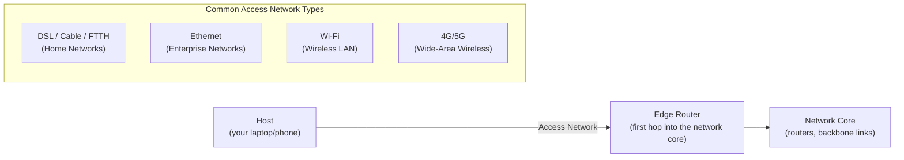

# Internet Overview & The Network Edge

**End systems and hosts, access networks and physical media, and the two complementary ways of defining "the Internet."**

## 1. The Intuition

::: callout-intuition Core Mental Model: The Global Highway System
Imagine a global highway network. Cars don't teleport between cities — they travel on physical roads, pass through intersections, and eventually arrive at a driveway belonging to a house or office. The Internet works the same way, except it moves **data** instead of cars.

* Your laptop, phone, or a streaming server is a **house** — an *end system* where a trip begins or ends.
* The fiber, copper, or radio link connecting you to the network is the **road** — a *communication link*.
* A router is an **intersection** — a *packet switch* that looks at an arriving chunk of data and forwards it toward the right road out.

Zoom out far enough, though, and this "nuts and bolts" picture isn't the only useful lens. A software engineer building an app for millions of users doesn't think about copper wire and fiber — they think of the Internet as a **service**: a distributed platform that reliably moves bytes between any two programs, anywhere. Both views are correct; they're just answering different questions ("how is it built?" vs. "what does it do for me?").
:::

---

## 2. Theoretical Framework & Formalism

### 2.1 The "Nuts and Bolts" View

| Component | Role | Real-world analogy |
|---|---|---|
| **End Systems (Hosts)** | Laptops, smartphones, servers, smart TVs, IoT devices that sit at the *edge* of the network and run applications | Houses and businesses |
| **Communication Links** | Fiber, copper, radio, satellite — each with its own transmission rate (bandwidth) | Roads of varying width/speed |
| **Packet Switches** | Routers and switches; take packets arriving on one link and forward them out another | Intersections and roundabouts |

### 2.2 The "Services" View

From this angle the Internet is a **distributed application platform**: an infrastructure that lets applications (browsers, streaming clients, social apps) exchange data without either endpoint needing to understand the physical path in between.

### 2.3 The Network Edge

The network edge is the outermost boundary of the Internet — where end systems physically attach. Hosts here split into two functional roles:

* **Clients** — desktops, mobile devices, laptops that *request* information.
* **Servers** — always-on, powerful machines that *supply* information (web pages, video streams, email), typically housed in large data centers today.

::: callout-pitfall Client and Server Are Roles, Not Device Types
Exams love this trap: a "server" is not a special kind of computer — it is a *role* an end system plays. Your laptop is a client when it streams Netflix, but the moment it serves a file to a peer (or runs a local dev server), it is acting as a **server**. Classify by *behavior* (requesting vs. supplying), never by hardware size.
:::

### 2.4 Access Networks — Getting From the Edge to the First Router

* **Home Networks:** DSL (over copper telephone wire), Cable (over coaxial TV cable), or FTTH (Fiber to the Home).
* **Enterprise Networks:** Devices connect via Ethernet switches, which connect to an institutional router — common in companies and universities.
* **Wireless Access Networks:**
  * **Wi-Fi (WLAN):** short range, within a building, to a local access point.
  * **Cellular (4G/5G):** long range, to a cell tower kilometers away.

### 2.5 Physical Media

Bits must travel across some physical medium — electromagnetic waves or light pulses.

* **Guided Media** (waves travel along a solid path):
  * *Twisted-Pair Copper* — cheapest, used in most Ethernet cabling (Cat5/Cat6).
  * *Coaxial Cable* — two concentric copper conductors, supports high download speeds.
  * *Fiber Optics* — pulses of light through glass fiber; extremely fast, immune to electromagnetic interference, backbone of long-haul transoceanic links.
* **Unguided Media** (waves propagate through open air/space):
  * *Terrestrial Radio* — Wi-Fi, AM/FM.
  * *Satellite Radio* — geosynchronous or Low Earth Orbit (LEO, e.g., Starlink).

---

## 3. Worked Example / Step-by-Step Scenario

::: step [Step 1: Setup] Formulating the Problem
You stream a movie on a smart TV connected over Wi-Fi to your home router, which uses a Fiber-to-the-Home (FTTH) connection to your ISP. Identify every "nuts and bolts" component involved in getting one video frame from Netflix's server to your TV screen.
:::

::: step [Step 2: Execution] Tracing the Path
1. **End Systems:** Netflix's server (a host, acting as *server*) and your smart TV (a host, acting as *client*).
2. **Access Network (server side):** Netflix's server sits in a data center connected via high-capacity enterprise-grade links into the network core.
3. **Network Core:** A sequence of **packet switches** (routers) forward the video's packets from Netflix's data center, across backbone links, toward your ISP.
4. **Access Network (your side):** The packets arrive at your ISP and travel over the **FTTH fiber link** (guided medium, physical layer) to your home router.
5. **Final Hop:** Your router forwards the packets over **Wi-Fi** (unguided medium, terrestrial radio) to the smart TV.
:::

::: step [Step 3: Conclusion] Final Result
A single video frame crosses *multiple* communication links (fiber, backbone links, Wi-Fi) and passes through *multiple* packet switches, yet the "services view" hides all of this: your smart TV's app simply sees a continuous stream of video data arriving, as if the underlying nuts-and-bolts complexity didn't exist.
:::

---

## 4. Active Recall Quizzes

::: quiz Q1: Foundational Concept
Why is a smartphone considered an "end system" or "host," even though it isn't a powerful server?
(A) Because it only receives data and never sends any
(*B) Because it sits at the edge of the network and runs (hosts) application programs, regardless of whether it acts as a client or server
(C) Because it is directly wired into the network core
(D) Because it lacks an IP address
::: explanation
"End system" and "host" describe *position* (at the network's edge) and *function* (running application programs), not raw processing power. A smartphone qualifies just as much as a data-center server — it simply usually plays the *client* role rather than the *server* role.
:::

::: quiz Q2: Foundational Concept
Which of the following is an example of a "packet switch" rather than an "end system"?
(A) A smart TV streaming Netflix
(B) A laptop sending an email
(*C) A router forwarding packets between two communication links
(D) A web server hosting a website
::: explanation
Packet switches (routers and switches) sit *inside* the network core or at its access points, forwarding data between links — they don't originate or consume application data themselves, which is what distinguishes them from end systems (hosts) like laptops or servers.
:::

::: quiz Q3: Foundational Concept
Why is Fiber Optic cable preferred over Twisted-Pair Copper for long-haul, transoceanic communication links?
(A) It is cheaper to manufacture per meter
(B) It requires no maintenance ever
(*C) It offers extremely high transmission rates and is immune to electromagnetic interference over very long distances
(D) It can only be used for wireless communication
::: explanation
Fiber optics carry data as light pulses through glass, which suffers far less signal degradation and interference over long distances than electrical signals in copper, making it the backbone medium of choice for undersea and cross-continental links.
:::
