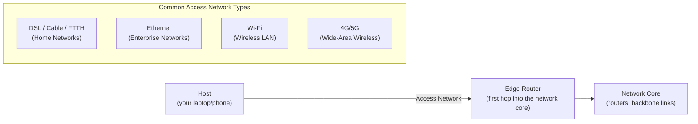

# Internet Overview & The Network Edge

**End systems and hosts, access networks and physical media, and the two complementary ways of defining "the Internet."**

## 1. The Real-World Situation — Start From Zero

You tap a video on your phone. A fraction of a second later, it plays. Nothing visibly travels to you — yet a copy of that video's data has just crossed thousands of kilometres of glass, copper, and air, hopping through a dozen or more relay stations on the way.

Here is the problem this note solves: **how is "the Internet" organized so that any two computers on Earth can exchange data?** Engineers answer with two complementary views. The **nuts-and-bolts view** (how is it built?) names the physical parts: computers at the edges, wires and radio links between them, and relay boxes that forward data. The **services view** (what does it do for me?) hides all of that and says: the Internet is a platform that moves bytes between any two programs, anywhere. Both views describe the same system; you need both, because exams test whether you can switch between them.

::: callout-intuition Core Mental Model: The Global Highway System
Imagine a global highway network. Cars don't teleport between cities — they travel on physical roads, pass through intersections, and eventually arrive at a driveway belonging to a house or office. The Internet works the same way, except it moves **data** instead of cars.

* Your laptop, phone, or a streaming server is a **house** — an *end system* where a trip begins or ends.
* The fiber, copper, or radio link connecting you to the network is the **road** — a *communication link*.
* A router is an **intersection** — a *packet switch* that looks at an arriving chunk of data and forwards it toward the right road out.

Dropping the highway now: the technical terms above are the ones the exam uses, and the rest of this note defines each of them precisely.
:::

## 2. Words First — Every Term Defined

| Term (abbreviation expanded on first use) | Plain meaning |
|---|---|
| **End system / host** | Any computer at the *edge* of the network that runs application programs (laptop, phone, server, smart TV, sensor). "Host" = it *hosts* (runs) applications. |
| **Packet** | One small chunk of a larger message. Long messages are split so links and switches handle short, uniform pieces. |
| **Packet switch** | A relay box inside the network (a **router** joins different networks; a **switch** joins devices in one local network) that receives packets on one link and forwards each out of the best next link. |
| **Communication link** | The physical path bits travel: fiber-optic cable, copper wire, or radio waves — each with a **transmission rate** (bits per second, also called bandwidth). |
| **Network edge** | The outermost boundary of the Internet: end systems plus the first link and router that attach them. |
| **Network core** | Everything inside: the mesh of packet switches and high-capacity links connecting edges together. |
| **Access network** | The link(s) connecting *your* end system to the *first* router of the core. |
| **ISP (Internet Service Provider)** | The company (e.g. your broadband or mobile operator) that runs that first router and sells you access. |
| **Guided / unguided media** | Guided = signals travel *along* a solid path (copper, glass fiber). Unguided = signals travel through open air or space (radio, satellite). |

::: toggle What does `packet` mean?
A `packet` is one small chunk of a larger message, with address headers attached.
Splitting matters because switches forward short uniform pieces without waiting for a whole file.
Tiny example: a 1 MB video becomes roughly a thousand 1 KB packets, each routed independently.
:::

::: toggle What do `host` and `client` mean here?
A `host` is any computer at the network edge that runs applications, so it originates or consumes data.
A `client` is the role of requesting data, while a `server` is the role of supplying it.
One laptop is a `client` when streaming and a `server` when sharing a file to a peer.
:::

## 3. Purpose — Why Two Views of One Internet

### 3.1 The "Nuts and Bolts" View (how it is built)

| Component | Role |
|---|---|
| **End Systems (Hosts)** | Laptops, smartphones, servers, smart TVs, Internet-of-Things (IoT) devices at the *edge*; they originate and consume data. |
| **Communication Links** | Fiber, copper, radio, satellite — each with its own transmission rate. |
| **Packet Switches** | Routers and switches; take packets arriving on one link and forward them out of another. |

### 3.2 The "Services" View (what applications get)

From this angle the Internet is a **distributed application platform**: an infrastructure that lets applications (browsers, streaming clients, social apps) exchange data without either endpoint needing to understand the physical path in between. Your video app never learns which routers carried its frames — and never needs to.

### 3.3 The Network Edge: Clients and Servers Are Roles

The network edge is where end systems physically attach. Hosts here split into two functional roles:

* **Clients** — desktops, mobile devices, laptops that *request* information.
* **Servers** — always-on, powerful machines that *supply* information (web pages, video streams, email), typically housed in large data centers today.

::: callout-pitfall Client and Server Are Roles, Not Device Types
Exams love this trap: a "server" is not a special kind of computer — it is a *role* an end system plays. Your laptop is a client when it streams video, but the moment it serves a file to a peer (or runs a local development server), it is acting as a **server**. Classify by *behavior* (requesting vs. supplying), never by hardware size.
:::

### 3.4 Access Networks — Getting From the Edge to the First Router

* **Home Networks:** DSL (Digital Subscriber Line, over copper telephone wire), Cable (over coaxial TV cable), or FTTH (Fiber to the Home).
* **Enterprise Networks:** Devices connect via Ethernet switches, which connect to an institutional router — common in companies and universities.
* **Wireless Access Networks:**
  * **Wi-Fi (Wireless Local Area Network, WLAN):** short range, within a building, to a local access point.
  * **Cellular (4G/5G):** long range, to a cell tower kilometers away.

### 3.5 Physical Media — What the Bits Ride On

Bits must travel across some physical medium — electromagnetic waves or light pulses.

* **Guided Media** (waves travel along a solid path):
  * *Twisted-Pair Copper* — cheapest, used in most Ethernet cabling (Cat5/Cat6 categories).
  * *Coaxial Cable* — two concentric copper conductors, supports high download speeds.
  * *Fiber Optics* — pulses of light through glass fiber; extremely fast and unaffected by electromagnetic interference (it carries light, not electric current), though signals still weaken with distance and the glass itself can be cut or damaged. It is the backbone of long-haul transoceanic links.
* **Unguided Media** (waves propagate through open air/space):
  * *Terrestrial Radio* — Wi-Fi, AM/FM broadcast.
  * *Satellite Radio* — geosynchronous satellites or Low Earth Orbit (LEO) constellations.

::: toggle What does `transmission rate` mean?
`Transmission rate` is bits per second the link can push, also called `bandwidth` here.
Why it matters: every link in the video path has its own rate, and the slowest one bounds the stream.
Tiny example: a 10 Mbps link delivers about 10 million bits per second, so a 40 Mb clip needs at least 4 seconds.
:::

::: toggle What does `guided` vs `unguided` mean?
`Guided` means waves travel along a solid path such as copper wire or glass fiber.
`Unguided` means waves propagate through open air or space, such as Wi-Fi or satellite radio.
Use it as: FTTH fiber is guided, the last hop of home Wi-Fi is unguided.
:::

## 4. Examples — Tiny First, Then Exam-Level

### 4.1 Toy Example (30 seconds)

One laptop, one home router, one video server. The laptop (client end system) asks over Wi-Fi (unguided access link); the home router (first packet switch) forwards the request onto fiber (guided link) toward the core; core routers forward it to the server (server end system), which sends video packets back along the reverse chain. Three parts — ends, links, switches — and nothing else is involved.

### 4.2 KTU-Style Worked Example

::: step [Step 1: Setup] Formulating the Problem
You stream a movie on a smart TV connected over Wi-Fi to your home router, which uses a Fiber-to-the-Home (FTTH) connection to your ISP (Internet Service Provider). Identify every "nuts and bolts" component involved in getting one video frame from the streaming server to your TV screen.
:::

::: step [Step 2: Execution] Tracing the Path
1. **End Systems:** The streaming server (a host, acting as *server*) and your smart TV (a host, acting as *client*).
2. **Access Network (server side):** The server sits in a data center connected via high-capacity enterprise-grade links into the network core.
3. **Network Core:** A sequence of **packet switches** (routers) forward the video's packets from the data center, across backbone links, toward your ISP.
4. **Access Network (your side):** The packets arrive at your ISP and travel over the **FTTH fiber link** (guided medium) to your home router.
5. **Final Hop:** Your router forwards the packets over **Wi-Fi** (unguided medium, terrestrial radio) to the smart TV.
:::

::: step [Step 3: Conclusion] Final Result
A single video frame crosses *multiple* communication links (fiber, backbone links, Wi-Fi) and passes through *multiple* packet switches, yet the "services view" hides all of this: your smart TV's app simply sees a continuous stream of video data arriving, as if the underlying nuts-and-bolts complexity didn't exist.
:::

## 5. Distinctions, Watch-Outs, and Exam Recap

| Pair students confuse | Distinction that earns marks |
|---|---|
| End system vs. packet switch | Hosts at the edge run applications (originate/consume data); switches inside forward packets (never originate application data). |
| Client vs. server | Roles (requesting vs. supplying), not device types — one laptop plays both across two apps. |
| Nuts-and-bolts vs. services view | How it is built (links/switches) vs. what apps get (a byte-moving platform). |
| Guided vs. unguided | Solid path (copper/coax/fiber) vs. open air/space (radio/satellite). |
| DSL vs. FTTH | Copper telephone wire vs. fiber to the premises (far higher rate). |

**Watch out:** (1) "Server" as hardware — always test role vs. device. (2) Calling the access link "the Internet" — it is only the first hop; the core lies beyond the edge router. (3) Fiber "immune to everything" — unaffected by electromagnetic interference, but still subject to attenuation and physical damage.

::: callout-exam KTU Exam Focus: One-Paragraph Recap
Internet = end systems at the edge + packet switches and links in the core. Two views: nuts-and-bolts (parts) and services (platform). Edge roles client/server are behavioral. Access: DSL/cable/FTTH (home), Ethernet (enterprise), Wi-Fi/cellular (wireless). Media: guided (twisted pair, coax, fiber) vs. unguided (terrestrial/satellite radio).
:::

**Active-recall checklist** (answer aloud, then check against the quizzes below): What makes a device an "end system"? What three parts does the nuts-and-bolts view name? Why can a laptop be both client and server? Which access network serves homes vs. enterprises? Which guided medium suits transoceanic links, and with what qualification?

## 6. Active Recall Quizzes

::: quiz Q1: Foundational Concept
Why is a smartphone considered an "end system" or "host," even though it isn't a powerful server?
(A) Because it only receives data and never sends any
(*B) Because it sits at the edge of the network and runs (hosts) application programs, regardless of whether it acts as a client or server
(C) Because it is directly wired into the network core
(D) Because it lacks an IP address
::: explanation
"End system" and "host" describe *position* (at the network's edge) and *function* (running application programs), not raw processing power. A smartphone qualifies just as much as a data-center server — it simply usually plays the *client* role rather than the *server* role.
:::

::: quiz Q2: Foundational Concept
Which of the following is an example of a "packet switch" rather than an "end system"?
(A) A smart TV streaming Netflix
(B) A laptop sending an email
(*C) A router forwarding packets between two communication links
(D) A web server hosting a website
::: explanation
Packet switches (routers and switches) sit *inside* the network core or at its access points, forwarding data between links — they don't originate or consume application data themselves, which is what distinguishes them from end systems (hosts) like laptops or servers.
:::

::: quiz Q3: Foundational Concept
Why is Fiber Optic cable preferred over Twisted-Pair Copper for long-haul, transoceanic communication links?
(A) It is cheaper to manufacture per meter
(B) It requires no maintenance ever
(*C) It offers extremely high transmission rates and is immune to electromagnetic interference over very long distances
(D) It can only be used for wireless communication
::: explanation
Fiber optics carry data as light pulses through glass, which suffers far less signal degradation and interference over long distances than electrical signals in copper, making it the backbone medium of choice for undersea and cross-continental links.
:::
