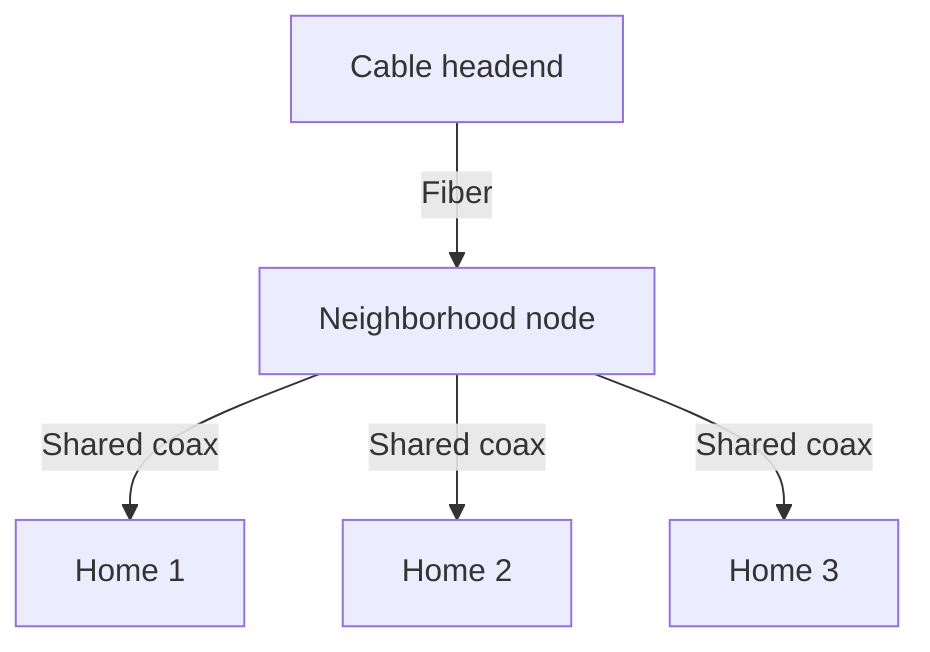
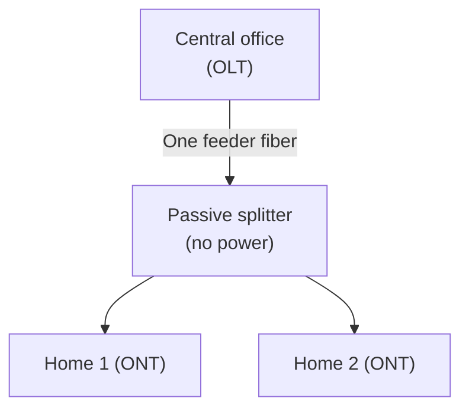
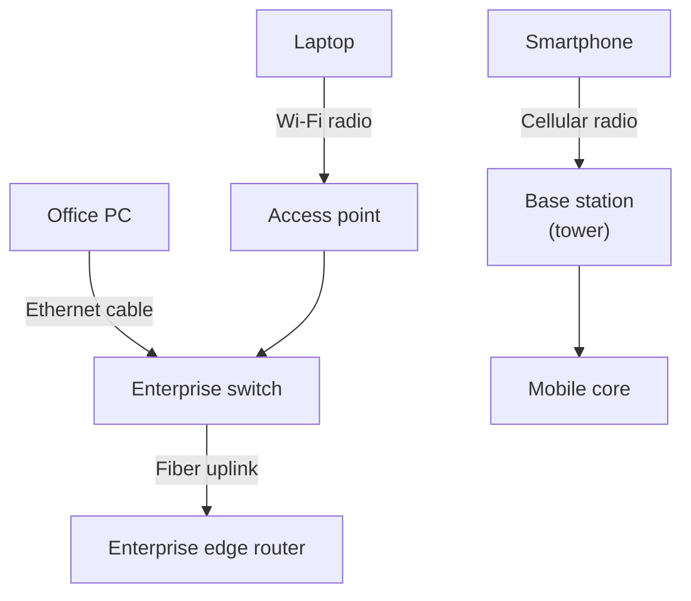
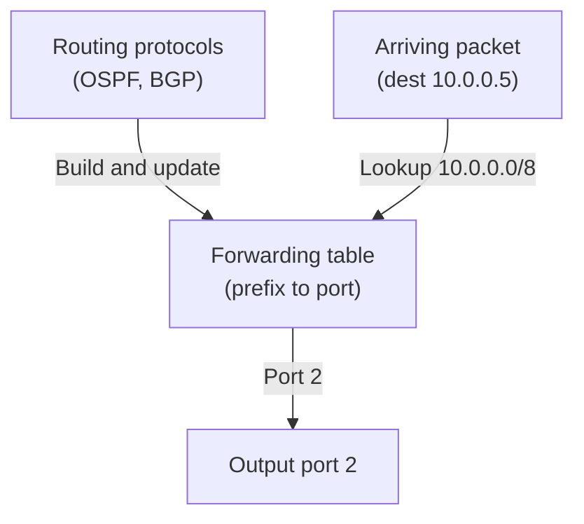
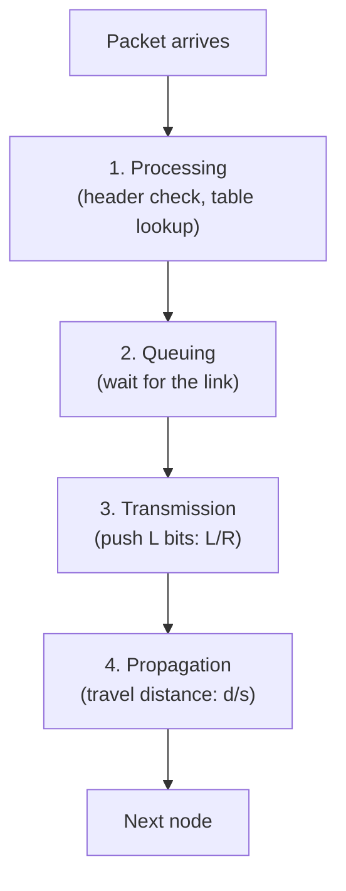
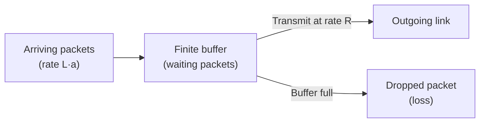

# Internet Overview & The Network Edge

**End systems and hosts, the Internet vs the Web, access networks and physical media, packet switching, the four nodal delays, and why protocols are layered.**

<a id="the-intuition"></a>
## 1. The Real-World Situation — Start From Zero

You tap a video on your phone. A fraction of a second later, it plays. Nothing visibly travels to you — yet a copy of that video's data has just crossed thousands of kilometres of glass, copper, and air, hopping through a dozen or more relay stations on the way.

Here is the problem this note solves: **how is "the Internet" organized so that any two computers on Earth can exchange data, how long does each hop take, and what rules keep the chaos interoperable?** Engineers answer with two complementary views. The **nuts-and-bolts view** (how is it built?) names the physical parts: computers at the edges, wires and radio links between them, and relay boxes that forward data. The **services view** (what does it do for me?) hides all of that and says: the Internet is a platform that moves bytes between any two programs, anywhere. Both views describe the same system; you need both, because exams test whether you can switch between them — and then quantify the trip with delay mathematics.

::: callout-intuition Core Mental Model: The Global Highway System
Imagine a global highway network. Cars don't teleport between cities — they travel on physical roads, pass through intersections, and eventually arrive at a driveway belonging to a house or office. The Internet works the same way, except it moves **data** instead of cars.

* Your laptop, phone, or a streaming server is a **house** — an *end system* where a trip begins or ends.
* The fiber, copper, or radio link connecting you to the network is the **road** — a *communication link*.
* A router is an **intersection** — a *packet switch* that looks at an arriving chunk of data and forwards it toward the right road out.

Dropping the highway now: the technical terms above are the ones the exam uses, and the rest of this note defines each of them precisely — then measures the trip (delays) and names the traffic rules (protocols).
:::

<a id="key-terms"></a>
## 2. Words First — Every Term Defined

| Term (abbreviation expanded on first use) | Plain meaning |
|---|---|
| **End system / host** | Any computer at the *edge* of the network that runs application programs (laptop, phone, server, smart TV, sensor). "Host" = it *hosts* (runs) applications. |
| **Process** | One running program on a host (a browser tab's renderer, a web server worker). A single host runs many processes at once. |
| **Client / server** | *Roles*, not device types: the side that *requests* data vs. the side that *supplies* it. One laptop plays both across two apps. |
| **Packet** | One small chunk of a larger message, with address headers attached. Long messages are split so links handle short, uniform pieces. |
| **Packet switch** | A relay box inside the network (a **router** joins different networks; a **switch** joins devices in one local network) that receives packets on one link and forwards each out of the best next link. |
| **Communication link** | The physical path bits travel: fiber-optic cable, copper wire, or radio waves — each with a **transmission rate** (bits per second, also called bandwidth). |
| **Network edge** | The outermost boundary of the Internet: end systems plus the first link and router that attach them. |
| **Network core** | Everything inside: the mesh of packet switches and high-capacity links connecting edges together. |
| **Access network** | The link(s) connecting *your* end system to the *first* router of the core. |
| **ISP (Internet Service Provider)** | The company (e.g. your broadband or mobile operator) that runs that first router and sells you access. |
| **Guided / unguided media** | Guided = signals travel *along* a solid path (copper, glass fiber). Unguided = signals travel through open air or space (radio, satellite). |
| **Forwarding / routing** | Forwarding = one router moving a packet from input port to output port. Routing = the network-wide computation of paths that fills forwarding tables. |
| **Nodal delay** | Total time a packet spends at one node: processing + queuing + transmission + propagation delay. |

::: toggle What does `packet` mean?
A `packet` is one small chunk of a larger message, with address headers attached.
Splitting matters because switches forward short uniform pieces without waiting for a whole file.
Tiny example: a 1 MB video becomes roughly a thousand 1 KB packets, each routed independently.
:::

::: toggle What do `host` and `client` mean here?
A `host` is any computer at the network edge that runs applications, so it originates or consumes data.
A `client` is the role of requesting data, while a `server` is the role of supplying it.
One laptop is a `client` when streaming and a `server` when sharing a file to a peer.
:::

<a id="the-math"></a>
## 3. Purpose — Views, Edge, Core, Delays, Rules

### 3.1 The "Nuts and Bolts" View (how it is built)

| Component | Role |
|---|---|
| **End Systems (Hosts)** | Laptops, smartphones, servers, smart TVs, Internet-of-Things (IoT) devices at the *edge*; they originate and consume data. |
| **Communication Links** | Fiber, copper, radio, satellite — each with its own transmission rate. |
| **Packet Switches** | Routers and switches; take packets arriving on one link and forward them out of another. |

This view tells you *what parts exist and how they connect*. It answers "what is the machine?" but says nothing about what the machine is *for* — that is the services view's job.

### 3.2 The "Services" View (what applications get)

From this angle the Internet is a **distributed application platform**: an infrastructure that lets applications (browsers, streaming clients, social apps) exchange data without either endpoint needing to understand the physical path in between. Your video app never learns which routers carried its frames — and never needs to. This view tells you *what guarantees programmers can rely on* (send bytes from process A to process B) while hiding the machinery.

### 3.3 The Complete Path: Host → Access → ISP → Core → Destination

Every trip follows the same skeleton, and every exam path-tracing question is answered by walking it:

```mermaid
flowchart LR
    accTitle: End-to-end Internet path from host to destination
    accDescr: A home host reaches an ISP edge router over an access network, crosses core routers, and arrives at the destination server network.
    H["Home host<br/>(laptop/phone)"] -->|Access network<br/>(DSL/cable/fiber/Wi-Fi)| ER["ISP edge router<br/>(first core hop)"]
    ER --> R1["Core router"] --> R2["Core router"] --> SRV["Destination network<br/>(server host)"]
```

*What* happens: your host hands data to its access network; the access network delivers it to the ISP's edge router (the first router of the core); core routers forward it hop by hop; the destination's access network drops it at the server. *Why* this shape: no single organization owns the planet's wires, so local access providers hand off to long-haul core networks — hierarchy is what makes global scale possible. *Example*: a Kochi laptop's request reaches a Mumbai server by laptop → home fiber → ISP edge router → 6–10 core routers → data-center router → server.

### 3.4 Internet vs. Web — Infrastructure vs. One Application

- **What they are.** The **Internet** is the global infrastructure: links, routers, IP (Internet Protocol) addresses, and packet-switching rules. The **World Wide Web (Web)** is *one* distributed application running *on top of* that infrastructure, using HTTP/HTTPS (HyperText Transfer Protocol / Secure) between a **browser** (the client program rendering pages) and a **web server** (the program supplying pages).
- **Why the distinction exists.** Confusing them makes every other statement wrong: email (SMTP — Simple Mail Transfer Protocol), file transfer (FTP — File Transfer Protocol), voice calls (VoIP — Voice over IP), name lookup (DNS — Domain Name System), and gaming are all Internet applications that are *not* the Web.
- **How to keep them straight.** The Internet is the highway system (roads, intersections, signs); the Web is one delivery-truck company driving on it — alongside buses (email) and ambulances (VoIP). Saying "the Web is a layer of the Internet" is misleading: the Web is not a network layer, it is an *application using* the network.
- **When/where tested.** Any question naming HTTP, a URL, HTML, or a browser is asking about the Web (application); any question naming IP addresses, routers, or packets is asking about the Internet (infrastructure).
- **Example.** Typing `www.example.com`: DNS (Internet infrastructure service) resolves the name to an IP address; then HTTP (Web application protocol) fetches the page *over* that infrastructure.

### 3.5 The Network Edge: Hosts, Processes, Clients, Servers

The network edge is where end systems physically attach. Three ideas, each earning marks:

- **Host / end system.** *What:* any edge computer running applications. *Why the names:* "host" because it *hosts* programs; "end system" because it sits at a communication endpoint. *Example:* phone, laptop, data-center machine, sensor.
- **Process and simultaneity.** *What:* a process is one running program. *Why it matters:* a host runs dozens of processes (browser, mail sync, OS updates) sharing one access link — the operating system multiplexes them, which is exactly why one laptop can stream (client), seed a torrent (server), and back up photos at the same time. *Result:* "client" and "server" describe *processes and behaviors*, never the box.
- **Client vs. server roles.** *What:* the side initiating a request vs. the side waiting to serve it. *Where used:* client processes usually run on personal devices with intermittently-changing (often dynamic) addresses; server processes usually run on well-provisioned machines with stable, reachable addresses (frequently static, but static addresses are common practice, not a law — avoid claiming servers *always* have them).

```mermaid
flowchart LR
    accTitle: Client-server and peer-to-peer communication patterns
    accDescr: In client-server mode the client requests and the server responds; in peer-to-peer mode two hosts exchange data as equals.
    C["Client<br/>(phone/laptop)"] -->|Request<br/>(e.g. HTTP GET)| S["Server<br/>(data-center host)"]
    S -->|Response<br/>(e.g. page/video)| C
    P1["Peer A"] <-->|Equal exchange| P2["Peer B"]
```

::: callout-pitfall Client and Server Are Roles, Not Device Types
Exams love this trap: a "server" is not a special kind of computer — it is a *role* an end system plays. Your laptop is a client when it streams video, but the moment it serves a file to a peer (or runs a local development server), it is acting as a **server**. Classify by *behavior* (requesting vs. supplying), never by hardware size.
:::

### 3.6 Access Networks — Getting From the Edge to the First Router

An access network connects your host to the ISP's edge router. Six technologies, each taught as WHAT → HOW → WHY → characteristics → example. Speeds below are *representative, deployment-dependent* figures — nominal link rates, not guaranteed application throughput, which is always lower (sharing, overhead, distance).

**DSL (Digital Subscriber Line).**
- *What:* Internet over the existing copper telephone line to a home.
- *How:* Frequency-division splits one wire into parallel channels: roughly 0–4 kHz stays voice, higher bands carry data upstream (~25–138 kHz) and downstream (~138 kHz–1.1 MHz) in classic ADSL (Asymmetric DSL) — numbers are illustrative of the ADSL standard, not every DSL variant.
- *Why it exists:* reuses the phone wiring already in every house; the copper pair is *dedicated* (your bits are not shared with neighbors).
- *Characteristics/example:* typically asymmetric (representative ADSL: ~24 Mbps down, ~1–3 Mbps up) because homes download more than they upload; rate falls sharply with distance from the telephone central office (a few km limit).

```mermaid
flowchart TB
    accTitle: DSL home access architecture
    accDescr: A house splitter separates voice and data over a dedicated copper pair reaching the central-office DSLAM, which splits voice to the phone network and data to the Internet core.
    HOME["House<br/>(PC + phone + splitter)"] -->|Dedicated copper pair<br/>(voice + data bands)| CO["Central office<br/>(DSLAM)"]
    CO -->|Voice| PSTN["Phone network"]
    CO -->|Data| CORE["Internet core"]
```

**Cable / HFC (Hybrid Fiber-Coax).**
- *What:* Internet over the cable-TV company's wiring.
- *How:* fiber runs from the cable headend to a neighborhood node; coaxial copper cable fans out from the node to each home; DOCSIS (Data Over Cable Service Interface Specification) encodes data as radio-frequency signals on the coax.
- *Why it exists:* reuses TV cable plant with fiber doing the long haul (fiber's capacity) and coax doing the last hop (cheap to homes).
- *Characteristics/example:* the neighborhood coax segment is *shared* — at 8 PM fifty neighbors streaming 4K contend for the same capacity, so evening speeds dip. This dedicated-vs-shared contrast with DSL is a favorite exam question.



**FTTH (Fiber to the Home).**
- *What:* glass fiber running from the central office all the way into the home (an ONT — Optical Network Terminal — converts light back to electrical frames).
- *How:* two deployment styles — AON (Active Optical Network, powered neighborhood switches route light per home) vs. PON (Passive Optical Network, unpowered optical splitters divide one feeder fiber among up to ~64 homes).
- *Why it exists:* removes copper's distance/bandwidth ceiling entirely.
- *Characteristics/example:* typically symmetric with commonly offered rates around hundreds of Mbps to ~1 Gbps (multi-gigabit in some deployments) and very low latency.



**Enterprise Ethernet + Wi-Fi and Cellular access.**
- *Ethernet (IEEE 802.3, wired):* WHAT office PCs wired to a switch; HOW Cat5e/Cat6A twisted-pair frames to an institutional switch with fiber uplink; WHY cheap, full-rate, low-interference indoor links (representative: 100 Mbps–1 Gbps desktop, 10 Gbps uplinks).
- *Wi-Fi (IEEE 802.11, wireless LAN):* WHAT laptops/phones via an access point (AP); HOW radio frames over tens of meters indoors to an AP bridged into the wired network; WHY mobility without cabling (Wi-Fi 5/6/7 generations raise rate and efficiency; walls and contention lower real throughput).
- *Cellular (4G/5G, wide-area wireless):* WHAT phones/vehicles via a tower kilometers away; HOW radio to a base station (eNodeB in 4G LTE, gNodeB in 5G) into the mobile core; WHY coverage where no wire reaches. Qualify generations: 3G brought basic mobile data (few Mbps); 4G LTE is all-IP packet data (representative tens–hundreds of Mbps); 5G raises peak rates (multi-Gbps under ideal conditions) and lowers latency (single-digit ms only in ideal deployments) — never present one vendor's figures as universal.



### 3.7 Physical Media — What the Bits Ride On (and Why Properties Differ)

Bits travel as voltages, light pulses, or radio waves. Media split into guided (waves confined to a solid path) vs. unguided (waves spread through air/space) — and each medium's *physics* explains its performance:

- **Twisted-pair copper.** *Why twisted:* adjacent pairs induce crosstalk (electromagnetic interference between neighbors); twisting cancels most of it. *Result:* cheapest indoor medium (Cat5e ~1 Gbps/100 m; Cat6A ~10 Gbps), but attenuation and crosstalk cap distance and rate.
- **Coaxial cable.** *Why better than bare pair:* a concentric metal shield confines the field and blocks outside noise. *Result:* higher, cleaner bandwidth over longer runs — the reason TV/cable plants chose it.
- **Fiber optics.** *Why superior:* light pulses in high-purity glass reflect internally (total internal reflection) with tiny attenuation and zero electromagnetic interference (it carries photons, not current). *Result:* enormous capacity and 100+ km repeater spacing — the transoceanic backbone. Qualification: still subject to attenuation and physical cuts; "immune to interference" never means "indestructible."
- **Terrestrial radio (Wi-Fi, Bluetooth, cellular).** *Why different:* unguided waves broadcast — anyone in range on that frequency can receive them (convenient for mobility, costly for security and contention). *Result:* mobility at the price of interference, shared airtime, and eavesdroppability.
- **Satellite radio.** *Why delay differs by orbit:* waves always travel at light speed (~3×10⁸ m/s) — delay comes from *distance*, not slow waves. GEO (geostationary, ~35,786 km) round trips run ~240–280 ms; LEO (low-earth orbit, ~500–1,500 km) constellations run ~20–40 ms typically. *Result:* LEO suits interactive use; GEO suits broadcast/backhaul.

### 3.8 Packet Switching — From First Principles

- **What it is.** The network core's forwarding discipline: application data → chopped into addressed packets → each packet transmitted link by link through routers → reassembled at the destination.
- **How one message travels.** (1) *Packetization:* the source splits a message (say a 10 MB image) into small packets. (2) *Headers:* each packet gets source/destination addresses. (3) *Hop-by-hop forwarding:* every router reads the destination and pushes the packet onto the next link. (4) *Reassembly:* the destination strips headers, reorders, and rebuilds the message.
- **Why packets, not whole messages.** Short uniform pieces keep any single transfer from monopolizing a link, let routers interleave many flows, and bound the damage of one lost chunk to a retransmission of that chunk — not the whole file.
- **Circuit switching contrast.** Old telephone networks *reserved* an end-to-end circuit per call: guaranteed rate, zero queuing — but silence on the line still burned reserved capacity, and only ~10 users fit a 1 Mbps link at 100 Kbps each. Packet switching *shares* capacity on demand (statistical multiplexing): with each of 35 users active only 10% of the time, the chance that more than 10 transmit at once is under 0.04% — so 35 users comfortably share that same 1 Mbps link. *Result:* far higher utilization at the cost of variable delay and possible loss.
- **When/where.** The entire Internet core is packet-switched; circuits survive only in niche guaranteed-rate services. Exam cue: "dedicated/reserved" → circuit; "shared/on-demand/statistical" → packet.

### 3.9 Store-and-Forward — The Rule That Creates Delay

- **What it is.** A router must receive *the entire packet* (all L bits) into its buffer before transmitting its first bit onward (simplified model used throughout this syllabus).
- **Why it exists.** A router cannot pick the correct output link until it has read the header — and the header is meaningless without its packet. Receiving-then-forwarding is the price of per-packet routing decisions (plus error checks).
- **How delay follows.** Pushing L bits onto a link of rate R takes L/R seconds *per hop*. For one packet over N identical links (ignoring other delays): d_end-to-end = N × L/R. *Example:* L = 6,000 bits, R = 3 Mbps → 2 ms per link; over N = 3 links → 6 ms. *Interpretation:* store-and-forward multiplies transmission cost by hop count — the fundamental reason path length matters.

```mermaid
flowchart LR
    accTitle: Packet journey with store-and-forward routers
    accDescr: The source transmits a full packet to router 1, which stores it completely before forwarding to router 2 and on to the destination.
    SRC["Source host"] -->|Transmit L bits<br/>(takes L/R)| R1["Router 1<br/>(store full packet,<br/>then forward)"]
    R1 -->|Transmit L bits<br/>(takes L/R)| R2["Router 2<br/>(store full packet,<br/>then forward)"]
    R2 --> DST["Destination host"]
```

### 3.10 Forwarding vs. Routing — Local Action vs. Global Computation

This distinction must be razor sharp — it recurs in every later module:

- **FORWARDING (data plane, local).** *What:* moving one arriving packet from a router's input port to the correct output port, *right now*, via a table lookup. *How:* read destination address → longest-prefix match in the local forwarding table → emit on the listed port — in microseconds, per packet, in hardware.
- **ROUTING (control plane, global).** *What:* computing the end-to-end paths across all routers and *filling* those forwarding tables. *How:* routing protocols (OSPF inside an ISP, BGP between ISPs) exchange reachability information in the background and continuously update tables.
- **Concrete example.** Packet for 10.0.0.5 arrives; the table says prefix 10.0.0.0/8 → port 2; the packet leaves on port 2 (forwarding). That table row exists because routing protocols earlier discovered "10.0.0.0/8 is reachable via port 2" (routing). GPS analogy: routing plans the whole New York→Los Angeles route; forwarding takes Exit 14B at this interchange.



### 3.11 The Four Nodal Delays — Four Different Physical Causes

At every node a packet suffers d_nodal = d_proc + d_queue + d_trans + d_prop. These are *different physics*, not four names for one thing:



- **Processing delay (d_proc).** *What:* header error-check + forwarding-table lookup time. *Why small:* done in hardware; typically microseconds or less — negligible beside the others, but examiners still list it.
- **Queuing delay (d_queue).** *What:* time waiting in the output buffer because the link is busy. *Why variable:* zero when the link is idle, huge under congestion — the only component that changes packet to packet (see §3.12).
- **Transmission delay (d_trans = L / R).** *What:* time to *push* all packet bits onto the wire. L = packet length in **bits**; R = link transmission rate in **bits/second**; result in **seconds**. *Why it works:* a rate of R bits/s needs L/R seconds to emit L bits — a serialization cost, independent of distance. *Example:* L = 8,000 bits (1,000 bytes × 8), R = 1 Mbps = 1,000,000 bits/s → d_trans = 8,000/1,000,000 = 0.008 s = **8 ms**. *Common mistake:* forgetting the ×8 bytes→bits conversion, or using megabytes (10⁶) vs. mebibytes — state your convention.
- **Propagation delay (d_prop = d / s).** *What:* time for *one bit* to travel the physical distance. d = link length in **meters**; s = signal speed in the medium in **meters/second** (≈ 2×10⁸ m/s in copper/fiber, ~2/3 of light speed c ≈ 3×10⁸ m/s); result in **seconds**. *Why it works:* distance divided by wave speed — a travel cost, independent of packet size. *Example:* d = 2,000 km = 2,000,000 m of fiber, s = 2×10⁸ m/s → d_prop = 2,000,000/200,000,000 = 0.01 s = **10 ms**. *Common mistake:* mixing km with m, or thinking bigger packets propagate slower — they don't; propagation ignores L entirely.

| Property | Transmission delay (d_trans) | Propagation delay (d_prop) |
|---|---|---|
| Definition | Time to push ALL bits onto the wire | Time for ONE bit to cross the distance |
| Formula | L / R | d / s |
| Depends on | Packet length, link rate | Distance, medium wave speed |
| Analogy | Toll booth releasing a 10-car caravan | One car driving 100 km of highway |

**Combined nodal example (all four, with steps).** Packet L = 10,000 bits; link R = 2 Mbps; distance d = 2,500 km fiber (s = 2.5×10⁸ m/s); d_proc = 1 ms; d_queue = 4 ms.
1. d_trans = 10,000 / 2,000,000 = 0.005 s = **5 ms**.
2. d_prop = 2,500,000 / 250,000,000 = 0.01 s = **10 ms**.
3. d_nodal = 1 + 4 + 5 + 10 = **20 ms**. *Interpretation:* on long links propagation dominates; on slow links transmission dominates; under load queuing dominates — read which term is largest before diagnosing.

### 3.12 Queuing, Traffic Intensity, and Packet Loss

- **Queue formation.** *What happens:* packets arrive at an output buffer faster than the link drains it. *How it grows:* each arrival while the link is busy waits behind earlier packets; waiting time = backlog ahead ÷ R. *Why delay varies:* arrivals are bursty — an idle gap empties the queue (d_queue → 0), a burst refills it (d_queue → large). *Result:* queuing is the only delay component with memory of recent traffic.
- **Traffic intensity (I = L·a / R).** L = packet size (**bits**), a = mean arrival rate (**packets/second**), so L·a = mean arriving bit-rate (**bits/second**); R = link rate (**bits/second**); I is **dimensionless**. *Meaning:* the fraction of time the link would need to stay busy serving arrivals. *Why I→1 hurts:* near saturation, tiny bursts build long backlogs and delay climbs steeply; sustained I > 1 means arrivals outrun service so the queue grows without bound. *Qualification (exam trap):* I is a *pressure gauge*, not a magic loss threshold — real loss depends on burstiness and finite buffer size, so never claim "loss begins exactly at I = 1."
- **Worked example.** L = 8,000 bits, a = 1,000 packets/s → L·a = 8 Mbps; R = 10 Mbps → I = 0.8 (busy but sustainable). If arrivals rise to a = 1,500 → I = 1.2: the queue grows unboundedly while this persists.
- **Packet loss.** *What:* router buffers are finite; a packet arriving at a *full* queue is discarded (dropped). *Why different from delay:* delay slows a packet; loss deletes it. *Recovery (conceptual):* the sender learns of the gap (e.g., a missing acknowledgment) and *retransmits* a copy — the mechanism reliable transport (TCP, next modules) is built on; loss-tolerant apps (live voice/video) instead skip the missing piece. No TCP internals here — that belongs to the transport module.



### 3.13 Protocols — Format, Order, Meaning, Action

- **What a protocol is.** A protocol defines, for communication between entities: (1) *message format/syntax* — field layout in headers (where source, destination, checksum bits sit); (2) *order/timing* — which message goes first, second, and what timers mean; (3) *meaning/semantics* — what each field value signifies (SYN = "open a connection"); (4) *actions* — what each side must *do* on sending/receiving (retransmit on timeout, deliver upward on receipt).
- **Human analogy first.** Two strangers meeting: "Hello!" → expect "Hello!" back (order + meaning); asking "what time is it?" → expect a time, not a joke (semantics); silence after a question → repeat it (timeout action). Break any rule and communication fails — networks formalize the same contract in bits.
- **Network example.** Opening a web page: TCP SYN → SYN-ACK → ACK (order), then HTTP GET /index.html → 200 OK + HTML (semantics + action: render the page). Every arrow in every diagram in this course is one protocol-governed step.

### 3.14 Why Layering — Managing Complexity Without Duplicating m1_02

- **Why needed.** Networks entangle cables, radio physics, kernels, routing math, crypto, and apps. Layering attacks *complexity* through: **modularity** (each layer is one manageable job), **abstraction** (a layer uses only the service below it — HTTP never touches radio waves), **interoperability** (any vendor's layer-N works with any other's layer-N if the interface holds), and **independent evolution** (swap Ethernet for Wi-Fi and HTTP/TCP keep working untouched — the Wi-Fi-upgrade example).
- **Where used.** Every standard in this course (HTTP, TCP, IP, Ethernet, Wi-Fi) lives at exactly one layer and leans on the rest.
- **Bridge — do not learn the stack here.** The full five-layer Internet stack (application, transport, network, link, physical), the OSI reference model, encapsulation, and service models are the *entire subject* of the next topic. Carry forward one sentence: *layering lets each protocol solve one problem while borrowing everything below it* — then open **m1_02 Protocol Layering / OSI / TCP-IP**.

<a id="worked-example"></a>
## 4. Examples — Tiny First, Then Exam-Level

### 4.1 Toy Example (30 seconds)

One laptop, one home router, one video server. The laptop (client end system) asks over Wi-Fi (unguided access link); the home router (first packet switch) forwards the request onto fiber (guided link) toward the core; core routers forward it to the server (server end system), which sends video packets back along the reverse chain. Three parts — ends, links, switches — and nothing else is involved.

### 4.2 KTU-Style Worked Example: Tracing One Video Frame

::: step [Step 1: Setup] Formulating the Problem
You stream a movie on a smart TV connected over Wi-Fi to your home router, which uses a Fiber-to-the-Home (FTTH) connection to your ISP (Internet Service Provider). Identify every "nuts and bolts" component involved in getting one video frame from the streaming server to your TV screen.
:::

::: step [Step 2: Execution] Tracing the Path
1. **End Systems:** The streaming server (a host, acting as *server*) and your smart TV (a host, acting as *client*).
2. **Access Network (server side):** The server sits in a data center connected via high-capacity enterprise-grade links into the network core.
3. **Network Core:** A sequence of **packet switches** (routers) forward the video's packets from the data center, across backbone links, toward your ISP.
4. **Access Network (your side):** The packets arrive at your ISP and travel over the **FTTH fiber link** (guided medium) to your home router.
5. **Final Hop:** Your router forwards the packets over **Wi-Fi** (unguided medium, terrestrial radio) to the smart TV.
:::

::: step [Step 3: Conclusion] Final Result
A single video frame crosses *multiple* communication links (fiber, backbone links, Wi-Fi) and passes through *multiple* packet switches, yet the "services view" hides all of this: your smart TV's app simply sees a continuous stream of video data arriving, as if the underlying nuts-and-bolts complexity didn't exist.
:::

### 4.3 Worked Calculation: Transmission vs. Propagation

::: step [Step 1: Setup] Reading the Question
A host sends a 1,000-byte packet over a 2,000 km fiber link (s = 2×10⁸ m/s) with transmission rate R = 4 Mbps. Compute d_trans and d_prop, and state which dominates.
:::

::: step [Step 2: Execution] Converting and Computing
1. **Bits:** L = 1,000 × 8 = **8,000 bits** (never divide bytes by a bits/s rate).
2. **Transmission:** d_trans = 8,000 / 4,000,000 = 0.002 s = **2 ms**.
3. **Propagation:** d = 2,000 km = 2,000,000 m; d_prop = 2,000,000 / 200,000,000 = 0.01 s = **10 ms**.
:::

::: step [Step 3: Conclusion] Interpretation
Propagation (10 ms) dominates transmission (2 ms) here — typical of long links. On a short slow link the verdict flips: always compute both before concluding.
:::

<a id="exam-recap"></a>
## 5. Distinctions, Watch-Outs, and Exam Recap

| Pair students confuse | Distinction that earns marks |
|---|---|
| End system vs. packet switch | Hosts at the edge run applications (originate/consume data); switches inside forward packets (never originate application data). |
| Internet vs. Web | Global infrastructure (links/routers/IP) vs. one HTTP application running on top of it. |
| Client vs. server | Roles (requesting vs. supplying), not device types — one laptop plays both across two apps. |
| Nuts-and-bolts vs. services view | How it is built (links/switches) vs. what apps get (a byte-moving platform). |
| Guided vs. unguided | Solid path (copper/coax/fiber) vs. open air/space (radio/satellite). |
| DSL vs. cable (HFC) | Dedicated copper pair vs. shared neighborhood coax — sharing explains evening slowdowns. |
| AON vs. PON (FTTH) | Powered neighborhood switching vs. unpowered optical splitters. |
| Packet vs. circuit switching | On-demand shared capacity (statistical multiplexing) vs. reserved end-to-end circuit. |
| Store-and-forward cost | One packet over N links costs N × L/R (plus other delays). |
| Forwarding vs. routing | Local per-packet port selection (data plane) vs. global path computation filling tables (control plane). |
| Transmission vs. propagation delay | L/R (push bits onto wire) vs. d/s (one bit crosses distance) — different physics. |
| Traffic intensity vs. loss threshold | I = L·a/R measures congestion *pressure*; loss depends on bursts and finite buffers, not a magic I = 1 tripwire. |
| Protocol vs. layering | One communication contract (format/order/meaning/action) vs. the modular stack organizing many contracts. |

**Watch out:** (1) "Server" as hardware — always test role vs. device; servers usually have stable addresses, not *always* static ones. (2) Calling the access link "the Internet" — it is only the first hop; the core lies beyond the edge router. (3) Fiber "immune to everything" — unaffected by electromagnetic interference, but still subject to attenuation and physical damage. (4) Bigger packet ⇒ bigger *transmission* delay only — propagation never depends on L. (5) Bytes vs. bits — convert (×8) before dividing by R. (6) Nominal link rates (5G peaks, Wi-Fi generations) are deployment-dependent, never universal constants. (7) The Web is an application *on* the Internet, never "a layer" of it.

::: callout-exam KTU Exam Focus: One-Paragraph Recap
Internet = end systems at the edge + packet switches and links in the core; the Web is one HTTP application on top. Two views: nuts-and-bolts (parts) and services (platform). Edge roles client/server are behavioral; one host runs many processes. Access: DSL (dedicated copper, asymmetric) / cable-HFC (shared coax) / FTTH (AON vs PON) / Ethernet / Wi-Fi / cellular. Media: guided (twisted pair, coax, fiber) vs. unguided (terrestrial/satellite radio) — physics explains performance. Core: packet switching with store-and-forward (N × L/R); forwarding (local, data plane) vs. routing (global, control plane). Delays: d_proc + d_queue + d_trans (L/R) + d_prop (d/s); I = L·a/R gauges congestion pressure; finite buffers mean loss, handled by retransmission. Protocols define format/order/meaning/action; layering manages complexity — full stack in m1_02.
:::

**Active-recall checklist** (answer aloud, then check against the quizzes below): What makes a device an "end system"? How does the services view differ from nuts-and-bolts? Why is the Web not "a layer" of the Internet? Why can one host be client and server at once? DSL vs. cable — which is shared, and why does it matter at 8 PM? Why does twisting copper help? Why is LEO faster than GEO? What four steps carry one message across a packet-switched core? Why does store-and-forward multiply delay by N? Forwarding or routing — which one reads the table per packet? Which delay ignores packet length? What are the units of I? Why is I = 1 not a loss tripwire? What four things must a protocol specify?

<a id="self-check"></a>
## 6. Active Recall Quizzes

::: quiz Q1: Foundational Concept
Why is a smartphone considered an "end system" or "host," even though it isn't a powerful server?
(A) Because it only receives data and never sends any
(*B) Because it sits at the edge of the network and runs (hosts) application programs, regardless of whether it acts as a client or server
(C) Because it is directly wired into the network core
(D) Because it lacks an IP address
::: explanation
"End system" and "host" describe *position* (at the network's edge) and *function* (running application programs), not raw processing power. A smartphone qualifies just as much as a data-center server — it simply usually plays the *client* role rather than the *server* role.
:::

::: quiz Q2: Foundational Concept
Which of the following is an example of a "packet switch" rather than an "end system"?
(A) A smart TV streaming Netflix
(B) A laptop sending an email
(*C) A router forwarding packets between two communication links
(D) A web server hosting a website
::: explanation
Packet switches (routers and switches) sit *inside* the network core or at its access points, forwarding data between links — they don't originate or consume application data themselves, which is what distinguishes them from end systems (hosts) like laptops or servers.
:::

::: quiz Q3: Foundational Concept
Why is Fiber Optic cable preferred over Twisted-Pair Copper for long-haul, transoceanic communication links?
(A) It is cheaper to manufacture per meter
(B) It requires no maintenance ever
(*C) It offers extremely high transmission rates and is immune to electromagnetic interference over very long distances
(D) It can only be used for wireless communication
::: explanation
Fiber optics carry data as light pulses through glass, which suffers far less signal degradation and interference over long distances than electrical signals in copper, making it the backbone medium of choice for undersea and cross-continental links.
:::

::: quiz Q4: Delay Calculation
A 1,000-byte packet crosses a 2,000 km fiber link (s = 2×10⁸ m/s) with R = 4 Mbps. What are d_trans and d_prop?
(A) d_trans = 16 ms, d_prop = 10 ms (forgot nothing — bytes equal bits)
(*B) d_trans = 2 ms, d_prop = 10 ms — convert bytes to bits first (8,000 bits), then L/R and d/s
(C) d_trans = 10 ms, d_prop = 2 ms (formulas swapped)
(D) d_trans = 2 ms, d_prop = 1 ms (kilometers used as meters)
::: explanation
L = 1,000 × 8 = 8,000 bits, so d_trans = 8,000/4,000,000 = 2 ms. With d = 2,000,000 m, d_prop = 2,000,000/200,000,000 = 10 ms. Propagation dominates on long links. The distractors show the three classic errors: skipping ×8, swapping the formulas, and mixing km with m.
:::

::: quiz Q5: Forwarding vs Routing
A packet for 10.0.0.5 arrives at a router whose table maps 10.0.0.0/8 to port 2, and leaves on port 2. Which part was forwarding, and which part was routing?
(A) Both are routing, because both involve the table
(*B) The per-packet table lookup and port-2 emission is forwarding (data plane); the earlier computation that installed the 10.0.0.0/8 row was routing (control plane)
(C) The lookup is routing and the emission is forwarding
(D) Neither — single-router hops need no routing
::: explanation
Forwarding is the local, per-packet act (match destination, pick port); routing is the global, background computation (OSPF/BGP discovering paths) that populates the table. GPS analogy: routing plans the whole trip, forwarding takes this exit.
:::

::: quiz Q6: Traffic Intensity and Loss
Traffic arrives at a 10 Mbps link at a = 1,500 packets/s with L = 8,000 bits/packet, sustained. What does I say, and what happens?
(A) I = 0.8, so the link is safe forever
(*B) I = 1.2, so arrivals outrun service — the queue grows while this persists and finite buffers will drop packets
(C) I = 1.2, which guarantees exactly 20% packet loss
(D) Queuing delay stays zero because R is large
::: explanation
I = (8,000 × 1,500)/10,000,000 = 1.2 > 1, so backlog grows without bound during the overload and drops follow when buffers fill. But I is a pressure gauge, not a tripwire: it never predicts an exact loss percentage — burstiness and buffer size decide that.
:::

::: quiz Q7: Protocol and Layering Bridge
Why does the Internet use protocol layering, and what belongs to the next topic rather than this one?
(A) Layering makes every protocol faster; the 5-layer stack details belong here
(*B) Layering manages complexity via modularity, abstraction, interoperability, and independent evolution (e.g. swapping Ethernet for Wi-Fi without touching HTTP/TCP); the full OSI/TCP-IP stack, encapsulation, and service models belong to m1_02
(C) Layering replaces the need for packet switching
(D) Each layer encrypts the one below it
::: explanation
A protocol specifies format, order, meaning, and actions; layering organizes many such contracts so each solves one problem using the service below. The complete stack model, its layers, and encapsulation are m1_02's subject — this note only motivates the *why*.
:::
