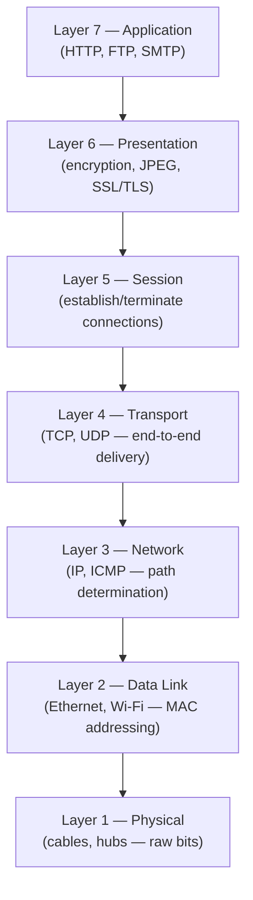

# Protocol Layering & OSI/TCP-IP Models

**Protocols, the rationale for layered architecture, the 7-layer OSI model, the 5-layer TCP/IP model, and encapsulation/decapsulation.**

## 1. The Real-World Situation — Start From Zero

Sending data across the planet involves dozens of sub-problems: which wire or radio carries the bits, who may speak on a shared channel, which path packets take, how lost data is recovered, and what the application's message even means. No single mechanism can solve all of that — so network designers split the job into a stack of **layers**, each solving one narrow problem and offering a service to the layer above it.

The problem before the solution: without layering, every application would need its own wiring, routing, and recovery logic, and changing one technology (say, copper to fiber) would force rewriting everything. Layering contains each change inside one layer.

::: callout-intuition Core Mental Model: Flying From New York to London
In human conversation, a protocol governs *what* is said and *when*. If you ask "What time is it?", the protocol dictates a reply with the time — not an unrelated song. Network protocols are the same idea, formalized: they define the exact **format** and **order** of messages exchanged, plus the **actions** taken when a message is sent or received.

Now think about flying internationally. You don't hand your passport to the pilot or discuss baggage weight with air traffic control — the trip is broken into independent **layers**: buying a ticket, checking bags, boarding at the gate, and the physical act of flying. Each layer only needs to know how to talk to the layer directly above and below it. If the airline switches from human baggage handlers to robots, your ticketing and boarding experience doesn't change at all. This independence between layers — **modularity** — is exactly why network designers split the impossibly complex job of "send data anywhere in the world" into a stack of layers, each solving one narrow problem.

Dropping the airport now: a **protocol** is the formal version of conversational etiquette, and **layering** is the formal version of the ticket/baggage/boarding split — the rest of this note names the actual layers.
:::

## 2. Words First — Every Term Defined

| Term (abbreviation expanded on first use) | Plain meaning |
|---|---|
| **Protocol** | The rules for one conversation: message **format**, message **order**, and the **actions** taken on send/receive. |
| **Layer / layered architecture** | One horizontal slice of the networking job (e.g. routing), implemented independently and talking only to adjacent layers. |
| **OSI (Open Systems Interconnection) model** | A 7-layer reference framework by the ISO (International Organization for Standardization): vocabulary and design guide, rarely implemented literally. |
| **TCP/IP (Transmission Control Protocol / Internet Protocol) suite** | The 5-layer practical stack the Internet actually runs on. |
| **PDU (Protocol Data Unit)** | What a layer calls its packaged data: Message, Segment, Datagram, Frame, Bits. |
| **Encapsulation** | Each layer wrapping the layer-above payload in its own header as data descends the sender's stack. |
| **Decapsulation** | Each layer reading and stripping only its own header as data ascends the receiver's stack. |
| **Interface / service** | The boundary contract between adjacent layers: what the lower layer offers, what the upper layer may assume. |

::: toggle What does `protocol` mean?
A `protocol` defines message format, message order, and actions on send or receive.
Format says what bits go where, order says who speaks when, actions say what each side does next.
Tiny example: asking the time expects a time as the reply, not a song.
:::

::: toggle What does `layer` mean?
A `layer` is one horizontal slice of the networking job, such as routing or reliable delivery.
Each layer talks only to the layers directly above and below it through a fixed interface.
Why it helps: swapping copper for fiber changes one layer while the rest keep working.
:::

## 3. Purpose — The Two Models, Then What Travels on the Wire

### 3.1 The OSI Reference Model (7 Layers)

Created by ISO as a conceptual, vendor-neutral framework. Rarely implemented exactly as-is in software, but universally used by engineers as a shared troubleshooting vocabulary.

> **Mnemonic (bottom to top):** **P**lease **D**o **N**ot **T**hrow **S**ausage **P**izza **A**way

SSL/TLS (Secure Sockets Layer / Transport Layer Security) provides encryption; JPEG is an image format handled at the presentation layer; MAC (Media Access Control) addresses name adapters on one link; IP (Internet Protocol) and ICMP (Internet Control Message Protocol) handle global addressing and error reporting; TCP (Transmission Control Protocol) and UDP (User Datagram Protocol) are the two transport personalities.

### 3.2 The TCP/IP Model (5 Layers) — Packet Structure Names

The Internet actually runs on the simpler, practical TCP/IP suite, which merges OSI's top three layers into one:

| TCP/IP Layer | Corresponds to OSI | Protocol Data Unit (PDU) |
|---|---|---|
| Application | Layers 5, 6, 7 combined | **Message** |
| Transport | Layer 4 | **Segment** |
| Network | Layer 3 | **Datagram** (Packet) |
| Link | Layer 2 | **Frame** |
| Physical | Layer 1 | **Bits** |

::: callout-formula KTU Formula Vault: PDU Names per Layer
Memorize top-down: **M**essage (Application) → **S**egment (Transport) → **D**atagram (Network) → **F**rame (Link) → **B**its (Physical). The classic 3-mark question gives the five names scrambled and asks you to match each to its layer — rehearse it in both directions.
:::

### 3.3 Operation Flow: Encapsulation and Decapsulation

As data descends the sender's stack, each layer wraps the payload from the layer above inside its own header — like nesting a letter inside progressively larger envelopes.

```mermaid
flowchart LR
    subgraph Sender["Sender: Encapsulation (going down)"]
        direction TB
        M["Application: Message"] --> S["Transport adds header → Segment"]
        S --> D["Network adds IP header → Datagram"]
        D --> F["Link adds MAC header/trailer → Frame"]
    end
    F -->|"Bits travel across physical medium"| G[" "]
    subgraph Receiver["Receiver: Decapsulation (going up)"]
        direction BT
        F2["Link reads/strips header → Datagram"] --> D2["Network reads/strips header → Segment"]
        D2 --> S2["Transport reads/strips header → Message"]
        S2 --> M2["Application: Message delivered"]
    end
    G --> F2
```

On the receiving side, the process reverses exactly: each layer reads only *its own* header, strips it off, and passes the remaining payload up to the next layer — which never needs to inspect headers from any layer other than its own peer.

::: toggle What does `encapsulation` mean?
`Encapsulation` is each layer wrapping the payload from above in its own header on the way down.
What goes in: the upper-layer message; what comes out: a larger unit with a new header added.
Tiny example: an HTTP message gains a TCP header, then an IP header, then a MAC header.
:::

::: toggle Why is a `Segment` different from a `Datagram` or `Frame`?
The name records how far down the stack the data has travelled and which header is outermost.
`Segment` is the transport unit, `Datagram` the network unit, `Frame` the link unit.
So the same HTTP bytes are called a message, then segment, then datagram, then frame.
:::

## 4. Examples — Tiny First, Then Exam-Level

### 4.1 Toy Example (30 seconds)

You send the 3-letter message "HI!". The application layer holds a **Message** ("HI!"). Transport adds its header → **Segment**. Network adds the IP (Internet Protocol) header → **Datagram**. Link adds its header and trailer → **Frame**. Physical sends **bits**. Same three characters, five names — the name tells you how far down the stack the data has travelled.

### 4.2 KTU-Style Worked Example

::: step [Step 1: Setup] Formulating the Problem
A browser sends an HTTP (HyperText Transfer Protocol) GET request for a web page. Trace what the message is called at each layer of the TCP/IP stack as it travels down the sender's stack and is transmitted onto the wire.
:::

::: step [Step 2: Execution] Applying Encapsulation Layer by Layer
1. **Application layer:** The browser constructs the HTTP GET request — this is a **Message**.
2. **Transport layer:** TCP wraps the message with a header (containing source/destination port, sequence numbers) — it is now a **Segment**.
3. **Network layer:** IP wraps the segment with a header (containing source/destination IP address) — it is now a **Datagram**.
4. **Link layer:** Ethernet or Wi-Fi wraps the datagram with a MAC header and trailer — it is now a **Frame**.
5. **Physical layer:** The frame is converted into a stream of **bits** — electrical signals, light pulses, or radio waves — and transmitted onto the medium.
:::

::: step [Step 3: Conclusion] Final Result
The same logical HTTP request is renamed at every layer (Message → Segment → Datagram → Frame → Bits) as successive headers are added. At the receiving web server, this exact sequence runs in reverse: bits are reassembled into a frame, the frame's header is stripped to reveal a datagram, the datagram's header is stripped to reveal a segment, and finally the segment's header is stripped to reveal the original HTTP Message, which is handed to the server's application process.
:::

## 5. Distinctions, Watch-Outs, and Exam Recap

| Pair students confuse | Distinction that earns marks |
|---|---|
| OSI 7 vs. TCP/IP 5 | OSI is the reference vocabulary (Presentation/Session named separately); TCP/IP is the running code (top three merged into Application). |
| Encapsulation vs. decapsulation | Down the sender (add headers) vs. up the receiver (strip only your own layer's header). |
| Segment vs. datagram vs. frame | Transport vs. network vs. link PDU — layer identity, not size. |
| Protocol vs. interface | Protocol = rules *within* a layer across machines; interface = contract *between* adjacent layers on one machine. |

**Watch out:** (1) Assigning PDU names to the wrong layer (the #1 scramble question — drill both directions). (2) Saying the receiver "reads all headers at once" — each layer touches only its peer's header. (3) Calling OSI "the Internet's stack" — the Internet runs TCP/IP; OSI is the reference model.

::: callout-exam KTU Exam Focus: One-Paragraph Recap
Protocol = format + order + actions. Layering buys modularity (change one layer, keep its service). OSI 7 bottom-up: Physical, Data Link, Network, Transport, Session, Presentation, Application. TCP/IP 5: Application, Transport, Network, Link, Physical. PDU order top-down: Message → Segment → Datagram → Frame → Bits. Encapsulation descends (wrap), decapsulation ascends (strip own header only).
:::

**Active-recall checklist:** What three things does a protocol define? Why does layering let Wi-Fi replace Ethernet transparently? Recite the PDU names top-down and bottom-up. Which header does the network layer strip on receipt?

## 6. Active Recall Quizzes

::: quiz Q1: Foundational Concept
Why is modularity/layering highly beneficial in network design?
(A) It makes every layer aware of every other layer's internal implementation
(*B) It lets each layer change its internal implementation independently, as long as it keeps offering the same service to the layer above it
(C) It reduces the total number of headers required for transmission
(D) It eliminates the need for standardized protocols
::: explanation
Layering isolates change: as long as a layer's *interface* to its neighbors stays the same, its internal implementation can be swapped out (e.g., replacing Wi-Fi with Ethernet at the link layer) without requiring any changes to the layers above or below it — exactly like the airline being able to automate baggage handling without affecting ticketing.
:::

::: quiz Q2: Foundational Concept
Match the Protocol Data Unit (PDU) to its corresponding TCP/IP layer: Frame, Segment, Datagram, Message.
(A) Frame=Application, Segment=Network, Datagram=Transport, Message=Link
(*B) Frame=Link, Segment=Transport, Datagram=Network, Message=Application
(C) Frame=Physical, Segment=Application, Datagram=Link, Message=Transport
(D) Frame=Network, Segment=Link, Datagram=Application, Message=Transport
::: explanation
Each layer's PDU has a distinct name: the Application layer produces Messages, the Transport layer wraps them into Segments, the Network layer wraps those into Datagrams, and the Link layer wraps those into Frames — which are finally transmitted as raw bits by the Physical layer.
:::

::: quiz Q3: Foundational Concept
In the OSI model, which layer is responsible for encryption/decryption and data representation formats like JPEG?
(A) Application (Layer 7)
(*B) Presentation (Layer 6)
(C) Session (Layer 5)
(D) Transport (Layer 4)
::: explanation
The Presentation layer (Layer 6) handles how data is represented, encoded, and secured — including encryption/decryption (SSL/TLS) and format conversions (JPEG) — distinct from the Application layer, which deals with the actual network process (like HTTP or FTP).
:::
