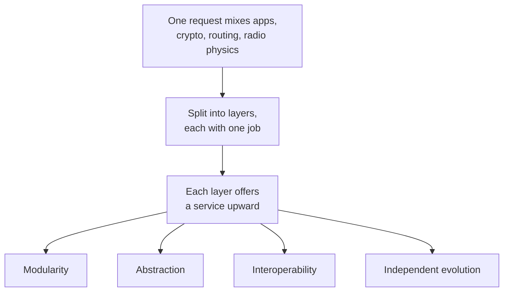
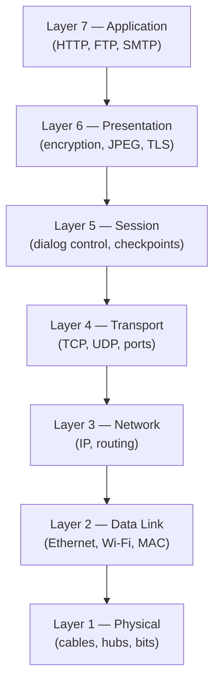
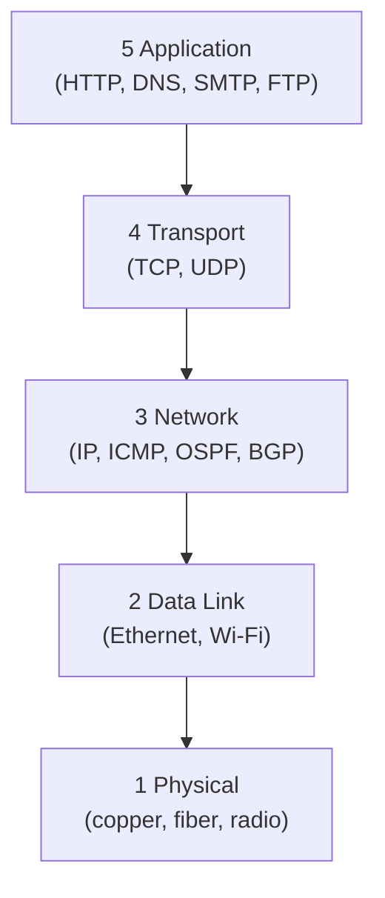
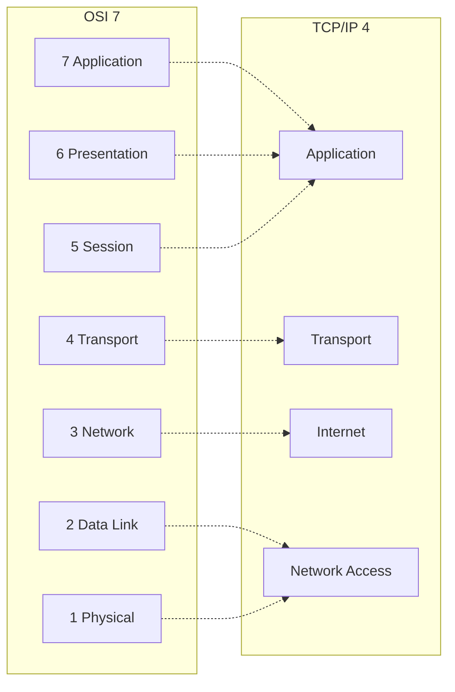
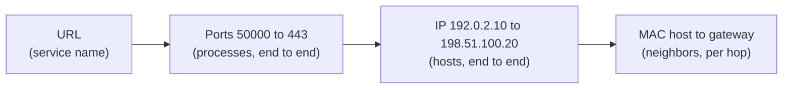
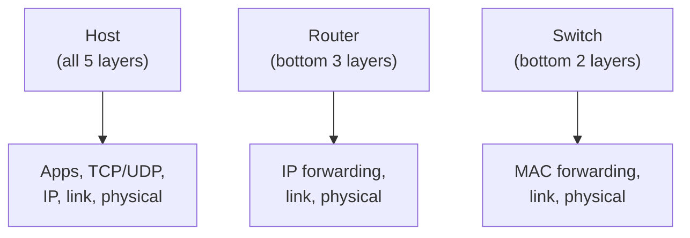
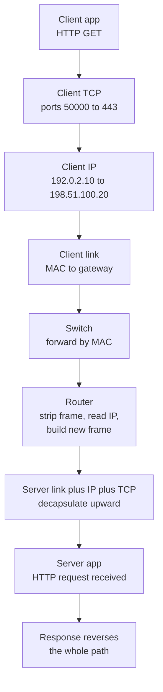

# Protocol Layering & OSI/TCP-IP Models

**Protocols, services and interfaces, the 7-layer OSI model, the TCP/IP suite, PDU names, encapsulation/decapsulation, MAC/IP/port addressing, and the end-to-end browser trace.**

## 1. The Real-World Situation — Start From Zero

Sending data across the planet involves dozens of sub-problems: which wire or radio carries the bits, who may speak on a shared channel, which path packets take, how lost data is recovered, and what the application's message even means. No single mechanism can solve all of that — so network designers split the job into a stack of **layers**, each solving one narrow problem and offering a service to the layer above it.

The problem before the solution: without layering, every application would need its own wiring, routing, and recovery logic, and changing one technology (say, copper to fiber) would force rewriting everything. Layering contains each change inside one layer.

::: callout-intuition Core Mental Model: Flying From New York to London
In human conversation, a protocol governs *what* is said and *when*. If you ask "What time is it?", the protocol dictates a reply with the time — not an unrelated song. Network protocols are the same idea, formalized: they define the exact **format** and **order** of messages exchanged, plus the **actions** taken when a message is sent or received.

Now think about flying internationally. You don't hand your passport to the pilot or discuss baggage weight with air traffic control — the trip is broken into independent **layers**: buying a ticket, checking bags, boarding at the gate, and the physical act of flying. Each layer only needs to know how to talk to the layer directly above and below it. If the airline switches from human baggage handlers to robots, your ticketing and boarding experience doesn't change at all. This independence between layers — **modularity** — is exactly why network designers split the impossibly complex job of "send data anywhere in the world" into a stack of layers, each solving one narrow problem.

Dropping the airport now: a **protocol** is the formal version of conversational etiquette, and **layering** is the formal version of the ticket/baggage/boarding split — the rest of this note names the actual layers.
:::

## 2. Words First — Every Term Defined

| Term (abbreviation expanded on first use) | Plain meaning |
|---|---|
| **Protocol** | The rules for one conversation: message **format**, message **order**, and the **actions** taken on send/receive. |
| **Service** | What a layer *offers* the layer directly above it (e.g. "deliver these bytes reliably") — the vertical promise. |
| **Interface (SAP — Service Access Point)** | The boundary contract through which the upper layer *calls* the lower layer's service on the same machine. |
| **Peer entities** | The two matching layer-N programs on different machines (your TCP ↔ the server's TCP) that converse *logically* via a protocol. |
| **Layer / layered architecture** | One horizontal slice of the networking job (e.g. routing), implemented independently and talking only to adjacent layers. |
| **OSI (Open Systems Interconnection) model** | A 7-layer reference framework by the ISO (International Organization for Standardization): vocabulary and design guide, rarely implemented literally. |
| **TCP/IP (Transmission Control Protocol / Internet Protocol) suite** | The practical protocol family the Internet actually runs on — described with 4 or 5 layers depending on the textbook. |
| **PDU (Protocol Data Unit)** | What a layer calls its packaged data: Message, Segment/Datagram, Packet/Datagram, Frame, Bits. |
| **SDU (Service Data Unit) / payload** | The untouched upper-layer data a layer receives — to layer N, layer N+1's whole PDU is just opaque payload bytes. |
| **Header / trailer** | Control metadata a layer *prepends* (header) or *appends* (trailer, mainly link layer for error checks) to the payload. |
| **Encapsulation** | Each layer wrapping the layer-above payload in its own header as data descends the sender's stack. |
| **Decapsulation** | Each layer reading and stripping only its own header as data ascends the receiver's stack. |

::: toggle What does `protocol` mean?
A `protocol` defines message format, message order, and actions on send or receive.
Format says what bits go where, order says who speaks when, actions say what each side does next.
Tiny example: asking the time expects a time as the reply, not a song.
:::

::: toggle What does `layer` mean?
A `layer` is one horizontal slice of the networking job, such as routing or reliable delivery.
Each layer talks only to the layers directly above and below it through a fixed interface.
Why it helps: swapping copper for fiber changes one layer while the rest keep working.
:::

## 3. Purpose — Why Layers, Then What Travels on the Wire

### 3.1 Why Protocol Layering Exists (First Principles)

One web request combines wildly different responsibilities: application meaning (what is this page?), representation/encryption (bytes, TLS), reliable delivery (resend what was lost), addressing (which host? which app?), routing (which path?), framing (who speaks on this wire?), and physical transmission (voltages, light, radio).

- **Why one giant protocol fails.** A monolith fuses every concern: a radio retune would ripple into the browser, two vendors could never interoperate on half the system, a single bug would be undebuggable, and testing would mean testing *everything* at once. Complexity grows faster than the sum of its parts.
- **Why layering fixes it.** Each layer owns one sub-problem and offers a *service* upward: **modularity** (small testable pieces), **abstraction** (HTTP never sees radio waves), **interoperability** (any vendor's layer-N works with any other's if the interface holds), **independent evolution** (Wi-Fi replaces Ethernet underneath an untouched TCP/HTTP), **easier troubleshooting** (check the cable light before blaming routing tables), and **easier implementation** (write one layer, reuse the rest).
- **What layering precisely guarantees — and does not.** It guarantees *change isolation through stable interfaces*: swapping a layer's internals is safe *if* its service contract holds. It does **not** make anything faster, does **not** remove header overhead (each layer *adds* bytes), and does **not** mean applications survive *any* lower-layer change — only changes that preserve the promised service. "Changing Wi-Fi requires rewriting the browser" is false *because* the service (deliver frames) is preserved, not because layers are magic.

### 3.2 Protocol vs. Service vs. Interface (With Concrete Example)

- **Protocol — WHAT:** rules used by *peer entities* (same layer, different machines) to communicate. *Why:* two independent implementations must agree bit-for-bit. *How:* format + order + actions (M1T1 §3.13). *Example:* your TCP and the server's TCP agree on sequence numbers and retransmission.
- **Service — WHAT:** functionality one layer *provides to the layer above it* on the same machine. *Why:* lets the upper layer stay ignorant of lower mechanics. *Example:* TCP offers the browser "a reliable byte stream" — the browser never sees packets, losses, or retransmissions.
- **Interface (SAP) — WHAT:** the boundary mechanism (function calls, primitives like request/indication) through which the upper layer *accesses* that service. *Why:* freezes the contract so either side's internals can be rewritten safely. *Example:* the socket API between your app and TCP — the OS can replace its whole TCP engine and your browser keeps calling the same socket functions.

| Aspect | Protocol | Service | Interface |
|---|---|---|---|
| Direction | Horizontal (peer to peer, across machines) | Vertical (lower layer to upper layer, same machine) | Vertical boundary on one machine |
| Answers | "How do equals converse?" | "What do I get?" | "How do I ask for it?" |
| Example | TCP rules between two hosts | Reliable byte stream for the browser | Socket API calls |
| Changes when | Either peer's wire behavior changes | Promised capability changes | Function signatures change |

### 3.3 Protocol Data Units — Names Earn Marks

- **What a PDU is.** The packaged unit *exchanged between peer entities at one layer* — payload plus that layer's control metadata.
- **Why PDUs exist.** Each layer needs somewhere to put its own instructions (addresses, ports, checksums) without corrupting the upper layer's data — so it wraps the payload and names the bundle.
- **Payload / header / trailer.** The *payload* (SDU) is the upper layer's untouched bundle; the *header* is prepended control data (addresses, sequence numbers, flags); the *trailer* is appended control data, used mainly at the link layer for error checks (Ethernet FCS — Frame Check Sequence / CRC — Cyclic Redundancy Check).
- **Names per layer (TCP/IP view).** Application → **Message**; Transport → **Segment** (TCP) or **Datagram** (UDP); Network → **Packet** (also called datagram in IP/RFC usage); Data Link → **Frame**; Physical → **Bits/signals**.
- **Terminology caution.** "Packet" is used *generically* for any bundled chunk and *specifically* for the network-layer PDU — read which meaning the question intends from context (a "packet sniffer" captures frames; an "IP packet" is layer 3). Likewise "datagram" names both UDP's transport PDU and IP's network PDU in different RFCs. Never claim every textbook uses identical names — qualify by layer.

### 3.4 Encapsulation — Down the Sender's Stack (HTTP Example)

Teach it as a pipeline: application data → transport header + data → network header + transport PDU → link header/trailer + network PDU → bits. At *every* stage know four things: what is added, why, who will use it, and what the bundle is now called.

1. **Application:** browser builds HTTP GET — added: nothing yet (raw message); used by: server's HTTP process; called: **Message**.
2. **Transport (TCP):** adds H_tcp with source/destination **ports** + sequence numbers — why: direct bytes to the right *process* and order them; used by: receiver's TCP; called: **Segment**.
3. **Network (IP):** adds H_ip with source/destination **IP addresses** — why: route across networks to the right *host*; used by: routers + receiver's IP; called: **Packet**.
4. **Link (Ethernet/Wi-Fi):** adds H_link with source/destination **MAC addresses** + trailer with FCS — why: deliver to the right *neighbor on this wire* and detect bit errors; used by: next-hop NIC; called: **Frame**.
5. **Physical:** converts the frame to voltages/light/radio — why: nothing travels until bits become signals; called: **Bits**.

```mermaid
flowchart LR
    accTitle: Encapsulation down the sender stack and decapsulation up the receiver stack
    accDescr: Each sender layer wraps the payload with its header going down; each receiver layer strips only its own header going up.
    subgraph Sender["Sender: encapsulation (down)"]
        direction TB
        M["Application<br/>Message"] --> S["Transport adds header<br/>Segment"]
        S --> D["Network adds IP header<br/>Packet"]
        D --> F["Link adds header/trailer<br/>Frame"]
    end
    F -->|Bits on the medium| G["Receiver link"]
    subgraph Receiver["Receiver: decapsulation (up)"]
        direction BT
        F2["Link strips header<br/>Packet"] --> D2["Network strips header<br/>Segment"]
        D2 --> S2["Transport strips header<br/>Message"]
        S2 --> M2["Application<br/>Message delivered"]
    end
    G --> F2
```

**Overhead math (worked).** HTTP payload 1,000 bytes + 20-byte TCP header + 20-byte IPv4 header + 18-byte Ethernet header/trailer (14 + 4) → total frame = 1,058 bytes; overhead = 58 bytes ≈ **5.48%**; efficiency (goodput) = 1,000/1,058 ≈ **94.52%**. *Interpretation:* headers cost single-digit percent on large transfers — the price of layering's services, and why tiny payloads (e.g. VoIP) feel overhead most.

::: toggle What does `encapsulation` mean?
`Encapsulation` is each layer wrapping the payload from above in its own header on the way down.
What goes in: the upper-layer message; what comes out: a larger unit with a new header added.
Tiny example: an HTTP message gains a TCP header, then an IP header, then a MAC header.
:::

::: toggle Why is a `Segment` different from a `Datagram` or `Frame`?
The name records how far down the stack the data has travelled and which header is outermost.
`Segment` is the transport unit, `Datagram` the network unit, `Frame` the link unit.
So the same HTTP bytes are called a message, then segment, then datagram, then frame.
:::

### 3.5 Decapsulation — Up the Receiver's Stack

The exact reverse, with one strict rule: each layer reads and strips **only its own peer's header**, treating everything inside as opaque payload.

1. **Physical:** signals → bits, reassemble the frame.
2. **Link:** verify FCS trailer (discard on error), match destination MAC to this NIC, strip header/trailer → hand the **packet** up.
3. **Network:** match destination IP to this host, strip IP header → hand the **segment** up.
4. **Transport:** read destination port → correct process, reorder/reassemble, strip header → deliver the **message** to the app.
5. **Application:** server process (e.g. Nginx) parses the HTTP request.

*Result:* the receiver's layer-N interprets exactly the headers the sender's layer-N created — layers never peek into each other's envelopes.

### 3.6 Peer-Layer Communication — Logical vs. Physical Paths

- **Physical movement** is vertical-then-horizontal-then-vertical: down the sender's stack, across wires and middleboxes, up the receiver's stack. Bits never leap sideways between two application processes.
- **Logical peer communication** is horizontal: sender Transport ↔ receiver Transport converse *conceptually* in TCP (sequence numbers, ACKs), sender Network ↔ receiver Network in IP — even though every one of those "conversations" physically rides inside lower-layer envelopes.
- *Why the distinction matters:* exam diagrams showing a straight Transport↔Transport arrow test whether you know the arrow is *logical* — the bits actually travel down, across, and up. Confusing the two is a classic trap.

### 3.7 The OSI 7-Layer Model — Every Layer, Then the Recap Table

ISO's reference framework: vocabulary and design guide, rarely implemented literally. Read bottom-up (bits → apps), and for *each* layer learn purpose → problem → handling → PDU/addressing → examples → misconception.

**L1 Physical — WHAT:** transmits raw bits as signals over a medium. *Problem:* bits must become physics (voltages, light pulses, radio waves, connector shapes, timing). *Handles:* no addresses, no PDU beyond **bits**. *Examples:* RJ45 copper, fiber, radio, hubs, repeaters. *Misconception:* "the physical layer is the cable" — it is the *signaling standards and bit transmission*, of which the cable is only the medium.

**L2 Data Link — WHAT:** node-to-node frame delivery over *one* link. *Problem:* wires are noisy and shared; bits need framing, local addressing, error detection, and medium access. *Handles:* **frames**, **MAC addresses** (48-bit NIC identifiers, local-link scope), FCS error detection, access rules (CSMA/CD on classic Ethernet, CSMA/CA on Wi-Fi). Sub-layers: LLC (top half, talks to L3) and MAC (bottom half, talks to hardware). *Examples:* Ethernet (IEEE 802.3), Wi-Fi (IEEE 802.11), PPP; switches, NICs. *Misconception:* MAC addresses route across the Internet — they never leave their local link.

**L3 Network — WHAT:** host-to-host delivery across *many* networks. *Problem:* endpoints live on different links worldwide. *Handles:* **packets**, logical **IP addresses** (global scope), routing (computing paths: OSPF, BGP) and forwarding (per-packet port selection). *Examples:* IPv4, IPv6, ICMP, IPsec; routers. *Misconception:* routing and forwarding are synonyms — routing fills tables (control plane), forwarding uses them per packet (data plane), as drilled in M1T1.

**L4 Transport — WHAT:** process-to-process delivery between apps. *Problem:* one host runs dozens of networked processes sharing one IP address. *Handles:* **segments** (TCP) / **datagrams** (UDP), 16-bit **port numbers** for multiplexing/demultiplexing, plus reliability, flow-control, and congestion-control *concepts* (full TCP/UDP mechanics belong to later transport topics — not here). *Examples:* TCP (reliable, connection-oriented), UDP (fast, connectionless). *Misconception:* ports identify machines — they identify *processes on* a machine.

**L5 Session — WHAT:** manages dialogs between apps: establishing, maintaining, synchronizing, terminating sessions. *Problem:* long exchanges need structure and recovery points. *Handles:* session setup/teardown, checkpoint markers (resume a 2 GB transfer from the last checkpoint, not byte zero). *Examples:* RPC, NetBIOS, SQL sessions. *Misconception (critical):* modern browsers open "OSI session layers" — they don't; see §3.7's mapping note.

**L6 Presentation — WHAT:** data representation: syntax, encoding, compression, encryption. *Problem:* hosts disagree on formats (ASCII vs. Unicode, byte order) and need secrecy. *Handles:* character sets, image formats (JPEG/PNG), compression (gzip), crypto (TLS/SSL concepts). *Examples:* TLS, ASN.1, MIME types. *Misconception (critical):* TLS sits neatly "at layer 6" — in deployed stacks TLS is a library/shim used *by* applications, roughly between application and transport, not a standalone wire layer.

**L7 Application — WHAT:** network services directly for user software. *Problem:* every app needs a standard way to ask the network for things. *Handles:* **messages** in app protocols. *Examples:* HTTP/HTTPS, SMTP, DNS, FTP, SSH. *Misconception:* "application layer" means phone/laptop apps themselves — it means the *network-facing protocols* those apps speak.

**Session/Presentation/Application in the real Internet — the honest mapping.** Modern stacks do *not* implement three separate wire layers: session-like duties (cookies, tokens, reconnect logic) live *inside* applications; presentation-like duties (JSON/HTML encoding, TLS encryption, gzip) live in *libraries the application calls*. So: learn the three OSI roles for vocabulary, but never claim a browser emits distinct "session PDUs" — exam answers about the real Internet fold all three into the application.

> **Mnemonic (bottom to top):** **P**lease **D**o **N**ot **T**hrow **S**ausage **P**izza **A**way (top-down: **A**ll **P**eople **S**eem **T**o **N**eed **D**ata **P**rocessing).

### 3.8 TCP/IP — 4 Layers or 5? (Not a Contradiction)

- **Why two counts.** The historical 4-layer TCP/IP model (Application, Transport, Internet, Network Access/Link) was designed *after* working protocols existed and never split wires from signals. Teachers add a 5th split (…Network, Data Link, Physical) to reuse OSI's crisp L1/L2 separation. Same protocols, different grouping granularity — a pedagogical choice, not a standards war.
- **The 5-layer teaching stack used in this course:** Application (HTTP, DNS, SMTP, FTP, SSH) → Transport (TCP, UDP) → Network (IPv4, IPv6, ICMP, OSPF, BGP) → Data Link (Ethernet 802.3, Wi-Fi 802.11, PPP) → Physical (copper, fiber, radio, hubs).
- **Suite placement logic.** Ask "what job does it do?": names/URLs and mail → Application; process delivery and reliability choices → Transport (TCP reliable/bytestream, UDP fast/datagram); global host addressing and path computation → Internet/Network (IP, ICMP for error reporting, OSPF/BGP for routing); one-hop neighbor delivery → Link (Ethernet, Wi-Fi); raw bit signaling → Physical.

### 3.9 OSI ↔ TCP/IP Mapping

OSI is the *reference model* (designed first, theoretically); TCP/IP is the *running suite* (designed from working code). They never align perfectly because TCP/IP folds OSI's top three into one application layer and never implemented session/presentation as wire protocols.

| OSI layers | TCP/IP (5-layer teaching) | TCP/IP (4-layer historic) | PDU |
|---|---|---|---|
| 7 Application, 6 Presentation, 5 Session | Application | Application | **Message** |
| 4 Transport | Transport | Transport | **Segment** (TCP) / Datagram (UDP) |
| 3 Network | Network | Internet | **Packet** (Datagram) |
| 2 Data Link | Data Link | Network Access / Link | **Frame** |
| 1 Physical | Physical | (folded into Network Access) | **Bits** |

::: callout-formula KTU Formula Vault: PDU Names per Layer
Memorize top-down: **M**essage (Application) → **S**egment (Transport) → **D**atagram (Network) → **F**rame (Link) → **B**its (Physical). The classic 3-mark question gives the five names scrambled and asks you to match each to its layer — rehearse it in both directions.
:::

### 3.10 Addressing at Different Layers — One Example, Every Value Explained

Four identifiers, four scopes — **not interchangeable**: MAC = *which neighbor on this wire*; IP = *which host on the planet*; port = *which process on that host*; application name = *which service for the human*.

Concrete session (illustrative documentation addresses, not universal): client 192.0.2.10 (TEST-NET-1 block reserved for examples) picks ephemeral port 50000; server 198.51.100.20 (TEST-NET-2) listens on port 443 (HTTPS).

- **Application identifier:** the URL/domain (e.g. `https://example.com`) names the *service*; DNS resolves it to 198.51.100.20 before any packet is built.
- **Port numbers:** 16-bit transport IDs (0–65535). Source 50000 = OS-picked ephemeral port identifying *this browser tab's socket*; destination 443 = well-known HTTPS port identifying the *server process*. Both stay constant end-to-end.
- **IP addresses:** source 192.0.2.10 → destination 198.51.100.20. Both stay constant across standard routers (NAT aside).
- **MAC addresses:** 48-bit hex NIC IDs (e.g. `AA:AA:…` → gateway `BB:BB:…`). Rewritten *every hop* to address the next local neighbor.

### 3.11 Hosts, Switches, and Routers — Layer Responsibilities

- **HOST:** runs applications and implements *all* layers — originates/terminates traffic, resolves names, multiplexes ports, routes via its own table, frames bits.
- **LAYER-2 SWITCH:** examines *link* headers, learns source MACs into a table, forwards frames to the port of the destination MAC *within its network*; never needs IP or ports for its core job.
- **LAYER-3 ROUTER:** strips each incoming frame, reads the destination *IP*, selects the next hop from routing-derived tables, and re-encapsulates the unchanged IP packet in a *new* frame per hop.
- **Anti-oversimplification (exam-safe).** Real boxes blur lines: "Layer-3 switches" route in hardware, home routers run DHCP/DNS apps, managed switches carry IP stacks for administration. So phrase answers functionally — "a switch *forwards on MAC addresses*; a router *forwards on IP addresses*" — never "a switch *contains only* layers 1–2."

### 3.12 Complete End-to-End Trace — Browser to Web Server

User enters a URL; follow every meaningful transition (client 192.0.2.10:50000 → server 198.51.100.20:443, gateway MACs as in §3.10):

1. **App:** browser builds `GET /index.html` (Message).
2. **Transport:** TCP adds ports 50000→443 + sequence numbers (Segment).
3. **Network:** IP adds 192.0.2.10→198.51.100.20 (Packet).
4. **Link:** Ethernet adds host-MAC→gateway-MAC + FCS (Frame) → bits on copper.
5. **Switch:** converts signals, matches gateway MAC in its table, forwards the *unchanged* frame; never touches IP.
6. **Router:** strips the frame, verifies FCS, reads destination IP, routes toward the server, builds a *new* frame with its own MAC → next-hop MAC.
7. **Core + server link:** repeats per hop until the server NIC accepts its MAC, strips link/IP/TCP headers in turn, and hands the HTTP request to the web process (e.g. Nginx).
8. **Response:** `200 OK` + HTML retraces the same logic in reverse (server ports swap to 443→50000).

### 3.13 Intermediate Hops — Frames Die, Packets Survive

The critical beginner concept: the **IP packet generally continues unchanged** toward the destination while **each link frame is local-only and replaced per hop.** Two-router example — laptop → router R1 → router R2 → server:

- Hop 1 frame: MAC laptop→R1-in; IP 192.0.2.10→198.51.100.20.
- R1 strips hop-1 frame, routes on the *unchanged* destination IP, builds hop-2 frame: MAC R1-out→R2-in; same IPs.
- R2 repeats: MAC R2-out→server; same IPs. Only the frame headers churn; the packet payload (and TCP ports) ride through untouched.
- *Qualification:* NAT (Network Address Translation) devices *do* rewrite IPs at borders — the "IPs never change" rule holds for standard routing; name NAT as the exception when questions involve home gateways.

## 4. Examples — Tiny First, Then Exam-Level

### 4.1 Toy Example (30 seconds)

You send the 3-letter message "HI!". The application layer holds a **Message** ("HI!"). Transport adds its header → **Segment**. Network adds the IP header → **Datagram**. Link adds its header and trailer → **Frame**. Physical sends **bits**. Same three characters, five names — the name tells you how far down the stack the data has travelled.

### 4.2 KTU-Style Worked Example: Tracing an HTTP GET

::: step [Step 1: Setup] Formulating the Problem
A browser sends an HTTP (HyperText Transfer Protocol) GET request for a web page. Trace what the message is called at each layer of the TCP/IP stack as it travels down the sender's stack and is transmitted onto the wire.
:::

::: step [Step 2: Execution] Applying Encapsulation Layer by Layer
1. **Application layer:** The browser constructs the HTTP GET request — this is a **Message**.
2. **Transport layer:** TCP wraps the message with a header (containing source/destination port, sequence numbers) — it is now a **Segment**.
3. **Network layer:** IP wraps the segment with a header (containing source/destination IP address) — it is now a **Datagram**.
4. **Link layer:** Ethernet or Wi-Fi wraps the datagram with a MAC header and trailer — it is now a **Frame**.
5. **Physical layer:** The frame is converted into a stream of **bits** — electrical signals, light pulses, or radio waves — and transmitted onto the medium.
:::

::: step [Step 3: Conclusion] Final Result
The same logical HTTP request is renamed at every layer (Message → Segment → Datagram → Frame → Bits) as successive headers are added. At the receiving web server, this exact sequence runs in reverse: bits are reassembled into a frame, the frame's header is stripped to reveal a datagram, the datagram's header is stripped to reveal a segment, and finally the segment's header is stripped to reveal the original HTTP Message, which is handed to the server's application process.
:::

### 4.3 Worked Calculation: Protocol Overhead

::: step [Step 1: Setup] Reading the Question
A 1,400-byte file chunk is sent with a 20-byte TCP header, a 20-byte IP header, and a 26-byte Wi-Fi header/trailer. Find total frame size, overhead ratio, and efficiency.
:::

::: step [Step 2: Execution] Adding and Dividing
1. **Total:** 1,400 + 20 + 20 + 26 = **1,466 bytes**.
2. **Overhead:** 66 bytes → 66/1,466 × 100 ≈ **4.50%**.
3. **Efficiency:** 1,400/1,466 × 100 ≈ **95.50%**.
:::

::: step [Step 3: Conclusion] Interpretation
Over 95% of the wire carries user data here — headers cost single digits on large transfers, which is exactly why tiny real-time payloads feel overhead most.
:::

## 5. Distinctions, Watch-Outs, and Exam Recap

| Pair students confuse | Distinction that earns marks |
|---|---|
| OSI 7 vs. TCP/IP 5 (or 4) | OSI is the reference vocabulary (Presentation/Session named separately); TCP/IP is the running code (top three merged into Application; 4-vs-5 is granularity, not contradiction). |
| Protocol vs. service vs. interface | Horizontal peer rules vs. vertical capability offered upward vs. the call boundary between adjacent layers. |
| Encapsulation vs. decapsulation | Down the sender (add headers) vs. up the receiver (strip only your own layer's header). |
| Segment vs. datagram vs. frame | Transport vs. network vs. link PDU — layer identity, not size; "packet" is generic in prose, specific at L3. |
| MAC vs. IP vs. port | Local neighbor (rewritten per hop) vs. global host (end-to-end) vs. process on a host (end-to-end). |
| Switch vs. router | Forwards on MACs within a network vs. forwards on IPs between networks — functionally, not "contains only layers X–Y". |
| Routing vs. forwarding | Global path computation filling tables vs. local per-packet port selection. |
| Physical vs. logical path | Bits travel down-across-up; peer entities converse *conceptually* side to side. |
| Internet vs. OSI | The Internet runs TCP/IP; OSI is the teaching/reference framework, not a deployed competitor. |

**Watch out:** (1) Assigning PDU names to the wrong layer (the #1 scramble question — drill both directions). (2) Saying the receiver "reads all headers at once" — each layer touches only its peer's header. (3) Calling OSI "the Internet's stack" — the Internet runs TCP/IP; OSI is the reference model. (4) Claiming TLS/session boxes are wire layers — in deployed stacks they live in application libraries. (5) "IPs change at every router" — frames change, IPs (normally) don't; NAT is the named exception. (6) Presenting 4-vs-5-layer counts as a contradiction — it is grouping granularity.

::: callout-exam KTU Exam Focus: One-Paragraph Recap
Protocol = format + order + actions; service = what a layer offers upward; interface = how the upper layer calls it. Layering buys modularity, abstraction, interoperability, independent evolution. OSI 7 bottom-up: Physical, Data Link, Network, Transport, Session, Presentation, Application. TCP/IP: 5 teaching layers (or historic 4) with the top three OSI layers merged. PDU order top-down: Message → Segment → Datagram → Frame → Bits. Encapsulation descends (wrap), decapsulation ascends (strip own header only); peers converse logically while bits travel physically. MAC = per-hop neighbor, IP = end-to-end host, port = end-to-end process; switches forward frames by MAC, routers forward packets by IP into fresh frames.
:::

**Active-recall checklist:** What three things does a protocol define, and how do service and interface differ? Why does layering let Wi-Fi replace Ethernet transparently — and what does it *not* guarantee? Recite the PDU names top-down and bottom-up. Which header does the network layer strip on receipt? Why do session/presentation have no wire PDUs in real browsers? What stays constant across router hops — MACs or IPs? Which address delivers a reply to your browser tab instead of your music app?

## 6. Active Recall Quizzes

::: quiz Q1: Foundational Concept
Why is modularity/layering highly beneficial in network design?
(A) It makes every layer aware of every other layer's internal implementation
(*B) It lets each layer change its internal implementation independently, as long as it keeps offering the same service to the layer above it
(C) It reduces the total number of headers required for transmission
(D) It eliminates the need for standardized protocols
::: explanation
Layering isolates change: as long as a layer's *interface* to its neighbors stays the same, its internal implementation can be swapped out (e.g., replacing Wi-Fi with Ethernet at the link layer) without requiring any changes to the layers above or below it — exactly like the airline being able to automate baggage handling without affecting ticketing.
:::

::: quiz Q2: Foundational Concept
Match the Protocol Data Unit (PDU) to its corresponding TCP/IP layer: Frame, Segment, Datagram, Message.
(A) Frame=Application, Segment=Network, Datagram=Transport, Message=Link
(*B) Frame=Link, Segment=Transport, Datagram=Network, Message=Application
(C) Frame=Physical, Segment=Application, Datagram=Link, Message=Transport
(D) Frame=Network, Segment=Link, Datagram=Application, Message=Transport
::: explanation
Each layer's PDU has a distinct name: the Application layer produces Messages, the Transport layer wraps them into Segments, the Network layer wraps those into Datagrams, and the Link layer wraps those into Frames — which are finally transmitted as raw bits by the Physical layer.
:::

::: quiz Q3: Foundational Concept
In the OSI model, which layer is responsible for encryption/decryption and data representation formats like JPEG?
(A) Application (Layer 7)
(*B) Presentation (Layer 6)
(C) Session (Layer 5)
(D) Transport (Layer 4)
::: explanation
The Presentation layer (Layer 6) handles how data is represented, encoded, and secured — including encryption/decryption (SSL/TLS) and format conversions (JPEG) — distinct from the Application layer, which deals with the actual network process (like HTTP or FTP). In deployed stacks these duties live in application libraries rather than a separate wire layer.
:::

::: quiz Q4: Overhead Calculation
A 1,400-byte chunk is sent with 20-byte TCP + 20-byte IP + 26-byte Wi-Fi headers/trailers. What are total size, overhead, and efficiency?
(A) 1,440 bytes, 2.8%, 97.2% (forgot the Wi-Fi trailer)
(*B) 1,466 bytes, ≈4.50% overhead, ≈95.50% efficiency — sum all headers, then divide by the total
(C) 1,466 bytes, 95.50% overhead (ratio inverted)
(D) 1,400 bytes exactly — headers don't count on the wire
::: explanation
Total = 1,400 + 20 + 20 + 26 = 1,466 bytes; overhead = 66/1,466 ≈ 4.50%; efficiency = 1,400/1,466 ≈ 95.50%. Headers always ride the wire — small payloads feel them most.
:::

::: quiz Q5: Addressing
A reply must reach a browser tab (not a music app) on host 192.0.2.10. Which identifier delivers it to the right process?
(A) The destination MAC address
(*B) The destination port number — the OS demultiplexes by port to the owning socket/process
(C) The destination IP address alone
(D) The URL in the HTTP body
::: explanation
IP gets the packet to the *host*; the URL named the *service* before sending; the MAC only crossed the last wire. Only the 16-bit destination port tells the kernel *which process* owns the data — the browser tab's socket, not the music app's.
:::

::: quiz Q6: Intermediate Hops
A packet crosses two routers toward its server. What changes hop by hop, and what stays the same?
(A) IP addresses change; MAC addresses stay constant
(*B) Each link frame (MAC headers) is stripped and rebuilt per hop; source/destination IPs continue unchanged
(C) Port numbers are rewritten by every router
(D) The TCP payload is decrypted and re-encrypted at each hop
::: explanation
Frames are local envelopes: each router discards the old one and builds a fresh frame for the next neighbor. The IP packet (and the ports and payload inside) rides through untouched under standard routing — NAT middleboxes are the named exception.
:::

::: quiz Q7: Peer Communication
Your TCP and a server's TCP exchange sequence numbers and ACKs. What path do these messages physically take?
(A) Horizontally, straight from your transport layer to the server's
(*B) Logically peer-to-peer, but physically down your stack, across links and routers, and up the server's stack
(C) Through a dedicated TCP wire bypassing IP entirely
(D) They don't travel at all — both sides guess the numbers
::: explanation
Peer-layer arrows are *logical*: TCP speaks to TCP using its protocol rules, but every such message physically descends as payload through IP and link layers, crosses the network, and ascends the far stack. Confusing the logical arrow with the physical path is the classic trap.
:::
