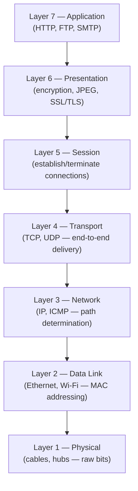

# Protocol Layering & OSI/TCP-IP Models

**Protocols, the rationale for layered architecture, the 7-layer OSI model, the 5-layer TCP/IP model, and encapsulation/decapsulation.**

## 1. The Intuition

::: callout-intuition Core Mental Model: Flying From New York to London
In human conversation, a protocol governs *what* is said and *when*. If you ask "What time is it?", the protocol dictates a reply with the time — not an unrelated song. Network protocols are the same idea, formalized: they define the exact **format** and **order** of messages exchanged, plus the **actions** taken when a message is sent or received.

Now think about flying internationally. You don't hand your passport to the pilot or discuss baggage weight with air traffic control — the trip is broken into independent **layers**: buying a ticket, checking bags, boarding at the gate, and the physical act of flying. Each layer only needs to know how to talk to the layer directly above and below it. If the airline switches from human baggage handlers to robots, your ticketing and boarding experience doesn't change at all. This independence between layers — **modularity** — is exactly why network designers split the impossibly complex job of "send data anywhere in the world" into a stack of layers, each solving one narrow problem.
:::

---

## 2. Theoretical Framework & Formalism

### 2.1 The OSI Reference Model (7 Layers)

Created by ISO as a conceptual, vendor-neutral framework. Rarely implemented exactly as-is in software, but universally used by engineers as a shared troubleshooting vocabulary.

> **Mnemonic (bottom to top):** **P**lease **D**o **N**ot **T**hrow **S**ausage **P**izza **A**way

### 2.2 The TCP/IP Model (5 Layers)

The Internet actually runs on the simpler, practical TCP/IP suite, which merges OSI's top three layers into one:

| TCP/IP Layer | Corresponds to OSI | Protocol Data Unit (PDU) |
|---|---|---|
| Application | Layers 5, 6, 7 combined | **Message** |
| Transport | Layer 4 | **Segment** |
| Network | Layer 3 | **Datagram** (Packet) |
| Link | Layer 2 | **Frame** |
| Physical | Layer 1 | **Bits** |

::: callout-formula KTU Formula Vault: PDU Names per Layer
Memorize top-down: **M**essage (Application) → **S**egment (Transport) → **D**atagram (Network) → **F**rame (Link) → **B**its (Physical). The classic 3-mark question gives the five names scrambled and asks you to match each to its layer — rehearse it in both directions.
:::

### 2.3 Encapsulation and Decapsulation

As data descends the sender's stack, each layer wraps the payload from the layer above inside its own header — like nesting a letter inside progressively larger envelopes.

```mermaid
flowchart LR
    subgraph Sender["Sender: Encapsulation (going down)"]
        direction TB
        M["Application: Message"] --> S["Transport adds header → Segment"]
        S --> D["Network adds IP header → Datagram"]
        D --> F["Link adds MAC header/trailer → Frame"]
    end
    F -->|"Bits travel across physical medium"| G[" "]
    subgraph Receiver["Receiver: Decapsulation (going up)"]
        direction BT
        F2["Link reads/strips header → Datagram"] --> D2["Network reads/strips header → Segment"]
        D2 --> S2["Transport reads/strips header → Message"]
        S2 --> M2["Application: Message delivered"]
    end
    G --> F2
```

On the receiving side, the process reverses exactly: each layer reads only *its own* header, strips it off, and passes the remaining payload up to the next layer — which never needs to inspect headers from any layer other than its own peer.

---

## 3. Worked Example / Step-by-Step Scenario

::: step [Step 1: Setup] Formulating the Problem
A browser sends an HTTP GET request for a web page. Trace what the message is called at each layer of the TCP/IP stack as it travels down the sender's stack and is transmitted onto the wire.
:::

::: step [Step 2: Execution] Applying Encapsulation Layer by Layer
1. **Application layer:** The browser constructs the HTTP GET request — this is a **Message**.
2. **Transport layer:** TCP wraps the message with a header (containing source/destination port, sequence numbers) — it is now a **Segment**.
3. **Network layer:** IP wraps the segment with a header (containing source/destination IP address) — it is now a **Datagram**.
4. **Link layer:** Ethernet or Wi-Fi wraps the datagram with a MAC header and trailer — it is now a **Frame**.
5. **Physical layer:** The frame is converted into a stream of **bits** — electrical signals, light pulses, or radio waves — and transmitted onto the medium.
:::

::: step [Step 3: Conclusion] Final Result
The same logical HTTP request is renamed at every layer (Message → Segment → Datagram → Frame → Bits) as successive headers are added. At the receiving web server, this exact sequence runs in reverse: bits are reassembled into a frame, the frame's header is stripped to reveal a datagram, the datagram's header is stripped to reveal a segment, and finally the segment's header is stripped to reveal the original HTTP Message, which is handed to the server's application process.
:::

---

## 4. Active Recall Quizzes

::: quiz Q1: Foundational Concept
Why is modularity/layering highly beneficial in network design?
(A) It makes every layer aware of every other layer's internal implementation
(*B) It lets each layer change its internal implementation independently, as long as it keeps offering the same service to the layer above it
(C) It reduces the total number of headers required for transmission
(D) It eliminates the need for standardized protocols
::: explanation
Layering isolates change: as long as a layer's *interface* to its neighbors stays the same, its internal implementation can be swapped out (e.g., replacing Wi-Fi with Ethernet at the link layer) without requiring any changes to the layers above or below it — exactly like the airline being able to automate baggage handling without affecting ticketing.
:::

::: quiz Q2: Foundational Concept
Match the Protocol Data Unit (PDU) to its corresponding TCP/IP layer: Frame, Segment, Datagram, Message.
(A) Frame=Application, Segment=Network, Datagram=Transport, Message=Link
(*B) Frame=Link, Segment=Transport, Datagram=Network, Message=Application
(C) Frame=Physical, Segment=Application, Datagram=Link, Message=Transport
(D) Frame=Network, Segment=Link, Datagram=Application, Message=Transport
::: explanation
Each layer's PDU has a distinct name: the Application layer produces Messages, the Transport layer wraps them into Segments, the Network layer wraps those into Datagrams, and the Link layer wraps those into Frames — which are finally transmitted as raw bits by the Physical layer.
:::

::: quiz Q3: Foundational Concept
In the OSI model, which layer is responsible for encryption/decryption and data representation formats like JPEG?
(A) Application (Layer 7)
(*B) Presentation (Layer 6)
(C) Session (Layer 5)
(D) Transport (Layer 4)
::: explanation
The Presentation layer (Layer 6) handles how data is represented, encoded, and secured — including encryption/decryption (SSL/TLS) and format conversions (JPEG) — distinct from the Application layer, which deals with the actual network process (like HTTP or FTP).
:::
