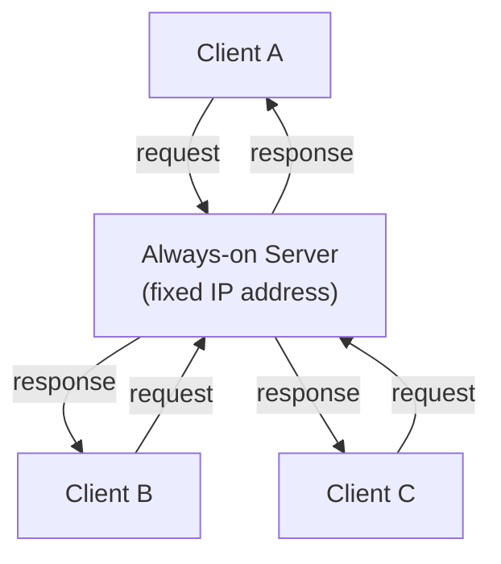
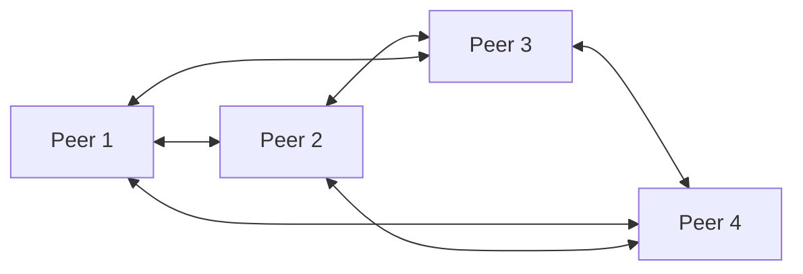

# Application Layer Paradigms

**Client-Server vs. Peer-to-Peer architectures, and how processes communicate across the network via sockets.**

## 1. The Real-World Situation — Start From Zero

You open two apps: a news website and a file-sharing program. The website always fetches articles from the company's own computers. The file-sharing app fetches pieces of a movie from *other users'* laptops. Same Internet underneath — but two opposite organizations of *who serves whom*.

The problem before the solution: an application designer must decide where the data lives and who does the work of serving it. Put everything on one central machine and you get control — but also a single bottleneck every user hammers. Spread the work across all users and you get scale — but lose control. This note names the two answers (client-server and peer-to-peer), then shows the one addressing trick both share: **sockets**.

::: callout-intuition Core Mental Model: The Restaurant vs. The Potluck
A **Client-Server** application is like a restaurant: there's one always-open kitchen (the server) that every customer (client) relies on. Customers never cook for each other — every request goes to the kitchen and every dish comes back from the kitchen. If the restaurant gets too popular, the kitchen becomes a bottleneck; the only fix is a bigger kitchen (or many kitchens acting as one, like a data center).

A **Peer-to-Peer (P2P)** application is like a potluck dinner: there's no dedicated kitchen at all. Every guest brings a dish (uploads something) and takes food from others (downloads something) — everyone is simultaneously a "customer" and a "cook." The more guests that show up, the more food is on the table too, so a potluck doesn't get bottlenecked the way a single restaurant would; it *self-scales*.

Whichever paradigm is chosen, the developer never writes code for the routers in between — only for the **end systems**. And underneath both paradigms, actual communication between two specific programs always happens through the same low-level interface: a **socket**.

Dropping the food now: restaurant = central server with a fixed address; potluck = symmetric peers that each serve and consume; socket = the numbered door a program sends through.
:::

## 2. Words First — Every Term Defined

| Term (abbreviation expanded on first use) | Plain meaning |
|---|---|
| **Client-server architecture** | Asymmetric design: one always-on **server** supplies a service; many **clients** consume it and never talk directly to each other. |
| **Peer-to-peer (P2P) architecture** | Symmetric design: every **peer** is both client and server at once; no dedicated central server. |
| **Process** | One running program (browser tab handler, mail client, game). The actual endpoint of communication — hosts run processes; processes exchange the bytes. |
| **Socket** | The software doorway between a process and the network, named by an IP (Internet Protocol) address plus a port number — written `IP:port`. |
| **Port number** | A 16-bit number naming *which process* on a host gets the data (e.g. web servers conventionally listen on port 80). |
| **IP (Internet Protocol) address** | The number naming *which host* on the Internet should receive the data. |
| **DDoS (Distributed Denial of Service) attack** | A flood of bogus requests from many machines meant to overwhelm a server — the weaponized form of the client-server bottleneck. |

::: toggle What does `client` vs `server` mean?
A `client` requests a service and a `server` supplies it, so the words name roles, not device types.
The `server` is usually always-on with a fixed address so clients can find it.
Tiny example: a browser is the client, the web machine answering on port 80 is the server.
:::

::: toggle What does `P2P` mean?
`P2P` means peer-to-peer: every peer is both client and server at once, with no central server.
Each newcomer adds demand and also upload capacity, so the system self-scales.
Tiny example: in BitTorrent each downloader re-uploads pieces to other downloaders.
:::

## 3. Purpose — The Two Architectures and the Shared Addressing Trick

### 3.1 Client-Server Architecture

* **Asymmetry:** the server *provides* a service; clients only *consume* it.
* **Always-on, fixed address:** clients must be able to find the server reliably, so it needs a permanent IP address.
* **Clients don't talk directly:** if Client A wants to reach Client B, the message is relayed *through* the server.
* **Scalability bottleneck:** a flood of simultaneous client requests can overwhelm a single server (this is the mechanism behind a DDoS attack). The industry fix is data centers with vast server farms acting as one virtual server.
* **Examples:** the Web (HTTP — HyperText Transfer Protocol), Email (SMTP — Simple Mail Transfer Protocol), File Transfer (FTP — File Transfer Protocol), streaming services.

### 3.2 Peer-to-Peer (P2P) Architecture

* **Symmetry:** every peer is simultaneously a client (requesting) and a server (providing).
* **Self-scalability:** each new peer adds *both* new demand (requests) and new capacity (uploads) — unlike client-server, where new demand only ever strains a fixed-size server.
* **Decentralized:** no single point of failure; one peer leaving doesn't take down the whole network.
* **Challenges:** harder to secure, highly variable performance (bounded by users' own upload speeds), and peers frequently have dynamic, changing IP addresses.
* **Examples:** BitTorrent, blockchain nodes, early Skype.

### 3.3 Operation Flow: Processes Communicating via Sockets

Regardless of architecture, the actual exchange of bytes happens between two **processes**, via a software interface called a **socket**.

> **The Door Analogy (then the technical fact):** A process is a house; its socket is the front door. Technically: to send a message, the process passes it through the socket to the transport layer below, which carries it to the receiver's socket.

To route a message correctly, the network needs *two* pieces of addressing information:

| Identifier | Role | Analogy (support only) |
|---|---|---|
| **IP Address** | Identifies the correct destination *host* (computer) | Street address |
| **Port Number** | Identifies the correct *process* running on that host | Apartment number |

A Web Server process, for example, conventionally listens on **Port 80** — so even though many processes may be running on the same machine, the port number ensures an incoming HTTP request reaches the right one.

::: toggle What does `port` mean?
A `port` is a 16-bit number naming which process on a host should receive the data.
The IP address finds the host, the port finds the process on that host.
Tiny example: port 80 steers an arrival to the web process, not the music app.
:::

::: toggle What does `socket` mean?
A `socket` is the software doorway between a process and the network, named as `IP:port`.
To send, a process passes bytes through its socket down to the transport layer below.
Tiny example: browser socket `192.0.2.5:5001` talking to server socket `93.184.216.34:80`.
:::

::: callout-exam KTU Exam Focus: The Two-Part Address
The 2-mark "why isn't IP enough?" answer is always: **IP address finds the host, port number finds the process** — together they name a **socket** (`IP:port`). Any option claiming one identifier suffices, or that ports replace IPs, is the planted distractor.
:::

## 4. Examples — Tiny First, Then Exam-Level

### 4.1 Toy Example (30 seconds)

Your laptop runs a browser and a music player. A packet arrives for your laptop's IP. The IP address alone cannot decide between the two programs — so the packet also carries a destination port: port 80 steers it to the web-facing process, the music app's port steers it there instead. One host, two doors, zero confusion.

### 4.2 KTU-Style Worked Example

::: step [Step 1: Setup] Formulating the Problem
Two applications are being designed: (1) a company's centralized customer database accessed by thousands of employee laptops, and (2) a file-sharing app where users exchange large video files directly with each other. Decide which architecture fits each, and justify why.
:::

::: step [Step 2: Execution] Applying the Paradigm Criteria
**Application 1 (Customer Database):** Requires strict control, security, and a single consistent source of truth that employees query and update. A **Client-Server** model fits: the database server is always-on, has a fixed address, and every client relies on it rather than on each other.
**Application 2 (File-Sharing):** Requires handling potentially huge numbers of large file transfers without one company having to fund and operate a single massive, always-on server. A **P2P** model fits: each user who downloads a video also becomes a source for other users, spreading the bandwidth cost across the whole user base and allowing the system to self-scale as more users join.
:::

::: step [Step 3: Conclusion] Final Result
The customer database chooses Client-Server for **consistency, security, and centralized control**; the file-sharing app chooses P2P for **self-scalability and lower infrastructure cost**. This illustrates the core trade-off: Client-Server favors control and reliability at the cost of a scalability bottleneck, while P2P favors scalability and cost-efficiency at the cost of control, security, and predictable performance.
:::

## 5. Distinctions, Watch-Outs, and Exam Recap

| Pair students confuse | Distinction that earns marks |
|---|---|
| Client-server vs. P2P | Asymmetric, always-on server, bottleneck vs. symmetric peers, self-scaling, harder to secure. |
| IP address vs. port number | Host identity vs. process identity — both required, neither replaces the other. |
| Socket vs. port | Socket = full `IP:port` doorway; port = just the process-number half. |
| Self-scalability vs. "free" | P2P capacity grows with users but is bounded by users' uploads — scaling, not magic. |

**Watch out:** (1) Calling a laptop "a client device" — client/server are roles; test behavior, not hardware. (2) Answering "IP address is enough" — one host runs many processes, so the port is mandatory. (3) Claiming P2P has no drawbacks — security, dynamic addresses, and variable speeds are the standard counterpoints.

::: callout-exam KTU Exam Focus: One-Paragraph Recap
Client-server = asymmetric, fixed-address server, bottleneck at scale (data centers mitigate). P2P = symmetric, self-scaling, decentralized, harder to secure. Processes talk via sockets named `IP:port`: IP finds the host, port finds the process (e.g. 80 = web). Developers code only end systems, never routers.
:::

**Active-recall checklist:** Which architecture fits a bank database, and why? Why does each new P2P peer add capacity? What two numbers name a socket, and what does each select? Where does transport-layer code run — hosts or routers?

## 6. Active Recall Quizzes

::: quiz Q1: Foundational Concept
Why is P2P considered "self-scaling"?
(A) Because peers never need to upload any data
(*B) Because each new peer joining the network adds both new demand (requests) and new service capacity (its own upload bandwidth), unlike a fixed-capacity server
(C) Because P2P networks always use fewer resources than client-server ones
(D) Because P2P eliminates the need for IP addresses entirely
::: explanation
In client-server, more clients only ever add *load* to a fixed-capacity server. In P2P, every new peer simultaneously contributes upload capacity back to the network — so the system's total capacity naturally grows alongside its total demand.
:::

::: quiz Q2: Foundational Concept
If two processes are communicating over the Internet, why isn't an IP address alone sufficient to get the data to the correct application?
(A) IP addresses are not globally unique
(*B) A single host can run many different processes simultaneously, and the port number is what identifies which specific process on that host should receive the data
(C) IP addresses only work for the Physical layer, not the Application layer
(D) Port numbers replace IP addresses entirely in modern networks
::: explanation
An IP address gets data to the right *machine*, but a computer may be simultaneously running a web browser, an email client, and a game — the port number is the second piece of addressing that ensures the data reaches the correct *process* (socket) on that machine, not just the correct machine.
:::

::: quiz Q3: Foundational Concept
Which of the following is a genuine challenge specific to the P2P architecture (compared to Client-Server)?
(A) A permanent, fixed IP address is required for every peer
(*B) Peers frequently have dynamic, changing IP addresses and highly variable performance depending on individual users' upload speeds
(C) There is always exactly one point of failure
(D) Clients cannot communicate with each other at all
::: explanation
Because peers are ordinary users' machines rather than dedicated infrastructure, they often sit behind dynamic IPs (assigned by an ISP or home router) and offer wildly different upload speeds — making P2P performance and addressing far less predictable than a professionally managed, always-on client-server setup.
:::
