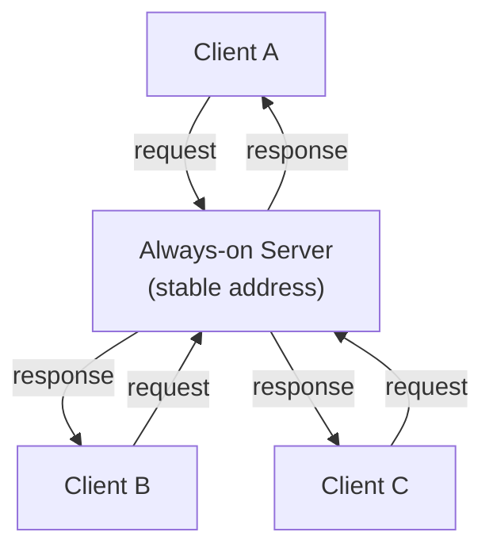
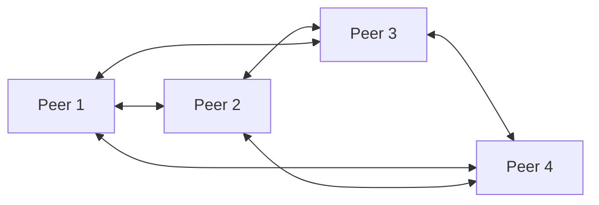
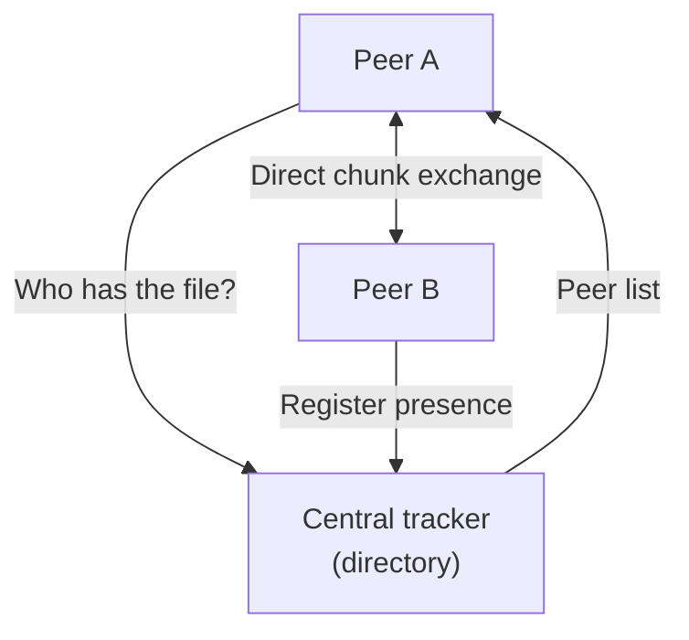
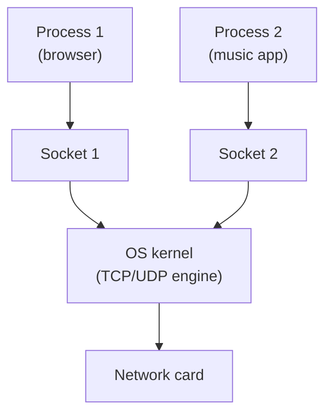
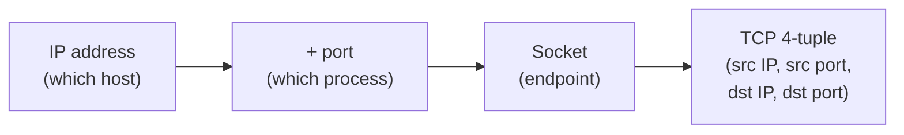
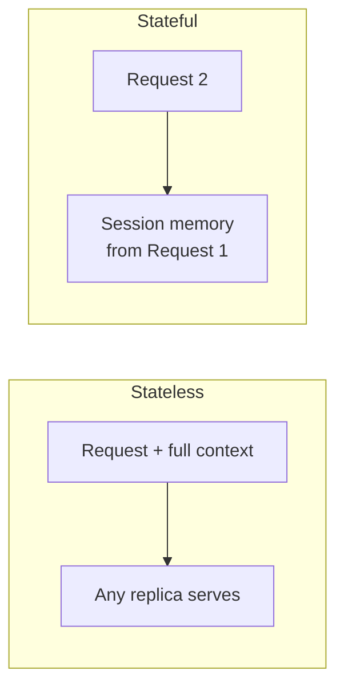
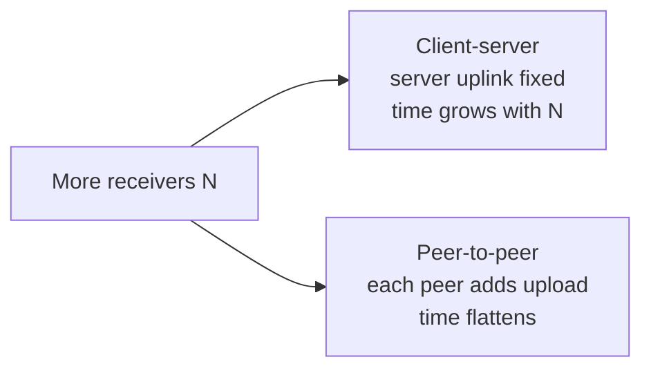

# Application Layer Paradigms

**Network apps vs. their protocols, client-server / P2P / hybrid architectures, processes and sockets, IP/port/4-tuple addressing, stateful vs. stateless, TCP vs. UDP, and the distribution-time model.**

## 1. The Real-World Situation — Start From Zero

You open two apps: a news website and a file-sharing program. The website always fetches articles from the company's own computers. The file-sharing app fetches pieces of a movie from *other users'* laptops. Same Internet underneath — but two opposite organizations of *who serves whom*.

The problem before the solution: an application designer must decide where the data lives and who does the work of serving it. Put everything on one central machine and you get control — but also a single bottleneck every user hammers. Spread the work across all users and you get scale — but lose control. This note names the answers (client-server, peer-to-peer, and their hybrid), then shows the machinery all three share: **processes**, **protocols**, **sockets**, and the **transport service** beneath them.

::: callout-intuition Core Mental Model: The Restaurant vs. The Potluck
A **Client-Server** application is like a restaurant: there's one always-open kitchen (the server) that every customer (client) relies on. Customers never cook for each other — every request goes to the kitchen and every dish comes back from the kitchen. If the restaurant gets too popular, the kitchen becomes a bottleneck; the only fix is a bigger kitchen (or many kitchens acting as one, like a data center).

A **Peer-to-Peer (P2P)** application is like a potluck dinner: there's no dedicated kitchen at all. Every guest brings a dish (uploads something) and takes food from others (downloads something) — everyone is simultaneously a "customer" and a "cook." The more guests that show up, the more food is on the table too, so a potluck doesn't bottleneck *at a single kitchen* the way a restaurant would; it *self-scales* — though the dining room itself can still get crowded (slow peers, thin uplinks, and scarce chunks still congest).

A **hybrid** design hires a coordinator for the guest list but lets guests swap dishes directly — central control where it matters, peer exchange where scale matters.

Whichever paradigm is chosen, the developer never writes code for the routers in between — only for the **end systems**. And underneath every paradigm, communication between two specific programs always happens through the same low-level interface: a **socket**.

Dropping the food now: restaurant = central server with a stable address; potluck = symmetric peers that each serve and consume; coordinator-plus-potluck = hybrid; socket = the numbered door a program sends through.
:::

## 2. Words First — Every Term Defined

| Term (abbreviation expanded on first use) | Plain meaning |
|---|---|
| **Network application** | The complete program (Chrome, Nginx, Spotify): UI, storage, logic *plus* networking. |
| **Application-layer protocol** | Just the conversation rules inside the app (HTTP, SMTP, DNS): message types, syntax, semantics, timing. |
| **Client-server architecture** | Asymmetric design: one stable **server** process supplies a service; many **client** processes consume it. |
| **Peer-to-peer (P2P) architecture** | Symmetric design: every **peer** is both client and server at once, sharing directly. |
| **Hybrid architecture** | Central coordination (discovery, login) combined with direct peer data exchange. |
| **Peer** | A participating application process (running on some host) acting as both consumer and supplier — the role matters, not the box. |
| **Process** | One running program (browser tab handler, mail client, game). Hosts run processes; processes exchange the bytes. |
| **Socket** | The software doorway between a process and the transport layer — an *abstraction*, not a wire or a packet. |
| **Port number** | A 16-bit number naming *which process* on a host gets the data (e.g. web servers conventionally listen on port 80/443). |
| **IP (Internet Protocol) address** | The number naming *which host* on the Internet should receive the data. |
| **TCP 4-tuple** | The four values identifying one TCP connection: source IP, source port, destination IP, destination port. |
| **State (application)** | Memory a server keeps *about a client between requests* (login session, FTP directory) — distinct from transport connection state. |
| **DDoS (Distributed Denial of Service) attack** | A flood of bogus requests from many machines meant to overwhelm a server — the weaponized form of the client-server bottleneck. |

::: toggle What does `client` vs `server` mean?
A `client` requests a service and a `server` supplies it, so the words name roles, not device types.
The `server` is usually always-on with a stable, reachable address so clients can find it.
Tiny example: a browser is the client, the web machine answering on port 80 is the server.
:::

::: toggle What does `P2P` mean?
`P2P` means peer-to-peer: every peer is both client and server at once.
Each newcomer adds demand and also upload capacity, so the system self-scales.
Tiny example: in BitTorrent each downloader re-uploads pieces to other downloaders.
:::

## 3. Purpose — Architectures, Processes, Sockets, Services, Models

### 3.1 Network Applications vs. Application-Layer Protocols

- **What they are.** A *network application* is the whole program in user space: interface, rendering, disk, business logic *and* networking (Chrome, Nginx, Zoom). An *application-layer protocol* is one component inside it: the exact message formats and exchange rules between peer processes (HTTP, SMTP, DNS), usually standardized in RFCs (Request for Comments) so vendors interoperate.
- **Why the split matters.** You can swap Chrome for Firefox without changing HTTP; you can rewrite a mail client's UI without touching SMTP. Exams test this with "which one is the program, which one is the rulebook?" Diplomats-and-language analogy: Chrome is the diplomat (office, documents, reports); HTTP is the grammar of the formal letters.
- **Design causal chain.** Users need a distributed capability → choose an *architecture* (client-server/P2P) → choose/design a *protocol* (syntax, semantics, rules) → processes open *sockets* into the OS kernel → select a *transport service* (TCP/UDP) → bytes flow to the destination process.

### 3.2 Client-Server Architecture

- **Roles, not hardware.** Client and server are *process* roles: the side initiating vs. the side waiting to serve. A laptop is a client while browsing and a server while sharing a file.
- **Request/response steps.** (1) Client opens a channel to the server's stable address. (2) Client sends a request message. (3) Server process parses it, reads central storage/computes. (4) Server returns the response. (5) Client renders/uses it; channel closes or persists.
- **Centralized resources.** Data, accounts, and truth live in one administered place — which is why banks, mail, and the Web use this model: consistency, access control, and backups are tractable.
- **Availability.** The server runs 24/7 on redundant power/networks with a stable, reachable address (typically static or DNS-named — common practice, not a law of physics).
- **Scalability and bottlenecks.** Every client hammers the same machine: load grows with users while capacity stays fixed. Floods of bogus requests weaponize this (DDoS). The industry answer is data centers: farms of machines behind load balancers acting as *one logical server*.
- **Examples/trade-offs.** Web (HTTP), mail (SMTP/IMAP), DNS, streaming. Trade: control + consistency + simple security vs. infrastructure cost + single-point congestion/failure.

### 3.3 Peer-to-Peer (P2P) Architecture

- **Peer defined.** A peer is a participating *application process* — software running on some host that is client and server *simultaneously*: downloading a chunk from peer B (client role) while uploading a chunk to peer C (server role). The host is just the machine it happens to run on.
- **Resource sharing.** Each peer donates disk and, crucially, *upload bandwidth* — the swarm's total serving capacity is the sum of its members.
- **Peer discovery.** Newcomers must *find* peers first: via a tracker, a DHT (Distributed Hash Table — a decentralized lookup spread over peers), or peer exchange. Pure "no-server" operation still needs this bootstrap step.
- **Direct communication.** Data chunks travel peer-to-peer without passing through a central application server.
- **Scalability and availability.** Self-scaling: each arrival adds demand *and* capacity. Availability follows churn (peers joining/leaving unpredictably with changing, often dynamic addresses) — popular content is highly available; rare content can vanish.
- **Advantages/limitations.** Plus: no big server bill, massive aggregate capacity, no single mandatory serving bottleneck. Minus: harder security (rogue/poisoned peers), unpredictable performance (bounded by strangers' uplinks), NAT/firewall traversal pain — and congestion still strikes access links, slow peers, and scarce chunks. P2P removes the *central* bottleneck, not bottlenecks as such.
- **Not necessarily decentralized.** Practical P2P is *rarely* pure: BitTorrent leans on trackers/DHT bootstrap nodes, blockchains lean on seed nodes and relays. Say "decentralized *data transfer* with (usually) some centralized *coordination*" — the unqualified "fully decentralized" claim is an exam trap.

### 3.4 Hybrid Architectures

- **What.** Centralized coordination (login, search, directory, offline queueing) + P2P data plane (bulk bytes flow peer-to-peer).
- **Why used.** Control and scale are both wanted: the center handles what needs truth (identity, membership, payment), peers handle what needs bandwidth (gigabytes nobody wants to pay a data center to serve).
- **Complete trace (BitTorrent).** (1) Peer A opens a `.torrent` file (hashes + tracker URL). (2) A asks the tracker over HTTP: who has this file? (3) Tracker returns live peer sockets (e.g. B at 172.16.0.8:6881). (4) A opens direct TCP sockets to B, C… and handshakes. (5) Bitfield messages advertise who holds which chunks; A pulls rare chunks first while simultaneously uploading chunks it already holds. (6) Each received chunk is hash-verified, saved, and immediately offered onward. Messaging apps mirror this: central login/queueing, then direct peer media whenever the network allows.

| Dimension | Client-Server | P2P |
|---|---|---|
| Data location | Central servers/data centers | Spread across user peers |
| Role symmetry | Asymmetric (serve vs. consume) | Symmetric (every peer does both) |
| Addressing | Stable server address; dynamic clients | Peers often dynamic, churning |
| Scalability | Bottlenecks; buy more servers | Self-scales with arrivals |
| Management | Costly hardware, simple software | Cheap hardware, complex software |
| Trust | Centralized, easier to secure | Rogue peers, poisoned data possible |

### 3.5 Processes and Inter-Process Communication

- **Process — WHAT:** one executing program instance in OS RAM. *Why it matters:* hosts don't talk — *processes* do; the browser tab and the music app on one laptop are distinct endpoints sharing one IP.
- **Process-to-process communication — WHAT:** bytes moving from a sender process's memory to a receiver process's memory across the network. *Roles:* the initiator is the client process, the waiter the server process (in P2P one program runs both concurrently).
- **Relationship to transport.** Application processes *use* transport services but don't implement them: the process hands a message down and names the service flavor it needs (reliable stream vs. fast datagrams); the OS kernel's TCP/UDP engine does the rest. *Result:* developers reason about messages and sockets, never about retransmission timers directly.

### 3.6 Sockets — The Boundary, Not a Wire

- **What.** A socket is the *software interface* (API object) through which a user-space process passes bytes to/from the kernel's transport engine — created with `socket()`, connected with `connect()`, fed with `send()`/`recv()`.
- **Why it exists.** Abstraction (no app writes NIC drivers or IP headers) plus a security boundary (unprivileged code touches the network only through kernel-mediated calls).
- **Division of labor.** Application/user space: message meaning, when to send, which peer (app code). OS kernel: ports, checksums, retransmission, routing-table lookup, actual transmission (network stack code).
- **Client workflow.** `socket()` → (OS assigns ephemeral source port) → `connect(server IP, server port)` → `send(request)` → `recv(response)` → close.
- **Server workflow.** `socket()` → `bind(well-known port)` (claim the doorway) → `listen()` (queue waiting clients) → `accept()` (mint one *new connected socket per client*, keeping the listening socket free) → `send/recv` per connection.
- **Terminology caution.** `bind` attaches a socket to a local address/port; `listen`/`accept` exist on connection-oriented (TCP) servers; saying "a socket *is* a connection/packet" is wrong — it is the *handle* the process uses, and one listening socket spawns many connected ones.

### 3.7 IP Addresses, Ports, and Socket Identification

- **IP address — WHAT:** the host's network-layer number (which *machine*, globally). **Port — WHAT:** a 16-bit transport number (which *process* on that machine). *Why both:* one host runs dozens of processes — IP alone picks the building, port picks the apartment. Neither replaces the other.
- **Port ranges (IANA).** Well-known 0–1023 (HTTP 80, HTTPS 443, SSH 22, DNS 53 — servers listen here); registered 1024–49151 (MySQL 3306, alternating HTTP 8080); dynamic/private 49152–65535 — the IANA *recommended* ephemeral range, not a universal law: real operating systems pick their own defaults (classic Linux uses 32768–60999; modern Windows follows the IANA range; older Windows used 1025–5000). Say "an OS-assigned ephemeral port", never "always above 49152".
- **Port ≠ machine.** A port identifies a *transport/application endpoint*; thousands of ports live on one IP, and one service can listen on several.
- **UDP endpoint (2-tuple, by default).** *Unconnected* UDP delivery keys on *(destination IP, destination port)*: a datagram for port 53 reaches whichever socket is bound there. But that is the default, not the whole story — a UDP socket may be *connected* to one peer (via `connect()`), after which the kernel associates that socket with the peer's source IP/port and routes only that peer's datagrams to it. Servers routinely hold one such connected socket per peer (games, VoIP, QUIC-style designs track peers by source address). So "regardless of sender" holds only for unconnected sockets — per-peer UDP associations are common and legitimate.
- **TCP connection (4-tuple).** Each connection is uniquely *(source IP, source port, destination IP, destination port)*: thousands of clients can share destination 443 because their source halves differ.
- **Careful note.** "2-tuple/4-tuple" is a *teaching model* of kernel demultiplexing, not a literal socket-API struct layout — say "identified by", never "the API struct is".
- **Concrete example.** Laptop 192.0.2.10 (Chrome) → server 198.51.100.20 (Nginx, port 443): client socket (192.0.2.10, ephemeral 50000); connection 4-tuple (192.0.2.10, 50000, 198.51.100.20, 443). A second tab gets ephemeral 50001 → a *different* 4-tuple → replies demultiplex to the right tab. Two tabs from *different* hosts may reuse source port 51001 with zero ambiguity, because source IPs differ.

::: callout-exam KTU Exam Focus: The Two-Part Address
The 2-mark "why isn't IP enough?" answer is always: **IP address finds the host, port number finds the process** — together they name a **socket** (`IP:port`). TCP refines this to a 4-tuple per connection; unconnected UDP demultiplexes on the 2-tuple, while a connected UDP socket associates with one peer. Any option claiming one identifier suffices is the planted distractor.
:::

### 3.8 Application-Protocol Structure — Types, Syntax, Semantics, Timing

Every application protocol specifies four things (the M1T1 protocol definition, applied):

1. **Message types** — request vs. response (GET vs. 200 OK).
2. **Syntax** — field layout (HTTP's ASCII lines ending `\r\n`, header `Host: …`).
3. **Semantics** — what values *mean* (`GET` = fetch this path; `200` = here it is; `404` = no such path).
4. **Timing/ordering** — who speaks when (HTTP/1.1: full request *before* any response; no server push unasked).
- **Valid syntax, invalid semantics — worked mini-trace.** Client sends `GET /no-such-page HTTP/1.1` + `Host: …` — every line parses (syntax ✓) but the path names nothing (semantics ✗) → server *must* answer `404 Not Found`, not crash or stay silent. *Interpretation:* syntax gets you parsed; semantics decides the outcome — examiners love this split.
- **State-machine intuition.** Think of each peer as a tiny machine: states (idle → request-sent → response-awaited → done) with one legal move per state. Timing rules *are* the transition table — an arrival in the wrong state is either queued, rejected, or fatal, per the protocol.

### 3.9 Stateful vs. Stateless Interaction

- **State — WHAT:** server-side memory *about a client* kept *between* requests (shopping cart, login session, FTP's current directory). Distinct from transport connection state (sequence numbers) — confusing the two layers is a standard trap.
- **Scope warning first:** stateful/stateless classifies *one interaction mechanism at one layer*, never an entire application. A single real system routinely mixes both: stateless HTTP exchanges carrying a stateful shopping cart (via cookies), over stateful TCP connections, against a persistent database. Always name *which* interaction you are classifying.
- **Stateless — WHAT/HOW:** server keeps nothing per client *for this interaction*; every request carries everything needed (auth token, parameters) and is processed in isolation. *Examples:* a baseline HTTP exchange, a DNS query. *Result:* crash recovery = just reboot and re-receive; any load-balanced replica can serve any request (massive scalability); price = repeated headers/tokens per request (bandwidth overhead) and no built-in continuity.
- **Stateful — WHAT/HOW:** server holds session tables across requests *of this interaction*; later commands depend on earlier ones (`USER` → `PASS` → `RETR` in an FTP control session). *Examples:* an FTP control session, a DB connection, an SSH login session. *Result:* lean follow-up messages, but per-client memory + timeouts (complexity, overhead), sticky-session load balancing, and crash = lost sessions forcing reconnects.
- **Critical clarification.** "Stateless" never means "the system stores nothing" — databases, caches, and files persist just fine; it means *these requests* carry their own context so *these servers* hold no per-client session memory. Modern "stateful web" (cookies, session tokens, JWTs — JSON Web Tokens) is application-layer state *smuggled inside stateless HTTP exchanges* — each HTTP interaction stays stateless while the overall application behaves statefully. Classify the interaction and the layer, never the whole app.

| Dimension | Stateless (HTTP, DNS) | Stateful (FTP, DB sessions) |
|---|---|---|
| Server complexity | Simple, no session tables | Complex, memory + timeouts per client |
| Crash recovery | Resilient — clients just resend | Fragile — sessions die, reconnect needed |
| Load balancing | Any replica serves any request | Needs sticky sessions or shared state (e.g. Redis) |
| Bandwidth | Repeats context per request | Context set once, lean follow-ups |

### 3.10 TCP vs. UDP — Selecting by Requirements, Not Myth

Evaluate four service dimensions first: **loss tolerance** (file bytes: zero loss vs. voice glitch: loss-tolerant), **throughput needs** (elastic web/mail vs. minimum-rate video), **timing sensitivity** (gaming/voice/trading demand low delay), **security** (handled by TLS/DTLS *above* transport — never by TCP/UDP themselves).

| Capability | TCP | UDP |
|---|---|---|
| Connection setup | 3-way handshake first | None — send immediately |
| Reliability/ordering | ACKs + retransmission, in-order stream | Best-effort, possibly lost/reordered |
| Flow + congestion control | Yes (throttles sender) | No (app decides, if at all) |
| Header/overhead | 20 bytes + handshake latency | 8 bytes, no handshake |
| Fits (typical, not destiny) | Correctness-first transfers (web, mail, files, SSH) | Latency-first exchanges (DNS, VoIP, games, live streams) — chosen per requirements below, not per app name |

- **"UDP is faster" — corrected.** UDP has *less mechanism* (no handshake/ACKs), so it *can* deliver sooner on a clean path — but it is not "inherently faster": on lossy paths TCP's retransmission *completes* transfers UDP would leave broken, and bulk throughput is bounded by the network, not the protocol. Correct phrasing: *lower overhead/latency, zero delivery promises*.
- **Security placement.** TCP/UDP provide *no* encryption or authentication; confidentiality/integrity come from TLS over TCP (HTTPS), DTLS (Datagram TLS) over UDP, or app-level crypto (QUIC bakes TLS 1.3 inside). Any "TCP encrypts" option is wrong.
- **Why each app fits — requirements, not categories.** HTTP/FTP/SMTP usually ride TCP because *their requirement* is zero-loss ordering (one wrong byte corrupts pages, binaries, mail). DNS usually rides UDP because *its requirement* is one tiny fast exchange, not a handshake. VoIP/games usually ride UDP because *their requirement* is low delay (a late retransmitted phoneme is worse than a dropped one). But these are tendencies, not laws: buffered video streams ride TCP just fine (latency-tolerant real-time), and **QUIC/HTTP-3 delivers a reliable, ordered, congestion-controlled transport *over UDP*** — custom loss recovery without head-of-line blocking. QUIC proves reliability is a *service design choice*, not a TCP monopoly: match the transport to the requirements, never to the app's name.

### 3.11 Distribution-Time Model — Client-Server vs. P2P, Derived

Distribute file F bits to N hosts. Symbols: F = file size (**bits**); N = number of receivers; u_s = server upload rate (**bits/s**); u_i = peer i upload rate (**bits/s**); d_min = slowest receiver download rate (**bits/s**).

- **D_CS = max(N·F/u_s, F/d_min) — why each term.** The server must push N copies totaling N·F bits through its own uplink → N·F/u_s seconds *minimum*. Separately, the slowest client needs F/d_min seconds for its single copy. The job finishes when the *slower* constraint clears → max(). *Bottleneck reading:* whichever term wins names the culprit (server uplink vs. slowest downloader).
- **D_P2P = max(F/u_s, F/d_min, N·F/(u_s + Σu_i)) — why each term.** The server must inject at least one full copy (F/u_s); the slowest peer still needs F/d_min; and the swarm as a whole must deliver N·F bits using *combined* upload (server + every peer), giving N·F/(u_s + Σu_i). Again max() = slowest constraint wins. *Intuition:* as N grows, Σu_i grows with it — the denominator chases the numerator, so P2P time flattens while D_CS grows ∝ N.
- **Assumptions/limitations.** Lower bounds, not schedules: fluid infinitely-splittable data, all peers present and fully cooperative from t=0, no churn, no protocol overhead, access links (not core) are the bottlenecks, d_min known. Real swarms do worse — state this whenever quoting the formulas.

**Complete worked comparison.** F = 8×10⁹ bits (1 GB), u_s = 100 Mbps, d_min = 10 Mbps, every u_i = 2 Mbps.
- *N = 10:* D_CS = max(10·8000/100, 8000/10) = max(800, 800) = **800 s (≈13.3 min)**. D_P2P = max(80, 800, 80000/120 ≈ 666.7) = **800 s** — identical: slow downloaders bottleneck both.
- *N = 1000:* D_CS = max(80000, 800) = **80,000 s (≈22.2 h)** — linear blowup. D_P2P = max(80, 800, 8000000/2100 ≈ 3809.5) = **≈3,810 s (≈1.06 h)** — ~21× faster. *Interpretation:* scale flips the winner; at small N both tie on d_min.
- *Common mistakes:* bits/bytes mixups (×8!), Mbps vs. MB/s, forgetting Σu_i includes *all* N peers, and quoting bounds as exact schedules.

## 4. Examples — Tiny First, Then Exam-Level

### 4.1 Toy Example (30 seconds)

Your laptop runs a browser and a music player. A packet arrives for your laptop's IP. The IP address alone cannot decide between the two programs — so the packet also carries a destination port: port 80 steers it to the web-facing process, the music app's port steers it there instead. One host, two doors, zero confusion.

### 4.2 KTU-Style Worked Example: Choosing the Architecture

::: step [Step 1: Setup] Formulating the Problem
Two applications are being designed: (1) a company's centralized customer database accessed by thousands of employee laptops, and (2) a file-sharing app where users exchange large video files directly with each other. Decide which architecture fits each, and justify why.
:::

::: step [Step 2: Execution] Applying the Paradigm Criteria
**Application 1 (Customer Database):** Requires strict control, security, and a single consistent source of truth that employees query and update. A **Client-Server** model fits: the database server is stable and reachable, and every client relies on it rather than on each other.
**Application 2 (File-Sharing):** Requires handling potentially huge numbers of large file transfers without one company funding a single massive server. A **P2P** model fits: each downloader re-uploads pieces, spreading bandwidth cost across users so the system self-scales.
:::

::: step [Step 3: Conclusion] Final Result
The database chooses Client-Server for **consistency, security, and centralized control**; file-sharing chooses P2P for **self-scalability and lower infrastructure cost**. Core trade-off: control and reliability (with a bottleneck price) versus scale and cost-efficiency (with a control/security price).
:::

### 4.3 Worked Calculation: Scaling From N = 10 to N = 1000

::: step [Step 1: Setup] Reading the Numbers
F = 8×10⁹ bits, u_s = 100 Mbps, d_min = 10 Mbps, u_i = 2 Mbps each. Compute D_CS and D_P2P at N = 10 and N = 1000.
:::

::: step [Step 2: Execution] Taking Each Maximum
N = 10: D_CS = max(800, 800) = **800 s**; D_P2P = max(80, 800, 666.7) = **800 s** — tie on slow downloaders. N = 1000: D_CS = max(80000, 800) = **80,000 s (≈22.2 h)**; D_P2P = max(80, 800, 3809.5) = **≈3,810 s (≈1.06 h)**.
:::

::: step [Step 3: Conclusion] Interpretation
Same file, same network — only scale changed, yet P2P goes from tied to ~21× faster. That crossover *is* the entire scalability argument, and every term that produced it is named above.
:::

## 5. Distinctions, Watch-Outs, and Exam Recap

| Pair students confuse | Distinction that earns marks |
|---|---|
| Network app vs. app protocol | Whole program (Chrome) vs. its conversation rules (HTTP). |
| Client-server vs. P2P vs. hybrid | Central server / symmetric peers / central directory + peer transfer. |
| Host vs. process | Machine with an IP vs. running program with a port. |
| Client-server vs. P2P | Asymmetric, stable server, bottleneck vs. symmetric peers, self-scaling, harder to secure. |
| IP address vs. port number | Host identity vs. process identity — both required, neither replaces the other. |
| Socket vs. port | Socket = full endpoint abstraction (`IP:port` + state); port = just the process-number half. |
| UDP 2-tuple vs. TCP 4-tuple | Unconnected UDP keys on (dst IP, dst port), with connected UDP sockets associating per peer — vs. TCP's always-per-connection (src IP, src port, dst IP, dst port). |
| Syntax vs. semantics | Layout that parses vs. meaning that decides (valid syntax can still 404). |
| Stateful vs. stateless | For one interaction: server remembers client across its requests vs. every request self-contained (≠ "stores nothing", ≠ a whole-app label). |
| TCP vs. UDP | Reliable ordered stream with control loops vs. lightweight datagrams with no promises (not "fast vs. slow"). |
| D_CS vs. D_P2P scaling | Linear in N (fixed server uplink) vs. flattening (peers add upload). |
| Self-scalability vs. "free" | P2P capacity grows with users but is bounded by users' uploads — scaling, not magic. |

**Watch out:** (1) Calling a laptop "a client device" — roles, not hardware; servers need *stable* addresses, not always static ones. (2) "IP is enough" — one host runs many processes; the port is mandatory. (3) "P2P = fully decentralized" — trackers/DHT/bootstrap nodes coordinate most real swarms. (4) "UDP is faster" — lower overhead, zero promises; throughput is network-bounded. (5) "TCP encrypts" — encryption lives in TLS/DTLS/app layers, never TCP/UDP. (6) Socket as a wire/packet — it is the API *handle*; one listening socket spawns many connected ones. (7) Transport connection state vs. application session state — different layers, don't merge them. (8) Quoting D_CS/D_P2P bounds as exact schedules — they assume fluid data, full cooperation, no churn. (9) Labeling a whole application "stateless"/"stateful" — classify one interaction at one layer; real apps mix stateless exchanges, stateful sessions, and persistent storage.

::: callout-exam KTU Exam Focus: One-Paragraph Recap
App = whole program; protocol = its conversation rules (types, syntax, semantics, timing). Client-server = asymmetric, stable server, bottleneck at scale (data centers mitigate); P2P = symmetric, self-scaling with no central serving bottleneck (links and peers can still congest), churn-prone, rarely fully decentralized; hybrid = central directory + peer transfer. Processes talk via sockets: IP finds the host, port finds the process; TCP identifies connections by 4-tuple, UDP endpoints by 2-tuple. Stateless = self-contained requests (cookies/JWTs simulate sessions); stateful = server-held sessions (resilient vs. costly). TCP = reliable ordered stream; UDP = lightweight datagrams — choose by requirements, noting QUIC builds reliability over UDP; neither encrypts (that's TLS/DTLS). Distribution: D_CS = max(NF/u_s, F/d_min) grows ∝ N; D_P2P = max(F/u_s, F/d_min, NF/(u_s + Σu_i)) flattens as peers contribute upload.
:::

**Active-recall checklist:** App vs. protocol — which is Chrome, which is HTTP? Why does each new P2P peer add capacity? What coordinates a "decentralized" swarm? What two numbers name a socket, and what does each select? How many server sockets serve 3 tabs, and why do the 4-tuples differ? Valid syntax, 404 outcome — syntax or semantics failure? Stateless server reboots mid-day — who notices? Which transport for a bank transfer vs. a voice call, and why is "UDP is faster" the wrong reason? Which D term dominates at N = 1000, and what assumption makes it a bound, not a schedule?

::: toggle Sockets in code: what do `bind`, `listen`, and `accept` do? (optional depth)
`bind` claims a local IP/port for the socket; `listen` marks a TCP socket as waiting and sizes its backlog queue; `accept` pulls one pending client off that queue into a brand-new connected socket. Extra example: a web server `bind`s 443 once, `listen`s once, then `accept`s thousands of times — one listening socket, thousands of connected ones.
:::

::: toggle Cookie-based sessions ride on stateless HTTP (optional depth)
A server sends `Set-Cookie: sess=abc`; the browser stores it and replays `Cookie: sess=abc` per request; the server looks up `abc` in its session store. Extra exam trap: the *protocol* stays stateless (each request self-describes) while the *application* is stateful — classify the layer being asked about.
:::

## 6. Active Recall Quizzes

::: quiz Q1: Foundational Concept
Why is P2P considered "self-scaling"?
(A) Because peers never need to upload any data
(*B) Because each new peer joining the network adds both new demand (requests) and new service capacity (its own upload bandwidth), unlike a fixed-capacity server
(C) Because P2P networks always use fewer resources than client-server ones
(D) Because P2P eliminates the need for IP addresses entirely
::: explanation
In client-server, more clients only ever add *load* to a fixed-capacity server. In P2P, every new peer simultaneously contributes upload capacity back to the network — so the swarm's total serving capacity grows alongside its total demand (individual links and slow peers can still congest).
:::

::: quiz Q2: Foundational Concept
If two processes are communicating over the Internet, why isn't an IP address alone sufficient to get the data to the correct application?
(A) IP addresses are not globally unique
(*B) A single host can run many different processes simultaneously, and the port number is what identifies which specific process on that host should receive the data
(C) IP addresses only work for the Physical layer, not the Application layer
(D) Port numbers replace IP addresses entirely in modern networks
::: explanation
An IP address gets data to the right *machine*, but a computer may be simultaneously running a web browser, an email client, and a game — the port number is the second piece of addressing that ensures the data reaches the correct *process* (socket) on that machine, not just the correct machine.
:::

::: quiz Q3: Foundational Concept
Which of the following is a genuine challenge specific to the P2P architecture (compared to Client-Server)?
(A) A permanent, fixed IP address is required for every peer
(*B) Peers frequently have dynamic, changing IP addresses and highly variable performance depending on individual users' upload speeds
(C) There is always exactly one point of failure
(D) Clients cannot communicate with each other at all
::: explanation
Because peer processes run on ordinary users' machines rather than dedicated infrastructure, they often sit behind dynamic IPs (assigned by an ISP or home router) and offer wildly different upload speeds — making P2P performance and addressing far less predictable than a professionally managed, always-on client-server setup.
:::

::: quiz Q4: Socket Demultiplexing
One server (203.0.113.50:443) serves two tabs from host A (source ports 51001, 51002) and one tab from host B (source port 51001). How many connected server sockets, and why no ambiguity?
(A) One socket — all tabs share port 443
(*B) Three connected sockets (plus the listening one) — the 4-tuples differ in source port or source IP, so the kernel demultiplexes exactly
(C) Two sockets — one per client host
(D) Four sockets — one per port number seen
::: explanation
Tab A1 = (198.51.100.10, 51001, 203.0.113.50, 443); Tab A2 differs in source port (51002); Tab B1 reuses 51001 but differs in source IP (198.51.100.20). Three distinct 4-tuples → three connected sockets. Same source port on different hosts never collides because the source IP is part of the identity.
:::

::: quiz Q5: Stateful vs Stateless
A server farm reboots one replica at noon with zero user-visible impact. Which interaction style explains it, and what was the price?
(A) Stateful — sessions live on that replica, so nothing is lost
(*B) Stateless — requests carry their own context, so any replica serves any request; price is repeated tokens/headers per request
(C) Stateless — the system stores nothing anywhere
(D) Stateful — Redis broadcasts every keystroke to all replicas
::: explanation
Stateless requests are self-contained, so the rebooted replica simply rejoins and serves fresh traffic — no session surgery. The price is bandwidth (auth tokens on every request) and no built-in continuity, which apps layer back with cookies/JWTs. Note (C)'s trap: databases persist; only *per-client session memory on servers* is absent.
:::

::: quiz Q6: Transport Selection
A bank transfer needs every byte, in order; a live voice call needs low delay above all. Which transport reasoning is correct, and why is "UDP is faster" wrong?
(A) UDP for the bank (speed!), TCP for voice (safety)
(*B) TCP for the bank (its requirement is zero-loss ordering) and UDP for voice (its requirement is low delay — a late retransmitted phoneme is worse than a dropped one); UDP has lower overhead, not higher speed — throughput is network-bounded
(C) TCP for both, since UDP is obsolete
(D) UDP for both, with TLS added inside UDP for the bank
::: explanation
Match transport to *requirements*, not app names: correctness-first data (money, files, pages) needs TCP's ACKs and ordering; latency-first media fits UDP's fire-and-forget. "Faster" misleads: UDP skips handshakes/ACKs (lower delay, tinier header) but completes nothing by itself. And neither encrypts — the bank's secrecy comes from TLS *above* TCP, not from TCP. Caveat for the exam: QUIC shows reliability can also be built over UDP, so "reliable ⇒ must be TCP" is outdated.
:::

::: quiz Q7: Distribution Model
With F = 8×10⁹ bits, u_s = 100 Mbps, d_min = 10 Mbps, u_i = 2 Mbps: at N = 1000, which term dominates each model, and what does it mean?
(A) D_CS dominated by F/d_min — slow downloaders are always the whole story
(*B) D_CS = max(80000, 800) = 80,000 s, dominated by the server-uplink term NF/u_s; D_P2P = max(80, 800, 3809.5) ≈ 3,810 s, dominated by total-upload term NF/(u_s + Σu_i) — the fixed uplink, not the downloaders, decides at scale
(C) D_P2P = 80 s, dominated by the single-copy injection term
(D) Both models tie at 800 s at every N
::: explanation
At N = 1000 the server must push 1,000 copies through one uplink (80,000 s) — that term dwarfs the 800 s downloader term, which is exactly why D_CS grows ∝ N. P2P's swarm denominator (100 + 2000 Mbps) holds the total-upload term to ~3,810 s. At N = 10 both tied at 800 s — scale, not the formulas, flips the winner.
:::
