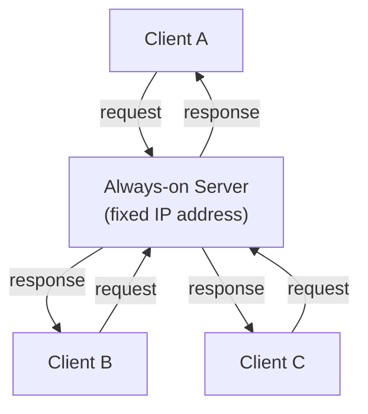
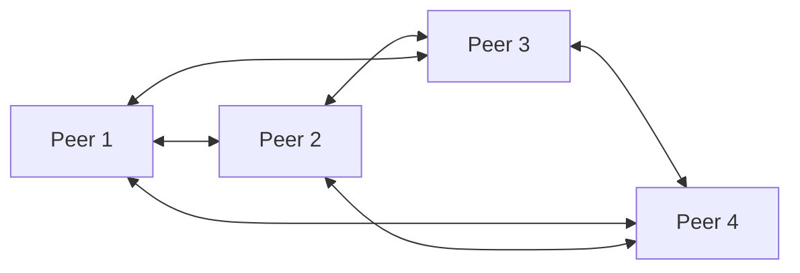

# Application Layer Paradigms

**Client-Server vs. Peer-to-Peer architectures, and how processes communicate across the network via sockets.**

## 1. The Intuition

::: callout-intuition Core Mental Model: The Restaurant vs. The Potluck
A **Client-Server** application is like a restaurant: there's one always-open kitchen (the server) that every customer (client) relies on. Customers never cook for each other — every request goes to the kitchen and every dish comes back from the kitchen. If the restaurant gets too popular, the kitchen becomes a bottleneck; the only fix is a bigger kitchen (or many kitchens acting as one, like a data center).

A **Peer-to-Peer (P2P)** application is like a potluck dinner: there's no dedicated kitchen at all. Every guest brings a dish (uploads something) and takes food from others (downloads something) — everyone is simultaneously a "customer" and a "cook." The more guests that show up, the more food is on the table too, so a potluck doesn't get bottlenecked the way a single restaurant would; it *self-scales*.

Whichever paradigm is chosen, the developer never writes code for the routers in between — only for the **end systems**. And underneath both paradigms, actual communication between two specific programs always happens through the same low-level interface: a **socket**.
:::

---

## 2. Theoretical Framework & Formalism

### 2.1 Client-Server Architecture

* **Asymmetry:** the server *provides* a service; clients only *consume* it.
* **Always-on, fixed address:** clients must be able to find the server reliably, so it needs a permanent IP address.
* **Clients don't talk directly:** if Client A wants to reach Client B, the message is relayed *through* the server.
* **Scalability bottleneck:** a flood of simultaneous client requests can overwhelm a single server (this is the mechanism behind a DDoS attack). The industry fix is data centers with vast server farms acting as one virtual server.
* **Examples:** the Web (HTTP), Email (SMTP), File Transfer (FTP), Netflix.

### 2.2 Peer-to-Peer (P2P) Architecture

* **Symmetry:** every peer is simultaneously a client (requesting) and a server (providing).
* **Self-scalability:** each new peer adds *both* new demand (requests) and new capacity (uploads) — unlike client-server, where new demand only ever strains a fixed-size server.
* **Decentralized:** no single point of failure; one peer leaving doesn't take down the whole network.
* **Challenges:** harder to secure, highly variable performance (bounded by users' own upload speeds), and peers frequently have dynamic, changing IP addresses.
* **Examples:** BitTorrent, blockchain/Bitcoin nodes, early Skype.

### 2.3 Processes Communicating via Sockets

Regardless of architecture, the actual exchange of bytes happens between two **processes**, via a software interface called a **socket**.

> **The Door Analogy:** A process is a house; its socket is the front door. To send a message, the process shoves it out the door, trusting that a transport infrastructure (the layers below) will carry it to the receiver's own door.

To route a message correctly, the network needs *two* pieces of addressing information:

| Identifier | Role | Analogy |
|---|---|---|
| **IP Address** | Identifies the correct destination *host* (computer) | Street address |
| **Port Number** | Identifies the correct *process* running on that host | Apartment number |

A Web Server process, for example, conventionally listens on **Port 80** — so even though many processes may be running on the same machine, the port number ensures an incoming HTTP request reaches the right one.

::: callout-exam KTU Exam Focus: The Two-Part Address
The 2-mark "why isn't IP enough?" answer is always: **IP address finds the host, port number finds the process** — together they name a **socket** (`IP:port`). Any option claiming one identifier suffices, or that ports replace IPs, is the planted distractor.
:::

---

## 3. Worked Example / Step-by-Step Scenario

::: step [Step 1: Setup] Formulating the Problem
Two applications are being designed: (1) a company's centralized customer database accessed by thousands of employee laptops, and (2) a file-sharing app where users exchange large video files directly with each other. Decide which architecture fits each, and justify why.
:::

::: step [Step 2: Execution] Applying the Paradigm Criteria
**Application 1 (Customer Database):** Requires strict control, security, and a single consistent source of truth that employees query and update. A **Client-Server** model fits: the database server is always-on, has a fixed address, and every client relies on it rather than on each other.
**Application 2 (File-Sharing):** Requires handling potentially huge numbers of large file transfers without one company having to fund and operate a single massive, always-on server. A **P2P** model fits: each user who downloads a video also becomes a source for other users, spreading the bandwidth cost across the whole user base and allowing the system to self-scale as more users join.
:::

::: step [Step 3: Conclusion] Final Result
The customer database chooses Client-Server for **consistency, security, and centralized control**; the file-sharing app chooses P2P for **self-scalability and lower infrastructure cost**. This illustrates the core trade-off: Client-Server favors control and reliability at the cost of a scalability bottleneck, while P2P favors scalability and cost-efficiency at the cost of control, security, and predictable performance.
:::

---

## 4. Active Recall Quizzes

::: quiz Q1: Foundational Concept
Why is P2P considered "self-scaling"?
(A) Because peers never need to upload any data
(*B) Because each new peer joining the network adds both new demand (requests) and new service capacity (its own upload bandwidth), unlike a fixed-capacity server
(C) Because P2P networks always use fewer resources than client-server ones
(D) Because P2P eliminates the need for IP addresses entirely
::: explanation
In client-server, more clients only ever add *load* to a fixed-capacity server. In P2P, every new peer simultaneously contributes upload capacity back to the network — so the system's total capacity naturally grows alongside its total demand.
:::

::: quiz Q2: Foundational Concept
If two processes are communicating over the Internet, why isn't an IP address alone sufficient to get the data to the correct application?
(A) IP addresses are not globally unique
(*B) A single host can run many different processes simultaneously, and the port number is what identifies which specific process on that host should receive the data
(C) IP addresses only work for the Physical layer, not the Application layer
(D) Port numbers replace IP addresses entirely in modern networks
::: explanation
An IP address gets data to the right *machine*, but a computer may be simultaneously running a web browser, an email client, and a game — the port number is the second piece of addressing that ensures the data reaches the correct *process* (socket) on that machine, not just the correct machine.
:::

::: quiz Q3: Foundational Concept
Which of the following is a genuine challenge specific to the P2P architecture (compared to Client-Server)?
(A) A permanent, fixed IP address is required for every peer
(*B) Peers frequently have dynamic, changing IP addresses and highly variable performance depending on individual users' upload speeds
(C) There is always exactly one point of failure
(D) Clients cannot communicate with each other at all
::: explanation
Because peers are ordinary users' machines rather than dedicated infrastructure, they often sit behind dynamic IPs (assigned by an ISP or home router) and offer wildly different upload speeds — making P2P performance and addressing far less predictable than a professionally managed, always-on client-server setup.
:::
