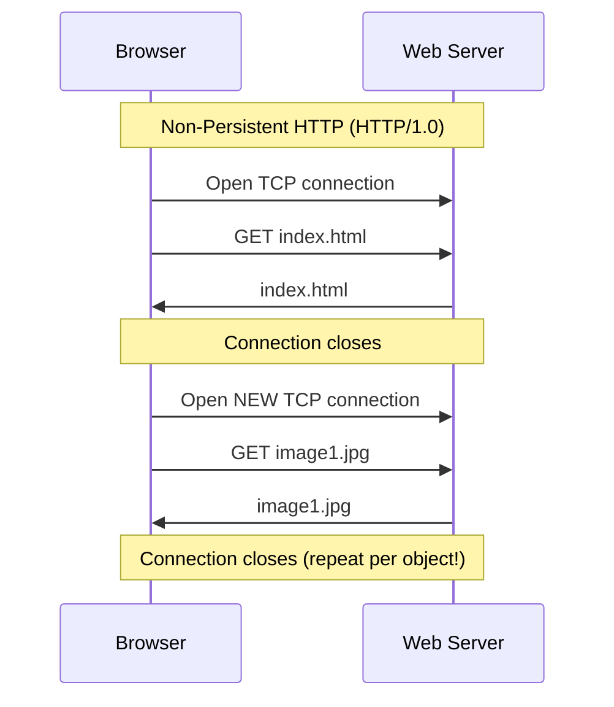
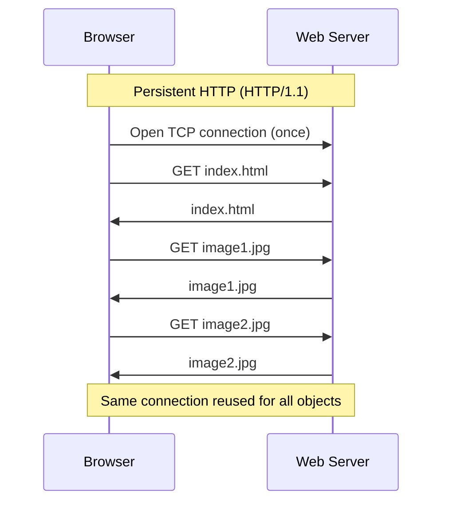
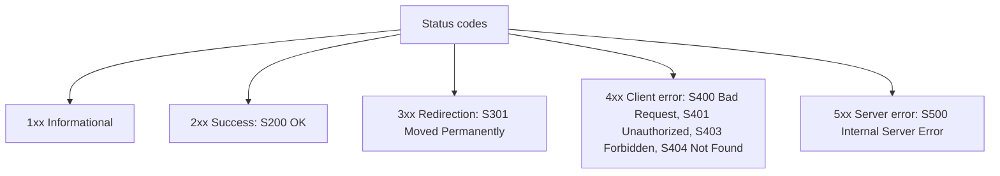

# The World Wide Web and HTTP

**Web vs. Internet, URL anatomy, HTTP request/response structure, methods and status codes, statelessness and cookies, non-persistent vs. persistent connections with RTT math, and HTTP versions.**

<a id="the-intuition"></a>
## 1. The Real-World Situation — Start From Zero

You type `http://www.example.com/index.html`, press Enter, and a page appears. Behind that instant are three prior lessons working together: M1T1's hosts and links carry the bits, M1T2's layers wrap them (your request travels as one HTTP *Message* inside TCP/IP envelopes), and M1T3's client-server roles, sockets, and statelessness set the rules of engagement. This note answers the one remaining question: **how exactly do a browser and a server converse — what do the messages look like, how many connections do they cost, and how does anything get remembered?**

Two design puzzles dominate. First, should the browser open a fresh transport connection for *every* object, or reuse one connection for all of them? Second, the server deliberately remembers *nothing* between requests — so how do logins and shopping carts survive? This note solves both: connection reuse first, memory-outside-the-protocol second — then prices everything in round trips.

::: callout-intuition Core Mental Model: The Amnesiac Waiter
Picture a waiter with total amnesia — every time you order, they treat you as a brand-new customer, with zero memory of anything you ordered a minute ago. This is exactly how **HTTP** behaves: it is **stateless**. Every request is handled in complete isolation from every previous one, even from the same browser, even seconds apart.

Now imagine fetching a webpage that has text plus ten embedded images. Should the waiter make a brand-new trip to the kitchen (open a brand-new connection) for *every single item*, or should they keep one open channel and bring everything back over it? Early HTTP (1.0) did the former — **non-persistent**, closing and reopening a TCP (Transmission Control Protocol) connection per object, wasting time on repeated handshakes. Modern HTTP (1.1) does the latter — **persistent**, reusing one open connection for many objects in a row.

But if the waiter forgets everything, how does a shopping cart or login session survive? The restaurant hands you a **cookie** — a small claim-check with a unique ID — the moment you first sit down. Every time you order again, you show that claim-check, and the amnesiac waiter looks up your ID in a notebook to instantly recall your entire history, without ever "remembering" anything on their own.

Dropping the restaurant now: stateless = server keeps no per-client memory; persistent = one TCP connection reused; cookie = client-held ID the server looks up.
:::

<a id="key-terms"></a>
## 2. Words First — Every Term Defined

| Term (abbreviation expanded on first use) | Plain meaning |
|---|---|
| **HTTP (HyperText Transfer Protocol)** | The Web's application-layer request/response protocol: browser asks, server answers. |
| **Web page / object / URL (Uniform Resource Locator)** | A page is a document (usually HTML — HyperText Markup Language) referencing objects (single files: images, style sheets, scripts); a URL is an object's address (protocol + hostname + port + path). |
| **Browser / web server** | The client *process* rendering pages (Chrome, Firefox) vs. the server *process* supplying objects (Apache, Nginx) — roles from M1T3, applied. |
| **Method** | The verb in a request line stating intent: `GET` (fetch), `POST` (submit), `HEAD` (headers only). |
| **Idempotent** | Safe to repeat with the same effect: fetching twice changes nothing; submitting twice may charge twice. |
| **Status code** | The server's 3-digit verdict in a response (2xx success, 3xx redirect, 4xx client error, 5xx server error). |
| **Stateless protocol** | The server retains no memory of past requests; each request is processed independently. |
| **Non-persistent connection** | A new TCP connection per object, closed after each transfer (HTTP/1.0 behavior). |
| **Persistent connection** | One TCP connection reused for many objects in sequence (HTTP/1.1 default), optionally pipelined. |
| **RTT (Round-Trip Time)** | Time for a small message to travel to the server and back; each fresh handshake costs RTTs. |
| **Cookie** | A small ID the server gives the browser (via the `Set-cookie` header) that the browser resends on later requests so the server can recover per-client state. |
| **TCP (Transmission Control Protocol)** | Reliable, ordered, connection-oriented transport service HTTP/1.0, HTTP/1.1, and HTTP/2 run over. (HTTP/3 instead runs over QUIC, a UDP-based protocol — so "HTTP always uses TCP" is true only up to HTTP/2.) |

::: toggle What does `HTTP` mean?
`HTTP` is the web's request-and-response protocol: the browser asks for an object, the server answers.
It runs at the application layer and, up to HTTP/2, uses TCP for reliable ordered delivery.
Tiny example: `GET /index.html HTTP/1.1` asks the server to return that one file.
:::

::: toggle What does `stateless` mean?
`Stateless` means the server keeps no memory of past requests between connections.
Each request is handled as if brand new, even from the same browser seconds later.
That is why logins need cookies: the protocol itself remembers nothing.
:::

<a id="the-math"></a>
## 3. Purpose — Architecture, Messages, Memory, Timing

### 3.1 Web Architecture: Internet vs. Web, Client vs. Server

- **What they are.** The **Internet** is the infrastructure (routers, links, IP addresses); the **Web** is one *application* on top of it — interlinked documents fetched with HTTP. Email (SMTP) and file transfer (FTP) rode the same infrastructure years before Tim Berners-Lee proposed the Web in 1989.
- **Why it matters.** Every "is the Web the Internet?" option on an exam is decided here: HTTP/URL/HTML/browser questions are Web questions; router/packet/IP questions are Internet questions.
- **The actors.** A **web page** = one base HTML file plus embedded **objects** (images, CSS — Cascading Style Sheets, scripts). The **browser** (client process) requests, receives, and *renders*; the **web server** (server process such as Apache/Nginx) stores objects and responds. HTTP never renders anything and never executes code — rendering is the browser engine's job, script execution the JavaScript engine's.

### 3.2 URL Anatomy — Read Every Address Part by Part

```
      Protocol          Host Name            Port Number           Path
     http://    www.example.edu           :80         /cs/courses/index.html
```

- **Protocol (`http://`).** *What:* which application protocol to speak. *Why:* the same host may serve HTTP, FTP, and more — the scheme picks the conversation.
- **Host Name (`www.example.edu`).** *What:* the server's domain name. *Why:* humans can't dial IPs; DNS (Domain Name System, M1T3) resolves this to an IP address before any HTTP flows.
- **Port (`:80`).** *What:* the server *process* to contact (M1T3 sockets). *Why:* one machine hosts many services; HTTP defaults to 80, HTTPS to 443, and the port may be omitted when default.
- **Path (`/cs/courses/index.html`).** *What:* which object on that server. *Why:* the server's disk holds millions of files — the path selects one.
- *Result of misreading:* swapping host and path, or calling the URL "the protocol", fails every trace question. Read left to right: *how → which machine → which process → which file*.

### 3.3 HTTP Fundamentals

- **Transport:** HTTP/1.0, HTTP/1.1, and HTTP/2 run over **TCP**, never plain UDP (User Datagram Protocol), because a single corrupt byte can scramble a page or script — reliable in-order delivery is mandatory. The modern exception is **HTTP/3**, which runs over QUIC (a reliable protocol built on UDP) — so qualify any "HTTP = TCP" claim with the version. (M1T3's QUIC lesson is the reason this exception exists.)
- **Statelessness:** the server retains **no memory** of past requests *at the HTTP layer*. Identical requests seconds apart are treated as entirely new. Session memory (carts, logins) lives *outside* HTTP — in cookies plus server databases, as §3.7 shows. This is M1T3's stateless-interaction lesson applied to one specific protocol.
- **Message format:** plain human-readable ASCII text (American Standard Code for Information Interchange) with lines ending in CRLF (`\r\n` — carriage return + line feed). A lone blank `\r\n` line separates headers from body — the single most parse-tested detail.

### 3.4 Operation Flow: Non-Persistent vs. Persistent Connections





| | Non-Persistent (HTTP/1.0) | Persistent (HTTP/1.1) |
|---|---|---|
| Connections needed | One per object | One, reused for many objects |
| Overhead | High — repeated TCP handshakes | Low — handshake paid once |
| Latency | Higher | Lower |

- **Pipelining modes (HTTP/1.1).** *Without pipelining* (default): one request outstanding at a time — each extra object costs another RTT. *With pipelining:* fire all requests back-to-back without waiting — all extra objects cost ~1 RTT combined. (HTTP/2 later replaces this with multiplexed binary framing; §3.9.)

::: callout-formula KTU Formula Vault: Connection-Count and RTT Rules
For a page with $N$ objects (HTML + embedded): **non-persistent needs $N$ TCP connections** (one per object, each paying a handshake), **persistent needs 1** (reused). Timing with negligible transmission (RTT = round-trip time): non-persistent ≈ $2(N+1)$ RTTs (2 per object: handshake + request); persistent without pipelining ≈ $(N+2)$ RTTs (2 for the first object, 1 per extra); pipelined ≈ 3 RTTs (2 + 1 for everything pipelined). The worked example below is $N = 6 \to$ 6 vs. 1 — learn the pattern, not the instance.
:::

### 3.5 Packet Structure: HTTP Message Structure

**Request Message (line by line):**
```
GET /department/cs/index.html HTTP/1.1\r\n
Host: www.university.edu\r\n
User-Agent: Mozilla/5.0\r\n
Accept: text/html\r\n
Connection: keep-alive\r\n
\r\n
```
- **Request Line:** method + path + version (`GET /department/cs/index.html HTTP/1.1`). *Why first:* it states intent before any metadata.
- **Header Lines:** `Host:` (mandatory in HTTP/1.1 — lets one server host many sites, i.e. virtual hosting), `User-Agent:` (browser/OS identity for tailored content), `Accept:`/`Accept-Language:` (formats the client understands), `Connection: keep-alive` (asks to reuse the TCP connection = persistence).
- **Blank `\r\n` line:** ends headers; body (if any) follows.
- **Entity Body:** carries payload for `POST` (form data, uploads); empty for `GET`.

**Response Message (line by line):**
```
HTTP/1.1 200 OK\r\n
Date: Tue, 22 Sep 2026 12:00:00 GMT\r\n
Server: Apache/2.4.41\r\n
Last-Modified: Mon, 15 Sep 2026 08:30:00 GMT\r\n
Content-Length: 1024\r\n
Content-Type: text/html\r\n
\r\n
(object bytes follow)
```
- **Status Line:** version + numeric code + reason phrase (`HTTP/1.1 200 OK`). *Why first:* the verdict before the evidence.
- **Header Lines:** `Date:` (send time), `Server:` (software identity), `Last-Modified:` (drives caching — refetch only if changed), `Content-Length:` (body size in bytes), `Content-Type:` (MIME — Multipurpose Internet Mail Extensions — type telling the browser how to render, e.g. `text/html`).
- **Body:** the object bytes themselves (HTML text or image binary).

::: toggle What do `GET`, `POST`, and status `200 OK` mean?
`GET` asks the server to return an object, while `POST` carries form data up in the body.
`200 OK` means the request succeeded, and `404 Not Found` means no such object exists.
Tiny example: `GET /index.html` returns the page, `POST /login` submits a form.
:::

::: toggle What does `cookie` mean?
A `cookie` is a small ID the server issues with `Set-cookie` for the browser to store.
The browser resends it on later requests so the server can look up that client's state.
The protocol stays stateless; the ID plus server-side lookup restores sessions.
:::

### 3.6 Methods and Status Codes — The Exam Core

**Methods (verbs):**

```mermaid
flowchart LR
    accTitle: HTTP methods from client to server
    accDescr: GET fetches data, POST submits data, HEAD fetches headers only.
    C["Client Browser"] -->|GET /index.html<br/>(fetch object)| S["Web Server"]
    C -->|POST /login<br/>(submit form body)| S
    C -->|HEAD /big.zip<br/>(headers only)| S
```

| Feature | GET | POST | HEAD |
|---|---|---|---|
| Purpose | Retrieve an object | Submit data (forms, logins) | Headers only (existence, size, date) |
| Request body | Empty (parameters in URL) | Carries the payload | Empty |
| Response body | The object | Result/confirmation | Always empty |
| Idempotent? | Yes (repeat = same effect) | No (repeat may double-charge) | Yes |
| Use case | Browsing | Form submission | Cache checks, link verification |

- **Why HEAD exists.** Checking `Last-Modified`/`Content-Length` of a huge file before downloading it — one headers-only round trip instead of gigabytes.
- **Idempotency consequence.** Browsers may safely retry GETs; retrying POSTs is dangerous — the double-payment exam scenario.

**Status codes (five classes + the tested seven):**



- **1xx** informational (received, continuing); **2xx** success; **3xx** redirection (new URL in `Location:`, browser follows automatically); **4xx** client error (bad syntax, can't fulfill); **5xx** server error (valid-looking request the server failed on).
- **The tested seven.** `200 OK` (here is your object); `301 Moved Permanently` (new address in `Location:`); `400 Bad Request` (malformed syntax); `401 Unauthorized` = *unauthenticated* ("who are you? log in"); `403 Forbidden` = authenticated but *unauthorized* ("I know you; you may not enter"); `404 Not Found` (no such path); `500 Internal Server Error` (server-side crash).
- **401 vs. 403 — the beloved trap.** No login at all → 401. Logged in as a student eyeing admin grades → 403. One word decides: *authentication* (identity) vs. *authorization* (permission).

### 3.7 Cookies: Faking Statefulness on Top of a Stateless Protocol

Absolute-beginner build-up (M1T3 taught stateless *interactions*; here is HTTP's instance): the server keeps nothing per client *inside HTTP* — so consecutive clicks arrive with no built-in memory linking them. Four cooperating pieces supply the missing memory, each living somewhere explicit:

1. **`Set-cookie` response header** (server → browser): issues the ID, e.g. `session_id=8329`.
2. **Browser cookie store** (client disk): keeps the ID per domain and auto-attaches it (`Cookie: session_id=8329`) to later requests.
3. **Server database** (server disk): maps ID → real state (cart items, login flag).
4. **Lookup on arrival**: server reads the ID, queries its database, personalizes the response — HTTP itself never "remembered" anything.

::: viz flow http-cookie Cookie lifecycle: first visit to remembered regular
1. First request carries no cookie — the server sees a stranger
2. Server creates ID 8329, saves it in its database, and replies `Set-cookie: 8329`
3. Browser stores the ID and resends it as `Cookie: 8329` on the next request
4. Server looks up 8329, retrieves the state, and returns a personalized page
:::

*Result:* protocol stays 100% stateless; *application* behaves statefully. Sessions, JWTs (JSON Web Tokens), and tokens from M1T3 are the same pattern with different ID formats. Exam phrasing that earns marks: "cookies don't make HTTP stateful — they let stateless messages *carry* the key to server-side state."

### 3.8 RTT Timing — Pricing a Page in Round Trips

- **Definitions.** RTT = one small packet there and back = 2 × propagation delay (M1T1 delays). TCP handshake ≈ 1 RTT (SYN out, SYN-ACK back; the final ACK rides with the request). One request/response exchange ≈ 1 RTT + object transmission time.
- **Formulas (N = embedded objects; T_html, T_obj = transmission times).**
  - Non-persistent: $(2·RTT + T_{html}) + N·(2·RTT + T_{obj})$ → ≈ $2(N+1)$ RTTs when transmission ≈ 0.
  - Persistent, no pipelining: $(2·RTT + T_{html}) + N·(1·RTT + T_{obj})$ → ≈ $(N+2)$ RTTs.
  - Persistent, pipelined: $(2·RTT + T_{html}) + (1·RTT + N·T_{obj})$ → ≈ 3 RTTs.
- **Why each term.** Every *new* connection pays a handshake (1 RTT) plus its request exchange (1 RTT) = 2; a reused connection pays only the exchange (1); pipelining batches all exchanges into roughly one.
- **Worked exam numbers (RTT = 50 ms, N = 5, T = 10 ms each).** Non-persistent: base 2·50+10 = 110 ms; each image 110 ms × 5 = 550 ms; **total 660 ms**. Persistent: 110 + 5·(50+10) = 110 + 300 = **410 ms**. Pipelined: 110 + (50 + 5·10) = 110 + 100 = **210 ms**. *Interpretation:* same page, same network — connection discipline alone cuts 660 → 210 ms. Verify every term before trusting a total.
- **Common mistakes.** Forgetting the base HTML in N (N counts *embedded* objects; total objects = N+1); dropping the initial handshake's extra RTT in persistent mode (first object still costs 2); treating pipelined objects as zero-cost (they still share ~1 RTT).

::: viz stepper Pricing one page three ways (RTT = 50 ms, N = 5, T = 10 ms)
1. Pay the handshake once: opening any TCP connection costs ~1 RTT before the first byte
2. Non-persistent: every object pays handshake + exchange — (110 ms base) + 5 × 110 ms = 660 ms
3. Persistent: pay the handshake once, then 1 RTT per exchange — 110 ms + 5 × 60 ms = 410 ms
4. Pipelined: batch all exchanges into ~1 shared RTT — 110 ms + 100 ms = 210 ms
:::

### 3.9 Versions — History vs. Modern Reality (Exam-Controlled)

- **HTTP/1.0 (1996):** non-persistent default, one object per connection.
- **HTTP/1.1 (1997/1999):** persistent default, mandatory `Host:` header, pipelining option — but pipelined head-of-line blocking (one stuck response stalls everything behind it) kept it little-used.
- **HTTP/2 (2015):** binary framing + multiplexing many interleaved streams over *one* TCP connection, header compression — head-of-line blocking *within* the stream solved at HTTP layer (TCP-level blocking remains).
- **HTTP/3:** drops TCP for QUIC over UDP — no handshake tax, no TCP-level blocking. (This is M1T3's QUIC lesson arriving on schedule.)
- **Exam rule, stated once.** Answer classical questions with HTTP/1.0 vs. 1.1 definitions *unless the question names* HTTP/2 or HTTP/3. Modern facts never override the version asked about.

<a id="worked-example"></a>
## 4. Examples — Tiny First, Then Exam-Level

### 4.1 Toy Example (30 seconds)

A page has exactly 2 objects: `a.html` and `b.jpg`. Non-persistent: open connection, fetch `a.html`, close; open connection, fetch `b.jpg`, close — 2 handshakes for 2 objects. Persistent: open once, fetch both, close — 1 handshake. Now scale 2 to any $N$.

### 4.2 KTU-Style Worked Example: Counting Connections

::: step [Step 1: Setup] Formulating the Problem
An HTML page references 5 embedded images. Compute the total number of TCP connections required to fully load this page under (a) Non-Persistent HTTP and (b) Persistent HTTP.
:::

::: step [Step 2: Execution] Counting Connections
**Non-Persistent:** the HTML file itself requires 1 connection. Each of the 5 images then requires its *own* new connection (opened and closed individually) = 5 more connections. Total = 1 + 5 = **6 separate TCP connections**.
**Persistent:** a single TCP connection is opened once, and the HTML file plus all 5 images are transferred sequentially over that same connection before it closes. Total = **1 TCP connection**.
:::

::: step [Step 3: Conclusion] Final Result
Non-Persistent HTTP needs 6× as many TCP connections as Persistent HTTP for this page — each extra connection costs a full TCP three-way handshake's worth of round-trip latency. This is precisely why HTTP/1.1's persistent connections became the default: dramatically less overhead for pages with many embedded objects, which describes nearly every modern web page.
:::

### 4.3 Worked Calculation: Pricing the Same Page Three Ways

::: step [Step 1: Setup] Reading the Numbers
Base HTML + 5 images (N = 5), RTT = 50 ms, every transmission 10 ms. Price the page under all three HTTP modes.
:::

::: step [Step 2: Execution] Adding Round Trips
**Non-persistent:** (2·50 + 10) + 5·(2·50 + 10) = 110 + 550 = **660 ms**. **Persistent:** 110 + 5·(50 + 10) = 110 + 300 = **410 ms**. **Pipelined:** 110 + (50 + 5·10) = 110 + 100 = **210 ms**.
:::

::: step [Step 3: Conclusion] Interpretation
Connection discipline alone moves 660 → 410 → 210 ms on identical hardware. Persistent reuses the handshake; pipelining additionally batches the exchanges — memorize *why each RTT count holds*, not the three totals.
:::

<a id="exam-recap"></a>
## 5. Distinctions, Watch-Outs, and Exam Recap

| Pair students confuse | Distinction that earns marks |
|---|---|
| Internet vs. Web | Infrastructure (routers/IP) vs. one HTTP application on top (invented 1989, after email/FTP). |
| Browser vs. server | Client process renders/fetches vs. server process stores/responds — M1T3 roles applied. |
| URL parts | Protocol (how) vs. host (which machine, via DNS) vs. port (which process) vs. path (which file). |
| Non-persistent vs. persistent | $N$ connections (one per object) vs. 1 reused connection; pipelining batches exchanges. |
| Stateless vs. stateful | HTTP server remembers nothing (cookies work around it); contrast FTP, which tracks sessions. |
| Cookie vs. session memory | Cookie = client-held ID (`Set-cookie`/`Cookie` headers); actual state lives in the server's database, keyed by that ID. |
| GET vs. POST vs. HEAD | Fetch (idempotent, empty body) vs. submit (non-idempotent, body) vs. headers-only (idempotent, always empty body). |
| 401 vs. 403 | Unauthenticated (who are you?) vs. authenticated-but-forbidden (not allowed). |
| HTTP/1.1 vs. HTTP/3 transport | Classical HTTP runs over TCP; HTTP/3 runs over QUIC (UDP-based). |
| Transmission vs. RTT math | Object bytes priced in ms via rate; handshake/exchange priced in RTTs — count both. |

**Watch out:** (1) Writing "HTTP never uses UDP" without the HTTP/3 qualification. (2) Counting only embedded images and forgetting the base HTML file ($N$ includes it in totals via $N+1$). (3) Saying cookies "make HTTP stateful" — the protocol stays stateless; cookies store the ID that lets the server *look up* state. (4) Answering modern-version facts to a classical-version question — match the version asked. (5) "POST has no length limit" stated absolutely — servers routinely cap body sizes; say "no protocol-imposed URL-length ceiling like GET's". (6) Calling the URL "the protocol" — the scheme is one component of four.

::: callout-exam KTU Exam Focus: One-Paragraph Recap
HTTP = stateless request/response over TCP (up to HTTP/2; HTTP/3 uses QUIC over UDP). URL = protocol + host + port + path. Request = request line + headers + body; response = status line + headers + data. Methods: GET (fetch, idempotent), POST (submit, non-idempotent), HEAD (headers only). Codes: 200/301/400/401 (who are you?) /403 (not allowed) /404/500. Non-persistent (1.0): one TCP connection per object. Persistent (1.1): one connection reused; pipelining batches. Timing: 2(N+1) / (N+2) / 3 RTTs. Cookies (`Set-cookie` ID + server-side lookup) restore sessions without changing statelessness.
:::

**Active-recall checklist:** What four parts does a URL carry, and what breaks if each is wrong? Which header lets one server host many sites? Why does non-persistent cost $N$ handshakes? What three parts does each message type carry? GET or POST for a payment — and what happens on retry? HEAD's response body contains what? 401 or 403 for a stranger vs. a student at the admin page? How does a cookie let an amnesiac server remember you — and where does the memory actually live? Which HTTP version breaks the "always TCP" rule, and when may you cite it?

<a id="self-check"></a>
## 6. Active Recall Quizzes

::: quiz Q1: Foundational Concept
Why is HTTP referred to as a "stateless" protocol?
(A) Because it does not use TCP as its transport protocol
(*B) Because the server retains no information about any previous client requests, treating every request as entirely new
(C) Because HTTP messages cannot contain any headers
(D) Because HTTP can only transfer static HTML files
::: explanation
Statelessness means the server has no built-in memory of past interactions — two identical requests from the same client are handled completely independently, with no server-side history unless something external (like a cookie) supplies that context.
:::

::: quiz Q2: Foundational Concept
An HTML page contains text and 5 image references. How many total TCP connections are established to fetch the entire page under Non-Persistent HTTP vs. Persistent HTTP?
(A) 1 connection in both cases
(*B) 6 connections under Non-Persistent HTTP (1 per object); 1 connection under Persistent HTTP (reused for all objects)
(C) 5 connections under Non-Persistent HTTP; 6 under Persistent HTTP
(D) Persistent HTTP always requires more connections than Non-Persistent HTTP
::: explanation
Non-Persistent HTTP opens and closes a fresh TCP connection for every single object (the HTML file plus each of the 5 images = 6 total), while Persistent HTTP keeps one TCP connection open and reuses it to fetch every object sequentially.
:::

::: quiz Q3: Foundational Concept
What role does the `Set-cookie` header play in maintaining state?
(A) It permanently changes the HTTP protocol from stateless to stateful
(*B) It gives the browser a unique identifier to store and resend on future requests, letting the server look up prior state associated with that ID
(C) It forces the browser to close its TCP connection
(D) It encrypts all future requests from that browser
::: explanation
`Set-cookie` doesn't change HTTP's fundamentally stateless nature — it works *around* it. The server issues a unique ID, the browser stores and automatically resends it, and the server uses that ID as a lookup key into its own database to reconstruct "memory" of that specific client.
:::

::: quiz Q4: RTT Calculation
A page holds base HTML + 3 images (N = 3) with negligible transmission time. How many RTTs under non-persistent vs. persistent-no-pipelining vs. pipelined HTTP?
(A) 4 / 4 / 4 — connections don't affect timing
(*B) 8 / 5 / 3 — from 2(N+1), (N+2), and 3 with N = 3
(C) 6 / 4 / 2 — forgetting the base HTML's handshake
(D) 8 / 5 / 1 — pipelining removes even the first handshake
::: explanation
Non-persistent: 4 objects × 2 RTTs = 8. Persistent: first object 2 RTTs + 3 × 1 = 5. Pipelined: 2 + 1 = 3. Distractor (C) drops the base page's handshake; (D) pretends pipelining skips connection setup — it never does.
:::

::: quiz Q5: Methods
A crawler wants only a file's size and modification date without downloading 2 GB. Which method, and why not GET or POST?
(A) POST with an empty body
(*B) HEAD — identical to GET except the server must omit the body, returning only status line and headers like Content-Length and Last-Modified
(C) GET with a Range cap, which is the same thing
(D) DELETE, which previews before removing
::: explanation
HEAD exists precisely for metadata inspection: same semantics as GET, guaranteed empty body. GET would transfer all 2 GB; POST submits data (wrong intent, non-idempotent). Check Content-Length/Last-Modified and decide — one cheap round trip.
:::

::: quiz Q6: Status Codes
A stranger with no login hits an admin dashboard; a logged-in student follows. Which codes, in order?
(A) 403 then 401
(*B) 401 then 403 — no credentials means unauthenticated; known-but-unpermitted means forbidden
(C) 404 then 500
(D) 200 then 301
::: explanation
401 = "who are you? log in" (authentication missing). 403 = "I know you; you're not allowed" (authorization denied). The order follows the server's checks: identity first, permission second.
:::
