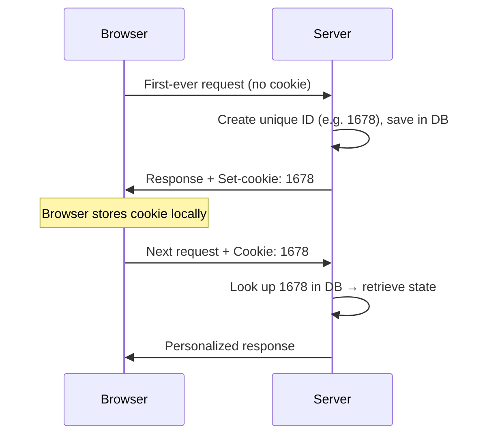

# The World Wide Web and HTTP

**HTTP request/response structure, non-persistent vs. persistent connections, statelessness, and cookies.**

## 1. The Real-World Situation — Start From Zero

You click a link. Your browser fetches a page made of a dozen pieces — text, images, style files — and assembles them faster than you can blink. Behind that click is one question answered by a protocol called HTTP (HyperText Transfer Protocol): **how should a browser ask a server for objects, and how should the server reply?**

Two design puzzles dominate. First, should the browser open a fresh transport connection for *every* object, or reuse one connection for all of them? Second, the server deliberately remembers *nothing* between requests — so how do logins and shopping carts survive? This note solves both: connection reuse first, memory-outside-the-protocol second.

::: callout-intuition Core Mental Model: The Amnesiac Waiter
Picture a waiter with total amnesia — every time you order, they treat you as a brand-new customer, with zero memory of anything you ordered a minute ago. This is exactly how **HTTP** behaves: it is **stateless**. Every request is handled in complete isolation from every previous one, even from the same browser, even seconds apart.

Now imagine fetching a webpage that has text plus ten embedded images. Should the waiter make a brand-new trip to the kitchen (open a brand-new connection) for *every single item*, or should they keep one open channel and bring everything back over it? Early HTTP (1.0) did the former — **non-persistent**, closing and reopening a TCP (Transmission Control Protocol) connection per object, wasting time on repeated handshakes. Modern HTTP (1.1) does the latter — **persistent**, reusing one open connection for many objects in a row.

But if the waiter forgets everything, how does a shopping cart or login session survive? The restaurant hands you a **cookie** — a small claim-check with a unique ID — the moment you first sit down. Every time you order again, you show that claim-check, and the amnesiac waiter looks up your ID in a notebook to instantly recall your entire history, without ever "remembering" anything on their own.

Dropping the restaurant now: stateless = server keeps no per-client memory; persistent = one TCP connection reused; cookie = client-held ID the server looks up.
:::

## 2. Words First — Every Term Defined

| Term (abbreviation expanded on first use) | Plain meaning |
|---|---|
| **HTTP (HyperText Transfer Protocol)** | The Web's application-layer request/response protocol: browser asks, server answers. |
| **Web page / object / URL (Uniform Resource Locator)** | A page is a document (usually HTML — HyperText Markup Language) referencing objects (single files: images, style sheets, scripts); a URL is an object's address (hostname + path). |
| **Stateless protocol** | The server retains no memory of past requests; each request is processed independently. |
| **Non-persistent connection** | A new TCP connection per object, closed after each transfer (HTTP/1.0 behavior). |
| **Persistent connection** | One TCP connection reused for many objects in sequence (HTTP/1.1 default). |
| **RTT (Round-Trip Time)** | Time for a small message to travel to the server and back; each fresh handshake costs RTTs. |
| **Cookie** | A small ID the server gives the browser (via the `Set-cookie` header) that the browser resends on later requests so the server can recover per-client state. |
| **TCP (Transmission Control Protocol)** | Reliable, ordered, connection-oriented transport service HTTP/1.0, HTTP/1.1, and HTTP/2 run over. (HTTP/3 instead runs over QUIC, a UDP-based protocol — so "HTTP always uses TCP" is true only up to HTTP/2.) |

## 3. Purpose — Connection Economy, Then Message Structure

### 3.1 HTTP Fundamentals

* **Transport:** HTTP/1.0, HTTP/1.1, and HTTP/2 run over **TCP**, never plain UDP (User Datagram Protocol), to guarantee reliable, in-order delivery. The modern exception is **HTTP/3**, which runs over QUIC (a reliable protocol built on UDP) — so qualify any "HTTP = TCP" claim with the version.
* **Statelessness:** the server retains **no memory** of past requests. Identical requests seconds apart are treated as entirely new.

### 3.2 Operation Flow: Non-Persistent vs. Persistent Connections

```mermaid
sequenceDiagram
    participant B as Browser
    participant W as Web Server
    rect rgb(40,40,60)
    Note over B,W: Non-Persistent HTTP (HTTP/1.0)
    B->>W: Open TCP connection
    B->>W: GET index.html
    W->>B: index.html
    Note over B,W: Connection closes
    B->>W: Open NEW TCP connection
    B->>W: GET image1.jpg
    W->>B: image1.jpg
    Note over B,W: Connection closes (repeat per object!)
    end
```

```mermaid
sequenceDiagram
    participant B as Browser
    participant W as Web Server
    rect rgb(40,60,40)
    Note over B,W: Persistent HTTP (HTTP/1.1)
    B->>W: Open TCP connection (once)
    B->>W: GET index.html
    W->>B: index.html
    B->>W: GET image1.jpg
    W->>B: image1.jpg
    B->>W: GET image2.jpg
    W->>B: image2.jpg
    Note over B,W: Same connection reused for all objects
    end
```

| | Non-Persistent (HTTP/1.0) | Persistent (HTTP/1.1) |
|---|---|---|
| Connections needed | One per object | One, reused for many objects |
| Overhead | High — repeated TCP handshakes | Low — handshake paid once |
| Latency | Higher | Lower |

::: callout-formula KTU Formula Vault: Connection-Count Rule
For a page with $N$ objects (HTML + embedded): **non-persistent needs $N$ TCP connections** (one per object, each paying a handshake), **persistent needs 1** (reused). The worked example below is $N = 6 \to$ 6 vs. 1 — learn the pattern, not the instance.
:::

### 3.3 Packet Structure: HTTP Message Structure

**Request Message:**
* **Request Line:** method (`GET`, `POST`, `HEAD`, `PUT`, `DELETE`) + URL path + version, e.g. `GET /index.html HTTP/1.1`
* **Header Lines:** `Host:`, `User-Agent:`, `Accept-Language:`, etc.
* **Entity Body:** used mainly by `POST` to carry form data/payloads.

**Response Message:**
* **Status Line:** version + status code + status message, e.g. `HTTP/1.1 200 OK` or `HTTP/1.1 404 Not Found`
* **Header Lines:** `Date:`, `Server:`, `Content-Length:`, `Content-Type:`
* **Data (Body):** the actual requested object.

### 3.4 Cookies: Faking Statefulness on Top of a Stateless Protocol

## 4. Examples — Tiny First, Then Exam-Level

### 4.1 Toy Example (30 seconds)

A page has exactly 2 objects: `a.html` and `b.jpg`. Non-persistent: open connection, fetch `a.html`, close; open connection, fetch `b.jpg`, close — 2 handshakes for 2 objects. Persistent: open once, fetch both, close — 1 handshake. Now scale 2 to any $N$.

### 4.2 KTU-Style Worked Example

::: step [Step 1: Setup] Formulating the Problem
An HTML page references 5 embedded images. Compute the total number of TCP connections required to fully load this page under (a) Non-Persistent HTTP and (b) Persistent HTTP.
:::

::: step [Step 2: Execution] Counting Connections
**Non-Persistent:** the HTML file itself requires 1 connection. Each of the 5 images then requires its *own* new connection (opened and closed individually) = 5 more connections. Total = 1 + 5 = **6 separate TCP connections**.
**Persistent:** a single TCP connection is opened once, and the HTML file plus all 5 images are transferred sequentially over that same connection before it closes. Total = **1 TCP connection**.
:::

::: step [Step 3: Conclusion] Final Result
Non-Persistent HTTP needs 6× as many TCP connections as Persistent HTTP for this page — each extra connection costs a full TCP three-way handshake's worth of round-trip latency. This is precisely why HTTP/1.1's persistent connections became the default: dramatically less overhead for pages with many embedded objects, which describes nearly every modern web page.
:::

## 5. Distinctions, Watch-Outs, and Exam Recap

| Pair students confuse | Distinction that earns marks |
|---|---|
| Non-persistent vs. persistent | $N$ connections (one per object) vs. 1 reused connection. |
| Stateless vs. stateful | HTTP server remembers nothing (cookies work around it); contrast FTP, which tracks sessions. |
| Cookie vs. session memory | Cookie = client-held ID; actual state lives in the server's database, keyed by that ID. |
| HTTP/1.1 vs. HTTP/3 transport | Classical HTTP runs over TCP; HTTP/3 runs over QUIC (UDP-based). |

**Watch out:** (1) Writing "HTTP never uses UDP" without the HTTP/3 qualification. (2) Counting only embedded images and forgetting the base HTML file ($N$ includes it). (3) Saying cookies "make HTTP stateful" — the protocol stays stateless; cookies store the ID that lets the server *look up* state.

::: callout-exam KTU Exam Focus: One-Paragraph Recap
HTTP = stateless request/response over TCP (up to HTTP/2; HTTP/3 uses QUIC over UDP). Non-persistent (1.0): one TCP connection per object. Persistent (1.1): one connection reused. Request = request line + headers + body; response = status line + headers + data. Cookies (`Set-cookie` ID + server-side lookup) restore sessions without changing statelessness.
:::

**Active-recall checklist:** Why does non-persistent cost $N$ handshakes? What three parts does each message type carry? How does a cookie let an amnesiac server remember you? Which HTTP version breaks the "always TCP" rule?

## 6. Active Recall Quizzes

::: quiz Q1: Foundational Concept
Why is HTTP referred to as a "stateless" protocol?
(A) Because it does not use TCP as its transport protocol
(*B) Because the server retains no information about any previous client requests, treating every request as entirely new
(C) Because HTTP messages cannot contain any headers
(D) Because HTTP can only transfer static HTML files
::: explanation
Statelessness means the server has no built-in memory of past interactions — two identical requests from the same client are handled completely independently, with no server-side history unless something external (like a cookie) supplies that context.
:::

::: quiz Q2: Foundational Concept
An HTML page contains text and 5 image references. How many total TCP connections are established to fetch the entire page under Non-Persistent HTTP vs. Persistent HTTP?
(A) 1 connection in both cases
(*B) 6 connections under Non-Persistent HTTP (1 per object); 1 connection under Persistent HTTP (reused for all objects)
(C) 5 connections under Non-Persistent HTTP; 6 under Persistent HTTP
(D) Persistent HTTP always requires more connections than Non-Persistent HTTP
::: explanation
Non-Persistent HTTP opens and closes a fresh TCP connection for every single object (the HTML file plus each of the 5 images = 6 total), while Persistent HTTP keeps one TCP connection open and reuses it to fetch every object sequentially.
:::

::: quiz Q3: Foundational Concept
What role does the `Set-cookie` header play in maintaining state?
(A) It permanently changes the HTTP protocol from stateless to stateful
(*B) It gives the browser a unique identifier to store and resend on future requests, letting the server look up prior state associated with that ID
(C) It forces the browser to close its TCP connection
(D) It encrypts all future requests from that browser
::: explanation
`Set-cookie` doesn't change HTTP's fundamentally stateless nature — it works *around* it. The server issues a unique ID, the browser stores and automatically resends it, and the server uses that ID as a lookup key into its own database to reconstruct "memory" of that specific client.
:::
