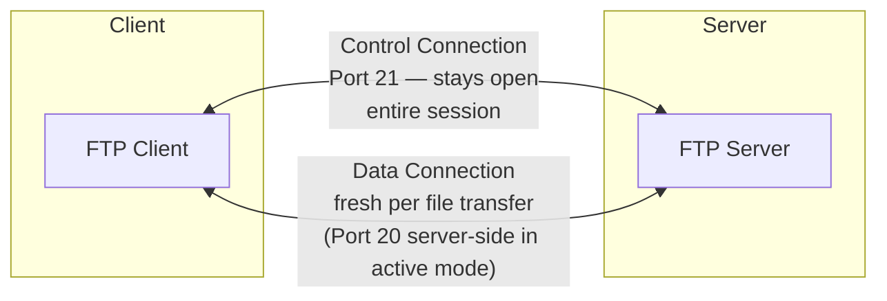
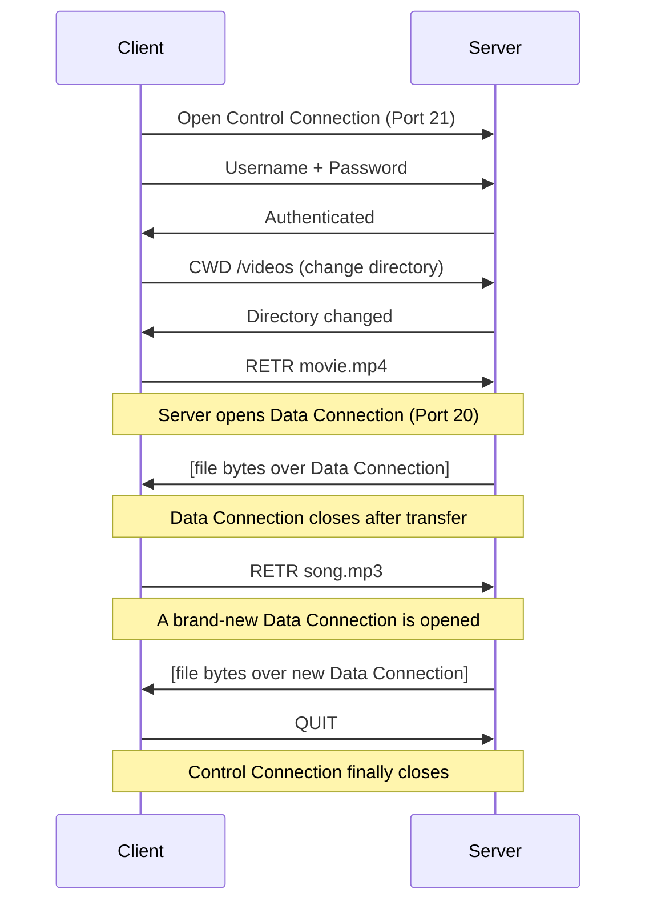

# File Transfer Protocol (FTP)

**Out-of-band control vs. data connections, the FTP session lifecycle, Active vs. Passive mode, and stateful session tracking.**

## 1. The Real-World Situation — Start From Zero

HTTP fetches pages brilliantly — but suppose you must *manage* files on a distant machine: log in, browse folders, rename things, upload and download large files. A page-fetching protocol has no notion of "current folder" or "logged-in user." FTP (File Transfer Protocol) was built for exactly this job, and its signature idea is radical: **use two separate connections** — one for conversation, one for cargo.

The problem before the solution: control chatter (commands, logins) is tiny and interactive, while file bytes are huge and one-directional. Mixing them on one channel (as HTTP does) forces the server to stay amnesiac. Splitting them lets the server hold a *session* — remembering who you are and where you stand — while bulk data flows undisturbed on its own channel.

::: callout-intuition Core Mental Model: Ordering a Refrigerator
Imagine ordering a refrigerator from a store. You call the store on the telephone to place the order, confirm your identity, and specify what you want — this phone conversation is entirely separate from what happens next: the store dispatches a large delivery truck carrying the actual refrigerator to your house. The conversation and the heavy lifting travel over two completely different channels.

This is exactly how **FTP** works. The **telephone call** is the **Control Connection (Port 21)** — used for login, browsing directories, and issuing commands like "send me this file." The **delivery truck** is the **Data Connection** — used strictly to carry the actual file bytes (in the original active-mode design the server sends it from its Port 20; passive mode uses a negotiated high port instead). Because control information travels on a separate channel from the data, FTP is said to use **out-of-band** control — in sharp contrast to HTTP, which mixes its request headers and payload data into the very same connection (**in-band** control).

Dropping the store now: control connection = Port 21, session-long; data connection = fresh per file; out-of-band = the two never mix.
:::

## 2. Words First — Every Term Defined

| Term (abbreviation expanded on first use) | Plain meaning |
|---|---|
| **FTP (File Transfer Protocol)** | The application-layer protocol for interactive file management and transfer between hosts. |
| **Control connection (TCP port 21)** | The session-long channel carrying logins, directory commands (`CWD` — change working directory), and transfer commands (`STOR` — store/upload, `RETR` — retrieve/download, `QUIT`). |
| **Data connection** | A short-lived channel carrying only raw file bytes — opened fresh per file, closed after. In **active mode** the server originates it from its port 20; in **passive mode** the client connects to a server-nominated high port. |
| **Out-of-band control** | Signaling travels on a different connection from the data it governs (FTP). Opposite: **in-band** (HTTP mixes both). |
| **Active mode** | The server opens the data connection back to the client's address. |
| **Passive mode (`PASV`)** | The client opens the data connection outbound to a server-provided port — firewall-friendly. |

::: toggle Why does `active` mode fail behind firewalls?
In `active` mode the server connects back to the client's random port for data.
Client firewalls reject that unsolicited inbound leg as if it were an attack.
`PASV` fixes it: the client always dials out, which firewalls normally allow.
:::

::: toggle What does `stateful` mean for FTP?
`Stateful` means the server remembers login and working directory across commands.
That lets relative commands like `CWD ../reports` make sense mid-session.
The price is per-user memory, so FTP scales worse than stateless HTTP.
:::
| **Stateful session** | The server remembers per-user context (working directory, login) across commands — the opposite of HTTP's amnesia. |
| **Firewall** | A filter (usually at a network boundary) that blocks unsolicited inbound connections while allowing outbound ones. |

::: toggle What does `FTP` mean?
`FTP` is the application-layer protocol for interactive file management and transfer.
It handles login, directory browsing, renaming, uploads, and downloads.
Tiny example: `RETR movie.mp4` downloads a file, `STOR notes.txt` uploads one.
:::

::: toggle What does `out-of-band` control mean?
`Out-of-band` means control commands travel on a separate connection from file bytes.
FTP keeps Port 21 for commands and opens a fresh data channel per file.
HTTP instead mixes headers and payload in one connection, which is `in-band`.
:::

## 3. Purpose — Two Channels, One Session Lifecycle, Two Firewall Modes

### 3.1 The Dual-Connection Architecture

* **Control Connection (Port 21):** carries login credentials, directory-navigation commands (`CWD`), and transfer commands (`STOR` to upload, `RETR` to download). Remains open for the **entire session**.
* **Data Connection:** carries only raw file bytes. A **new** data connection is opened and closed for **every individual file**. Qualifier: "data = Port 20" is true only of the server's end in **active mode** — in passive mode the server nominates a random high port, and the client's end is always an ephemeral port.

::: callout-pitfall Two Numbers, Two Rules
**Port 20 is the *active-mode* data port** — in passive mode the server instead opens a random high port (see §3.3), so never write "data = always 20" without the active-mode qualifier. And the counting rule is fixed: **1 control connection per session, 1 fresh data connection per file** — a 3-file download means 1 + 3, never 3 + 3.
:::

### 3.2 Operation Flow: The FTP Session Lifecycle

### 3.3 Active vs. Passive FTP

Firewalls, by design, block unsolicited incoming connections — which causes trouble for FTP's original design:

| Mode | Behavior | Firewall Compatibility |
|---|---|---|
| **Active Mode** | Client opens a random port and tells the server to connect *back* to it | Often **blocked** — client's own firewall rejects the server's inbound connection attempt |
| **Passive Mode (`PASV`)** | Client asks the server to open a random high port; client then connects *outbound* to that port | Works well — the client always initiates outbound, which firewalls typically allow |

### 3.4 FTP is Stateful

Unlike HTTP, the FTP server **remembers** things about each connected user throughout the session:

* The user's current working directory (so relative paths like `CWD ../reports` make sense).
* The user's authentication/authorization state.

*Trade-off:* maintaining this per-user state limits how many simultaneous sessions a single FTP server can sustain, compared to a stateless HTTP server that can serve far more clients with the same resources.

## 4. Examples — Tiny First, Then Exam-Level

### 4.1 Toy Example (30 seconds)

You download one file. Control connection opens (Port 21), you log in, send `RETR notes.txt`; one data connection opens, carries the bytes, closes; you send `QUIT`, control closes. Tally: 1 control + 1 data. Add a second file before quitting and only the data count grows: 1 + 2.

### 4.2 KTU-Style Worked Example

::: step [Step 1: Setup] Formulating the Problem
A user connects to an FTP server, changes into a `/videos` directory, downloads two files (`movie.mp4` and `trailer.mp4`), then disconnects. Count how many Control Connections and how many Data Connections are used in total.
:::

::: step [Step 2: Execution] Tracing Connections
1. **Control Connection opened** (Port 21) — used for login and the `CWD /videos` command. **1 control connection total**, and it stays open the whole time.
2. `RETR movie.mp4` is issued over the control connection → the server opens a **new Data Connection**, transfers the file, then closes that data connection.
3. `RETR trailer.mp4` is issued over the *same* control connection → the server opens **another new Data Connection** (a second one), transfers the file, then closes it.
4. `QUIT` is sent over the control connection, which finally closes.
:::

::: step [Step 3: Conclusion] Final Result
The session uses exactly **1 Control Connection** (open for the whole session) and **2 separate Data Connections** (one per file transferred). This demonstrates FTP's defining rule: the control channel is long-lived and shared across the whole session, while a fresh data channel is created and torn down for every single file.
:::

## 5. Distinctions, Watch-Outs, and Exam Recap

| Pair students confuse | Distinction that earns marks |
|---|---|
| Out-of-band vs. in-band | FTP splits control (21) from data; HTTP mixes both in one connection. |
| Active vs. passive | Server dials back (firewall-blocked) vs. client always dials out (firewall-friendly). |
| Stateful vs. stateless | FTP tracks directory + login per session (costs scale); HTTP remembers nothing (scales). |
| Port 20 vs. port 21 | Control is always 21; 20 is only the server's active-mode data port. |

**Watch out:** (1) "Data = always Port 20" — add the active-mode qualifier. (2) Counting one control connection per file — it is one per *session*. (3) "Stateful means faster" — state buys continuity, statelessness buys scale; the direction is the reverse of the naive guess.

::: callout-exam KTU Exam Focus: One-Paragraph Recap
FTP = out-of-band (Port-21 control, session-long) + per-file data channels; lifecycle login → navigate → RETR/STOR per file → QUIT. Active (server connects back, firewall-hostile) vs. passive PASV (client dials out, firewall-friendly). Stateful (directory + auth per session) trades scale for continuity — the mirror of HTTP's statelessness.
:::

**Active-recall checklist:** What travels on Port 21 vs. the data channel? How many of each connection does a 3-file session use? Why does active mode fail behind firewalls, and what is the minimal fix? Why does statefulness bound simultaneous users?

## 6. Active Recall Quizzes

::: quiz Q1: Foundational Concept
What does it mean when we say FTP uses "out-of-band" control?
(A) FTP does not use TCP for either connection
(*B) Control information (commands, login) travels over a separate connection (Port 21) from the actual file data (Port 20), unlike HTTP which mixes both into one connection
(C) FTP control messages are encrypted while data is not
(D) FTP has no concept of a control connection at all
::: explanation
"Out-of-band" specifically means the signaling/control channel is physically separate from the data channel — FTP's Port 21 (control) and Port 20 (data) are two entirely distinct TCP connections, whereas HTTP sends both requests and data "in-band" over the same single connection.
:::

::: quiz Q2: Foundational Concept
Why did FTP introduce "Passive Mode"?
(A) To make file transfers faster by compressing data
(*B) Because in Active Mode, client-side firewalls typically block the server's unsolicited inbound connection attempt; Passive Mode has the client always initiate outbound connections instead
(C) To eliminate the need for a control connection entirely
(D) To allow multiple users to share the same data connection simultaneously
::: explanation
Active Mode requires the *server* to open a new connection back to the client, which most client firewalls block by default (since it looks like unsolicited incoming traffic). Passive Mode flips this: the client always initiates the data connection outbound to a port the server opens, which firewalls generally permit.
:::

::: quiz Q3: Foundational Concept
Why does maintaining FTP's stateful session information limit server scalability compared to stateless HTTP?
(A) FTP servers use more expensive hardware than HTTP servers
(*B) The server must keep dedicated per-user state (current directory, authentication) in memory for the duration of each session, consuming resources that scale with the number of simultaneously connected users
(C) FTP cannot support more than one user at a time
(D) FTP requires more physical cabling than HTTP
::: explanation
Because FTP tracks per-session context (like the current working directory) rather than treating each request independently, a busy FTP server must dedicate ongoing resources to every connected user — unlike a stateless HTTP server, which can process each request without holding onto any long-lived per-client memory.
:::
