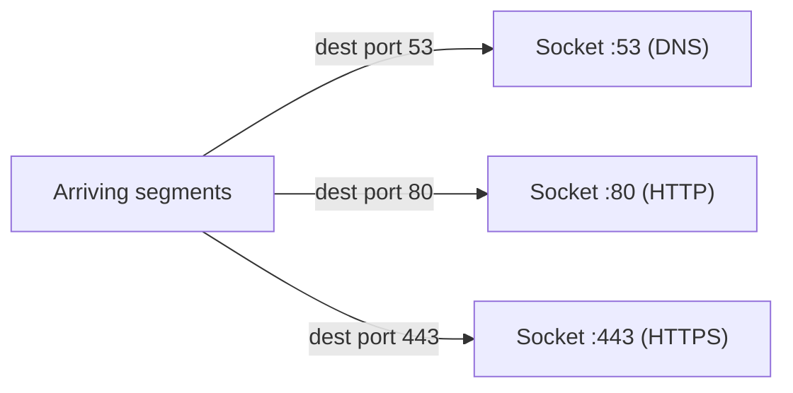

# Transport-Layer Services & Multiplexing

**Process-to-process delivery, connectionless vs. connection-oriented service, ports, sockets, and how one host sorts arriving segments to the right app.**

## 1. The Real-World Situation — Start From Zero

Your computer receives one stream of packets at its single IP (Internet Protocol) address — but runs a browser, a mail client, and a game at the same time. Which bytes belong to which program? The network layer (which delivers host-to-host) cannot answer: it stops at the front door. Someone must read the apartment number on each envelope.

The problem before the solution: extend host-to-host delivery into **process-to-process** delivery. That someone is the **transport layer**, living in your machine (and the sender's) — never in the routers between. It offers applications exactly two service personalities: fast-and-unreliable (UDP — User Datagram Protocol) or careful-and-reliable (TCP — Transmission Control Protocol).

::: callout-intuition Core Mental Model: The Apartment Building
The network layer delivers mail to the right **building** (host, by IP address) — but a building holds many **apartments** (processes: browser, mail client, game). Somebody must read the apartment number on each envelope and slide it under the correct door. That somebody is the **transport layer**: it extends host-to-host delivery into **process-to-process** delivery. The "apartment numbers" are **port numbers**, and each door (socket) is watched by exactly one process.

Dropping the building now: port = process number in the header; socket = the `IP:port` endpoint; multiplexing = many sockets sharing one network layer on send; demultiplexing = sorting arrivals back to sockets on receipt.
:::

The transport layer offers application processes exactly two personalities to choose from — and every application you have met picks one:

* **Connectionless, unreliable (UDP):** "throw the envelope and hope." No setup, no guarantees — but fast and light. (DNS lookups, live streaming, online games.)
* **Connection-oriented, reliable (TCP):** "call first, then speak carefully." A handshake opens the channel then every byte is tracked, ordered, and re-sent if lost. (Web, email, file transfer.)

::: callout-pitfall Service Lives in the End Systems, Not the Network
Exam trap: multiplexing, reliability, and congestion control are implemented **only in hosts** (sender + receiver), never inside routers. The network core stays dumb and fast; all the cleverness sits at the edge. If an option places TCP logic "in the router," eliminate it instantly.
:::

## 2. Words First — Every Term Defined

| Term (abbreviation expanded on first use) | Plain meaning |
|---|---|
| **Transport layer** | The end-to-end layer (layer 4) extending host delivery to process delivery. |
| **Multiplexing (sender side)** | Gathering data chunks from several sockets, wrapping each with a transport header, handing them down to the network layer. |
| **Demultiplexing (receiver side)** | Inspecting each arrival's identifiers and steering its payload up to the correct socket. |
| **Socket** | The programming doorway between a process and transport, named `IP:port`. |
| **Port number** | 16-bit process identifier; 0–1023 are **well-known** (HTTP 80, HTTPS 443, FTP-control 21, DNS 53, SMTP 25); clients use ephemeral high ports. |
| **2-tuple / 4-tuple** | The demultiplexing key: UDP uses (destination IP, destination port); TCP uses (source IP, source port, destination IP, destination port). |

::: toggle What do `multiplexing` and `demultiplexing` mean?
`Multiplexing` gathers chunks from several sender sockets, adds transport headers, and hands them to the network layer.
`Demultiplexing` inspects each arrival's port identifiers and steers the payload up to the correct receiver socket.
Tiny example: a browser and a mail client send together, and ports sort their replies back apart on arrival.
:::

::: toggle What is a `2-tuple` vs a `4-tuple`?
A UDP `2-tuple` keys only on destination IP and destination port, so two senders share one socket.
A TCP `4-tuple` adds source IP and source port, so each client connection gets its own socket.
Tiny example: two clients on source ports 5001 and 5002 share server port 80 but use two different 4-tuples.
:::

## 3. Purpose — Sorting Rules, Then the Numbers

### 3.1 Multiplexing and Demultiplexing

* **Multiplexing (sender):** gathering data chunks from several sockets, wrapping each with transport headers, and handing the segments down to the network layer.
* **Demultiplexing (receiver):** inspecting each arriving segment's destination identifiers and steering its payload up to the correct socket.

How the receiver identifies the socket differs — and this difference is heavily examined:

| | UDP demultiplexing | TCP demultiplexing |
|---|---|---|
| Key used | (destination IP, destination **port**) | full **4-tuple**: (source IP, source port, destination IP, destination port) |
| Consequence | Two senders to the same port land in the **same** socket | Each client connection gets its **own** socket, even to the same server port |

::: callout-formula KTU Formula Vault: The Demux Keys
UDP = **2-tuple** (dst IP, dst port). TCP = **4-tuple** (+ src IP, src port). The standard 3-mark question: "two HTTP clients connect to one web server — how many sockets?" Answer: **three** — one welcoming socket plus one connection socket per client, distinguished by the clients' differing source ports.
:::

### 3.2 Sockets, Ports, and Well-Known Numbers

A **socket** is the programming interface between an application process and the transport layer, named by `(IP address, port number)`. Ports 0–1023 are **well-known** (HTTP 80, HTTPS — HyperText Transfer Protocol Secure — 443, FTP-control 21, DNS 53, SMTP 25); servers listen on them while clients use ephemeral high ports.

::: toggle What is a `socket` and a `well-known port`?
A `socket` is the `IP:port` doorway where one application process sends and receives transport data.
A `well-known port` is a fixed low number below 1024 where a standard service listens, such as 80 for HTTP.
Tiny example: a browser uses ephemeral port 49152 to talk to server `IP:80`, and the reply reverses the pair.
:::

## 4. Examples — Tiny First, Then Exam-Level

### 4.1 Toy Example (30 seconds)

One server port (80), two clients. Client A (source port 5001) and client B (source port 5002) both connect. Same destination IP + port — yet the server keeps them apart, because the full 4-tuples differ in the source half. Sockets server-side: 1 welcoming + 2 connection = 3.

### 4.2 KTU-Style Worked Example

::: step [Step 1: Setup] Formulating the Problem
Host A runs a DNS client (ephemeral port 52001) and a browser tab fetching a page. Host B runs a DNS server (port 53) and a web server (port 80). A DNS reply and an HTTP segment both arrive at host A addressed to its IP. Which socket gets each segment, and why can't they be mixed up?
:::

::: step [Step 2: Execution] Applying Demultiplexing
The DNS reply carries destination port 52001 → steered to the DNS client's socket (UDP 2-tuple match). The HTTP segment carries destination port (browser's ephemeral port, e.g. 49152) → steered to the browser's TCP socket (4-tuple match). The port numbers in the headers make the decision unambiguous even though both segments arrived at the same IP in the same instant.
:::

::: step [Step 3: Conclusion] Final Result
Demultiplexing keys — not arrival order, not timing — decide ownership. UDP needs only the destination pair; TCP additionally separates connections by source, which is why one server port can serve thousands of simultaneous clients without confusion.
:::

## 5. Distinctions, Watch-Outs, and Exam Recap

| Pair students confuse | Distinction that earns marks |
|---|---|
| Multiplexing vs. demultiplexing | Sender-side gathering vs. receiver-side sorting. |
| UDP vs. TCP demux key | 2-tuple (dst IP + port) vs. 4-tuple (+ src IP + port). |
| Port vs. socket | Port = process number; socket = full `IP:port` endpoint. |
| Welcoming vs. connection socket | One listener on the well-known port vs. one socket per TCP connection. |

**Watch out:** (1) "One port, one socket" — ports name services, 4-tuples name connections. (2) Placing transport logic in routers — hosts only. (3) Answering "1 socket" for 200 clients — count 1 welcoming + 200 connection sockets.

::: callout-exam KTU Exam Focus: One-Paragraph Recap
Transport = process-to-process via ports/sockets, implemented in end systems only. UDP demux = 2-tuple; TCP demux = 4-tuple (one welcoming + one connection socket per client). Services: connectionless unreliable (UDP: DNS, streaming, games) vs. connection-oriented reliable (TCP: web, mail, files). Well-known ports 0–1023; clients ephemeral.
:::

**Active-recall checklist:** What does the transport layer add over the network layer? Recite both demux keys. Why do 200 clients need 201 server sockets? Where does reliability code execute?

## 6. Active Recall Quizzes

::: quiz What is the transport layer's core job, beyond what the network layer already provides?
() Routing packets across multiple networks
(*) Extending host-to-host delivery into process-to-process delivery via ports and sockets
() Converting domain names into IP addresses
() Encrypting all application data
::: explanation
The network layer moves datagrams between *hosts* (IP addresses). The transport layer adds the second half of the address — the *port* — so payloads reach the correct *process* (socket) on that host. Routing, DNS, and encryption belong to other layers/mechanisms.
:::

::: quiz Two different clients open HTTP connections to the same web server port 80. How does the server keep their data separate?
() It cannot — the second client is rejected until the first disconnects
(*) Each connection is demultiplexed by its full 4-tuple, and the clients' differing source IPs/ports give each its own connection socket
() The server assigns each client a different IP address
() HTTP is connectionless, so no separation is needed
::: explanation
TCP demultiplexing uses (source IP, source port, destination IP, destination port). Same destination port 80, but different source endpoints → different 4-tuples → separate connection sockets. This is exactly why one well-known port serves unlimited concurrent clients.
:::

::: quiz Where are transport-layer functions (reliability, multiplexing, congestion control) implemented?
() Inside core routers, which inspect every TCP header
(*) Only in the end systems (sender and receiver hosts)
() In DNS servers distributed across the network
() Equally in every device including switches and hubs
::: explanation
The end-to-end principle: transport intelligence lives at the edge. Routers forward IP datagrams without TCP/UDP connection state, which keeps the core fast and simple while hosts implement reliability and congestion control cooperatively.
:::
