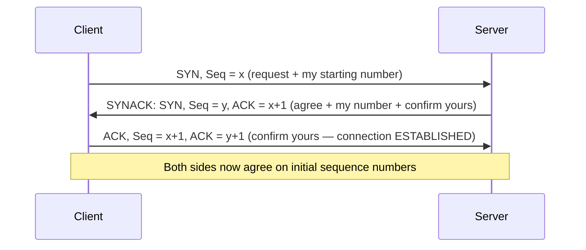

# TCP Flow Control & Connection Management

**Receive window (rwnd) overflow protection, the 3-way handshake with sequence synchronization, and why teardown needs four steps.**

## 1. The Real-World Situation — Start From Zero

Two mismatches threaten every TCP connection. First, a fast sender can drown a slow reader: if the receiver's app reads 1 KB/s while the sender pushes 1 MB/s, the receiver's buffer overflows and data dies at the finish line. Second, two strangers must agree they are actually talking to each other — and later agree they are done — over a network that duplicates and delays messages.

The problem before the solution: (a) pace the sender to the *reader's* speed (flow control), and (b) open and close the conversation so reliably that stale duplicate messages can never conjure phantom connections or cut farewells short.

::: callout-intuition Core Mental Model: The Thirsty Guest
Flow control is pouring drinks for a guest: you match *their* sipping speed, not your jug's capacity — overflow the glass and drink spills (packets drop at an overwhelmed receiver). Connection management is the phone call around the conversation: you **dial and confirm** ("hello? — hello! — let's talk") before speaking, and both sides **say goodbye and wait for the echo** before hanging up, so no farewell is ever cut off mid-sentence.

Dropping the party now: rwnd = free buffer bytes advertised by the receiver; handshake = SYN → SYNACK → ACK synchronizing both starting numbers; teardown = FIN/ACK each way plus a 2MSL wait.
:::

## 2. Words First — Every Term Defined

| Term (abbreviation expanded on first use) | Plain meaning |
|---|---|
| **Flow control** | Pacing the sender to the receiver's drain rate so its buffer never overflows. |
| **rwnd (receive window)** | Free bytes currently in the receiver's buffer: `RcvBuffer − (LastByteRcvd − LastByteRead)`, advertised in every TCP header. |
| **cwnd (congestion window)** | Sender-computed cap protecting the *network* (next topic) — the sender honors `min(cwnd, rwnd)`. |
| **SYN / ACK / FIN (synchronize / acknowledgment / finish)** | TCP flags opening (SYN), confirming (ACK), and closing (FIN) a connection. |
| **ISN (Initial Sequence Number)** | Each side's random starting byte number, confirmed by the other side. |
| **MSL (Maximum Segment Lifetime)** | Bound on how long any segment can linger in the network; teardown waits **2MSL**. |
| **Half-close** | One direction closed (FIN sent) while the other still delivers — legal because directions close independently. |

## 3. Purpose — Window Inequality, Handshake, Teardown

### 3.1 Flow Control: Never Drown the Receiver

The receiver advertises a **receive window** `rwnd` = free bytes left in its buffer (`RcvBuffer − (LastByteRcvd − LastByteRead)`). Symbols: `LastByteSent` = highest byte transmitted; `LastByteAcked` = highest byte confirmed. The sender obeys:

$$\text{LastByteSent} - \text{LastByteAcked} \le \min(\text{cwnd}, \text{rwnd})$$

* `rwnd` protects the **receiver** (flow control, this topic); `cwnd` protects the **network** (congestion control, next topic) — the sender always honors the *smaller* of the two.
* The window rides in every TCP header, so it tracks the application's reading speed in real time. A zero window politely freezes the sender (with persist probes against deadlock).

### 3.2 Operation Flow: Connection Setup — The 3-Way Handshake

Numbered logic: (1) client's SYN proves client→server reachability and proposes ISN `x`; (2) server's SYNACK proposes ISN `y` and confirms `x`; (3) client's ACK confirms `y`.

Why three and not two? The third ACK proves the *server's* SYN arrived — with only two steps, a stale duplicate SYN could conjure a half-open connection the client never wanted. Each side picks a **random ISN** (security: predictable ISNs enable spoofing) and each side's number is explicitly confirmed by the other.

::: anim tcp-handshake The Three-Message Greeting
Watch SYN leave, SYNACK return, ACK confirm — in this order, always. The animation loops the exact sequence from the diagram above; notice nothing carries data until all three complete.
:::

### 3.3 Operation Flow: Teardown — Four Steps (FIN Apiece + Echoes)

Either side sends **FIN**; the other **ACKs** it, finishes its own remaining data, then sends its **own FIN**, which is ACKed in turn — 4 messages because the two directions close **independently** (half-close is legal: "I'm done sending, still listening"). The initiator then waits **2MSL** (twice the maximum segment lifetime) in TIME_WAIT so stray duplicates die before the same ports are reused.

::: callout-formula KTU Formula Vault: Handshake vs Teardown
Setup = **3** (SYN → SYNACK → ACK; synchronizes *both* ISNs, defeats stale SYNs). Teardown = **4** (FIN → ACK … FIN → ACK; directions close independently) + **2MSL** wait (lets ghosts expire). Sender's live limit = **min(cwnd, rwnd)** — cwnd guards the *network*, rwnd guards the *receiver*.
:::

::: callout-pitfall Flow Control ≠ Congestion Control
Same mechanism family (windows), opposite patients: **rwnd** answers "is the *receiver's buffer* full?" (end-to-end, receiver-set); **cwnd** answers "is the *network* overloaded?" (inferred from loss/delay, sender-computed). An exam option attributing router queues to rwnd — or receiver buffers to cwnd — is always wrong.
:::

## 4. Examples — Tiny First, Then Exam-Level

### 4.1 Toy Example (30 seconds)

Receiver buffer 1000 bytes; app read 600 of 800 received. `rwnd = 1000 − (800 − 600) = 800`. Sender has 800 unACKed → may send 0 more until ACKs or reads free space. The reader's sip, not the sender's jug, sets the pace.

### 4.2 KTU-Style Worked Example

::: step [Step 1: Setup] Formulating the Problem
Receiver buffer 8000 bytes; app has read 5000, received 7000 total. Sender's `cwnd` is 12000 bytes with 3000 unACKed in flight. How many more bytes may the sender transmit right now, and which window binds?
:::

::: step [Step 2: Execution] Computing Both Windows
Free buffer: `rwnd = 8000 − (7000 − 5000) = 6000` bytes. In-flight: 3000, so rwnd allows `6000 − 3000 = 3000` more bytes. cwnd allows `12000 − 3000 = 9000` more bytes. Effective limit: `min(9000, 3000) = 3000` bytes.
:::

::: step [Step 3: Conclusion] Final Result
Only **3000 bytes** may go — the **receiver window binds**, not congestion. The app must read faster (draining the buffer raises rwnd) before the sender's generous cwnd matters at all. This is flow control doing its job: the slow reader, not the fast network, sets the pace.
:::

## 5. Distinctions, Watch-Outs, and Exam Recap

| Pair students confuse | Distinction that earns marks |
|---|---|
| rwnd vs. cwnd | Receiver's free buffer (advertised) vs. network-safe flight size (inferred); honor the min. |
| 3-way setup vs. 4-step teardown | Both ISNs need confirmation (stale-SYN defense) vs. two directions close independently (+ 2MSL). |
| FIN vs. RST | Graceful close vs. abortive reset. |
| Zero window vs. closed connection | Frozen sender (persist-probed) vs. no connection at all. |

**Watch out:** (1) Blaming rwnd for router queues (or cwnd for receiver buffers). (2) "Two messages suffice" — the server's SYN would stay unconfirmed. (3) Skipping 2MSL — ghosts on reused ports corrupt the next connection.

::: callout-exam KTU Exam Focus: One-Paragraph Recap
Limit = `min(cwnd, rwnd)`; rwnd = `RcvBuffer − (Rcvd − Read)`. Setup: SYN(x) → SYNACK(y, ACK x+1) → ACK(y+1); random ISNs, stale-SYN defense. Teardown: FIN/ACK per direction (half-close legal) + TIME_WAIT 2MSL so duplicates expire before port reuse.
:::

**Active-recall checklist:** What does each window guard? Why is the third handshake message indispensable? Why four teardown messages plus a wait? What does a zero window do?

## 6. Active Recall Quizzes

::: quiz The sender's effective transmit limit is min(cwnd, rwnd). What distinct danger does each window guard against?
() Both guard against router congestion; rwnd is just a backup copy
(*) cwnd guards against overloading the network (inferred by the sender); rwnd guards against overflowing the receiver's buffer (advertised by the receiver)
() cwnd guards the receiver while rwnd guards the sender's memory
() Neither guards anything — they only measure throughput
::: explanation
Two patients, two doctors: congestion collapse is a *network* disease treated with the sender's congestion window; receiver overflow is an *endpoint* disease treated with the advertised receive window. The min() takes the stricter diagnosis at every instant.
:::

::: quiz Why does TCP connection setup need three messages instead of two?
() To triple-encrypt the initial sequence numbers
(*) The third ACK confirms the server's SYN arrived — with two, a stale duplicate SYN could open a connection the client never requested
() Three is modem tradition with no technical reason
() To negotiate the MSS value twice for redundancy
::: explanation
Each direction's ISN must be *confirmed*, not merely sent. SYN proves client→server reachability; SYNACK proves server→client; the final ACK closes the loop on the server's number. Two messages leave the server's SYN unconfirmed — the classic half-open-connection ambush.
:::

::: quiz After the final ACK of teardown, why does the initiator sit in TIME_WAIT for 2MSL instead of closing immediately?
() To save power while the other side finishes
(*) So delayed duplicate segments expire in the network before the same port pair is reused and misattributed to a new connection
() TIME_WAIT is when retransmission timers are calibrated
() It waits for DNS to release the hostname
::: explanation
The network can harbor ghosts: old duplicates arriving after close could be mistaken for a fresh connection's data on reused ports. 2MSL bounds any segment's lifetime, so waiting it out guarantees a clean slate — correctness bought with a little lingering state.
:::
