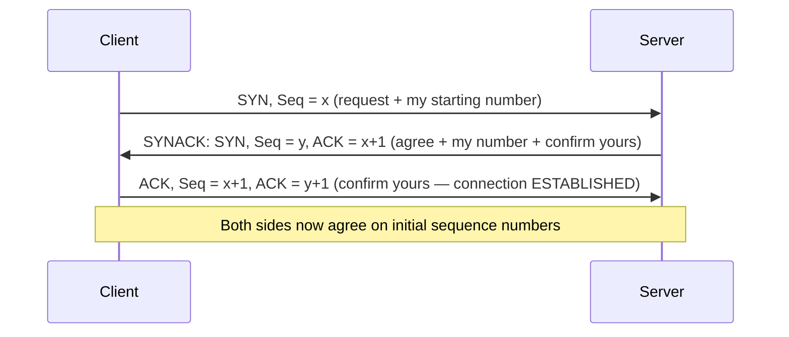

# TCP Flow Control & Connection Management

**Receive window (rwnd) overflow protection, the 3-way handshake with sequence synchronization, and why teardown needs four steps.**

## 1. The Intuition

::: callout-intuition Core Mental Model: The Thirsty Guest
Flow control is pouring drinks for a guest: you match *their* sipping speed, not your jug's capacity — overflow the glass and drink spills (packets drop at an overwhelmed receiver). Connection management is the phone call around the conversation: you **dial and confirm** ("hello? — hello! — let's talk") before speaking, and both sides **say goodbye and wait for the echo** before hanging up, so no farewell is ever cut off mid-sentence.
:::

---

## 2. Theoretical Framework & Formalism

### 2.1 Flow Control: Never Drown the Receiver

The receiver advertises a **receive window** `rwnd` = free bytes left in its buffer (`RcvBuffer − (LastByteRcvd − LastByteRead)`). The sender obeys:

$$\text{LastByteSent} - \text{LastByteAcked} \le \min(\text{cwnd}, \text{rwnd})$$

* `rwnd` protects the **receiver** (flow control, this topic); `cwnd` protects the **network** (congestion control, next topic) — the sender always honors the *smaller* of the two.
* The window rides in every TCP header, so it tracks the application's reading speed in real time. A zero window politely freezes the sender (with persist probes against deadlock).

### 2.2 Connection Setup: The 3-Way Handshake

Why three and not two? The third ACK proves the *server's* SYN arrived — with only two steps, a stale duplicate SYN could conjure a half-open connection the client never wanted. Each side picks a **random ISN** (security: predictable ISNs enable spoofing) and each side's number is explicitly confirmed by the other.

### 2.3 Teardown: Four Steps (FIN Apiece + Echoes)

Either side sends **FIN**; the other **ACKs** it, finishes its own remaining data, then sends its **own FIN**, which is ACKed in turn — 4 messages because the two directions close **independently** (half-close is legal: "I'm done sending, still listening"). The initiator then waits **2MSL** (twice the maximum segment lifetime) in TIME_WAIT so stray duplicates die before the same ports are reused.

::: callout-formula KTU Formula Vault: Handshake vs Teardown
Setup = **3** (SYN → SYNACK → ACK; synchronizes *both* ISNs, defeats stale SYNs). Teardown = **4** (FIN → ACK … FIN → ACK; directions close independently) + **2MSL** wait (lets ghosts expire). Sender's live limit = **min(cwnd, rwnd)** — cwnd guards the *network*, rwnd guards the *receiver*.
:::

::: callout-pitfall Flow Control ≠ Congestion Control
Same mechanism family (windows), opposite patients: **rwnd** answers "is the *receiver's buffer* full?" (end-to-end, receiver-set); **cwnd** answers "is the *network* overloaded?" (inferred from loss/delay, sender-computed). An exam option attributing router queues to rwnd — or receiver buffers to cwnd — is always wrong.
:::

---

## 3. Worked Example / Step-by-Step Scenario

::: step [Step 1: Setup] Formulating the Problem
Receiver buffer 8000 bytes; app has read 5000, received 7000 total. Sender's `cwnd` is 12000 bytes with 3000 unACKed in flight. How many more bytes may the sender transmit right now, and which window binds?
:::

::: step [Step 2: Execution] Computing Both Windows
Free buffer: `rwnd = 8000 − (7000 − 5000) = 6000` bytes. In-flight: 3000, so rwnd allows `6000 − 3000 = 3000` more bytes. cwnd allows `12000 − 3000 = 9000` more bytes. Effective limit: `min(9000, 3000) = 3000` bytes.
:::

::: step [Step 3: Conclusion] Final Result
Only **3000 bytes** may go — the **receiver window binds**, not congestion. The app must read faster (draining the buffer raises rwnd) before the sender's generous cwnd matters at all. This is flow control doing its job: the slow reader, not the fast network, sets the pace.
:::

---

## 4. Active Recall Quizzes

::: quiz The sender's effective transmit limit is min(cwnd, rwnd). What distinct danger does each window guard against?
() Both guard against router congestion; rwnd is just a backup copy
(*) cwnd guards against overloading the network (inferred by the sender); rwnd guards against overflowing the receiver's buffer (advertised by the receiver)
() cwnd guards the receiver while rwnd guards the sender's memory
() Neither guards anything — they only measure throughput
::: explanation
Two patients, two doctors: congestion collapse is a *network* disease treated with the sender's congestion window; receiver overflow is an *endpoint* disease treated with the advertised receive window. The min() takes the stricter diagnosis at every instant.
:::

::: quiz Why does TCP connection setup need three messages instead of two?
() To triple-encrypt the initial sequence numbers
(*) The third ACK confirms the server's SYN arrived — with two, a stale duplicate SYN could open a connection the client never requested
() Three is modem tradition with no technical reason
() To negotiate the MSS value twice for redundancy
::: explanation
Each direction's ISN must be *confirmed*, not merely sent. SYN proves client→server reachability; SYNACK proves server→client; the final ACK closes the loop on the server's number. Two messages leave the server's SYN unconfirmed — the classic half-open-connection ambush.
:::

::: quiz After the final ACK of teardown, why does the initiator sit in TIME_WAIT for 2MSL instead of closing immediately?
() To save power while the other side finishes
(*) So delayed duplicate segments expire in the network before the same port pair is reused and misattributed to a new connection
() TIME_WAIT is when retransmission timers are calibrated
() It waits for DNS to release the hostname
::: explanation
The network can harbor ghosts: old duplicates arriving after close could be mistaken for a fresh connection's data on reused ports. 2MSL bounds any segment's lifetime, so waiting it out guarantees a clean slate — correctness bought with a little lingering state.
:::
