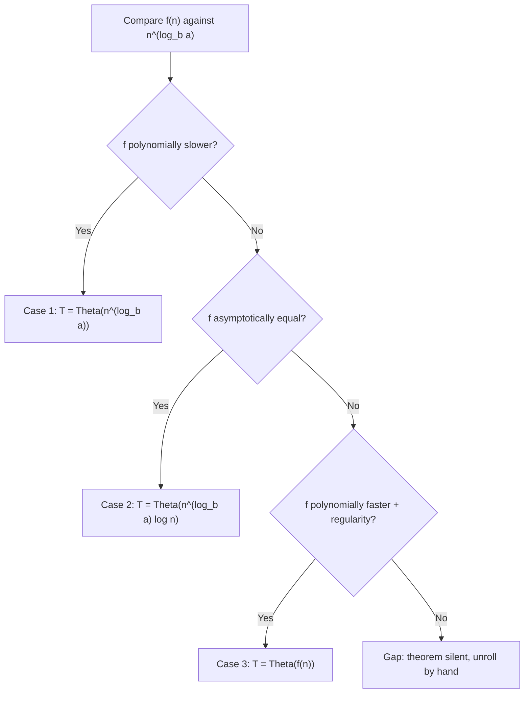

# The Master Theorem for Divide-and-Conquer Recurrences

**Master Theorem formula T(n) = aT(n/b) + f(n), Case 1, Case 2, and Case 3.**

## 1. Start from zero — the problem first

**Problem first.** Iteration and recursion trees both kept asking one question: does the root's work dominate, do the leaves dominate, or is every level equal? The Master Theorem turns that observation into a formula for the whole family $T(n) = aT(n/b) + f(n)$ — compare $f(n)$ against one reference quantity, read off one of three answers, no unrolling.

::: callout-intuition Core Mental Model
Think of it as the cheat sheet *earned* by the previous two topics. Root work vs leaf count, decided by a single comparison: compute the "watershed" $n^{\log_b a}$ (the leaf-level cost from the tree method), then ask whether your $f(n)$ is polynomially smaller (leaves win), equal (tie — pay per level), or polynomially bigger (root wins, with one regularity check).
:::

**Tiny toy example.** $T(n) = 2T(n/2) + 1$: watershed $n^{\log_2 2} = n^1 = n$; $f(n) = 1$ is polynomially smaller → leaves dominate → $\Theta(n)$. One comparison replaces a full tree.

---

## 2. Basic idea, then formal theory

**Symbols:** $a \ge 1$ = sub-problems per call; $b > 1$ = shrink factor; $f(n)$ = non-recursive split/combine work; $\epsilon > 0$ = a fixed polynomial gap (not a limit trickle); $n^{\log_b a}$ = the watershed reference.

**Setup.** Applies only to the exact form $T(n) = a\,T(n/b) + f(n)$.

**Case 1 — leaves dominate.** If $f(n) = O(n^{\log_b a - \epsilon})$ for some $\epsilon > 0$ (polynomially slower):
$$T(n) = \Theta(n^{\log_b a})$$

**Case 2 — balanced.** If $f(n) = \Theta(n^{\log_b a})$ (same rate):
$$T(n) = \Theta(n^{\log_b a} \log n)$$

**Case 3 — root dominates.** If $f(n) = \Omega(n^{\log_b a + \epsilon})$ for some $\epsilon > 0$ (polynomially faster) **and** the regularity condition $a\,f(n/b) \le c\,f(n)$ holds for some $c < 1$ and large $n$ (routine for ordinary polynomials/logs):
$$T(n) = \Theta(f(n))$$

**The gap (honest caveat).** The cases miss $f(n)$ differing from the watershed by only a log factor (e.g. $n^{\log_b a}\log^2 n$): not exact (Case 2 needs equality), not polynomial (Cases 1/3 need $n^\epsilon$ gaps). There, the basic theorem is silent — fall back to iteration/trees or an extended theorem.

::: callout-formula KTU Formula Vault: Master Theorem in 30 Seconds
Compute $n^{\log_b a}$ first. $f$ polynomially *slower* → **Case 1**: $\Theta(n^{\log_b a})$. $f$ *equal* → **Case 2**: $\Theta(n^{\log_b a}\log n)$. $f$ polynomially *faster* (+ regularity) → **Case 3**: $\Theta(f(n))$. Differs only by a $\log$ factor → **gap**: theorem silent, unroll by hand.
:::

---

## 3. Worked example — binary search and merge sort

::: step [Step 1: Setup] Formulating the Problem
Classify $T(n) = T(n/2) + O(1)$ (binary search: $a = 1$, $b = 2$, $f = \Theta(1)$) and $T(n) = 2T(n/2) + \Theta(n)$ (merge sort: $a = 2$, $b = 2$, $f = \Theta(n)$).
:::

::: step [Step 2: Execution] Applying Core Algorithm
**Binary Search:** watershed $n^{\log_2 1} = n^0 = 1$; $f = \Theta(1)$ matches exactly → **Case 2**. **Merge Sort:** watershed $n^{\log_2 2} = n$; $f = \Theta(n)$ matches exactly → **Case 2**.
:::

::: step [Step 3: Conclusion] Final Result
Binary Search: $\Theta(n^0 \log n) = \Theta(\log n)$. Merge Sort: $\Theta(n \log n)$ — the shortcut agrees with the hand-derived iteration result, confirming the theorem is formalised tree reasoning, not magic.
:::

---

## 4. Watch out, distinctions, exam recap

**Common confusions (watch out):**

- Always compute $\log_b a$ first — misreading $\log_2 4$ as 1 (it is 2) flips Case 2 into Case 1 wrongly.
- Case 3 needs the regularity check stated; for exam polynomials it holds, but writing "regularity holds since…" earns the mark.
- "Polynomially" is load-bearing: a mere $\log$ factor difference is *not* enough for Cases 1 or 3.

| Similar pair | Distinction that earns marks |
|---|---|
| Case 1 vs Case 3 | $f$ polynomially below watershed (leaves) vs above it (root + regularity) |
| Case 2 vs the gap | Exact $\Theta$-match vs off-by-a-log-factor (theorem silent) |
| Watershed vs answer | Reference $n^{\log_b a}$ vs final bound (extra $\log n$ only in Case 2) |

**Exam recap (facts an examiner rewards):** the three case conditions with $\epsilon$; regularity $af(n/b) \le cf(n)$; binary search and merge sort are both Case 2; $2T(n/2) + n\log n$ sits in the gap ($\Theta(n\log^2 n)$ needs unrolling).

---

## 5. Active Recall Quizzes

::: quiz In the Master Theorem for $T(n) = aT(n/b)+f(n)$, which case applies when $f(n)$ grows at *exactly* the same rate as $n^{\log_b a}$?
() Case 1
(*) Case 2
() Case 3
() None of the cases apply
::: explanation
Case 2 is defined precisely by $f(n) = \Theta(n^{\log_b a})$ — the extra work per call matches the reference function's growth rate exactly, meaning every level of the recursion tree contributes roughly equal total work, giving the extra $\log n$ factor: $T(n) = \Theta(n^{\log_b a}\log n)$.
:::

::: quiz For the recurrence $T(n) = 4T(n/2) + n$, what is $n^{\log_b a}$, and which Master Theorem case applies?
() $n^{\log_2 4} = n$; since $f(n)=n$ matches the reference exactly, this is Case 2, giving $T(n)=\Theta(n\log n)$
(*) $n^{\log_2 4} = n^2$; since $f(n)=n$ grows polynomially slower, this is Case 1, giving $T(n)=\Theta(n^2)$
() $n^{\log_2 4} = n^2$; this is Case 3, giving $T(n)=\Theta(n)$
() $n^{\log_2 4} = n^2$; this is Case 2, giving $T(n)=\Theta(n^2\log n)$
::: explanation
Here $a=4, b=2$, so $\log_b a = \log_2 4 = 2$ (not 1 — a common slip is reading $\log_2 4$ as 1), giving reference function $n^2$. Since $f(n)=n=n^1$ grows polynomially slower than $n^2$ (i.e. $f(n) = O(n^{2-\epsilon})$ for $\epsilon=1$), this satisfies Case 1, and the leaves dominate: $T(n) = \Theta(n^{\log_b a}) = \Theta(n^2)$.
:::

::: quiz Which of the following recurrences falls *outside* the basic three-case Master Theorem (i.e., is in the "gap" where none of the three cases cleanly apply)?
() $T(n) = 2T(n/2) + n$
() $T(n) = T(n/2) + 1$
(*) $T(n) = 2T(n/2) + n\log n$
() $T(n) = 3T(n/2) + n^3$
::: explanation
Here $\log_b a = \log_2 2 = 1$, so the reference function is $n$. $f(n) = n\log n$ is asymptotically larger than $n$ but not by a full polynomial factor $n^\epsilon$ for any constant $\epsilon>0$ — it only differs by a logarithmic factor. This sits in the gap between Case 2 (exact match) and Case 3 (polynomially larger), so the basic Master Theorem doesn't directly apply; the actual answer, $\Theta(n\log^2 n)$, requires the iteration or recursion-tree method (or an extended version of the theorem) to derive.
:::
